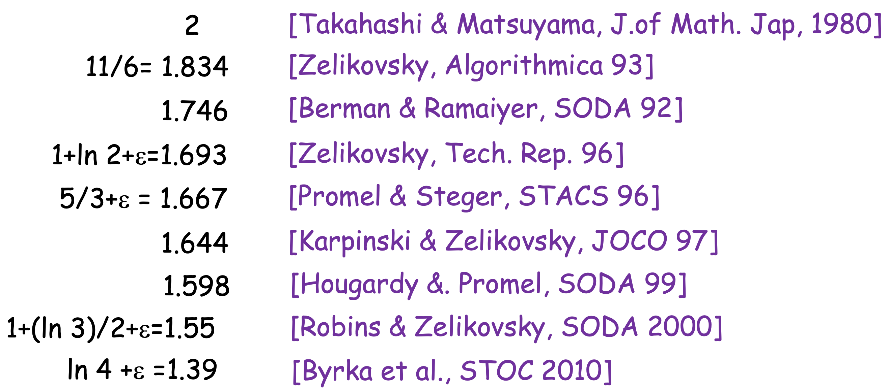
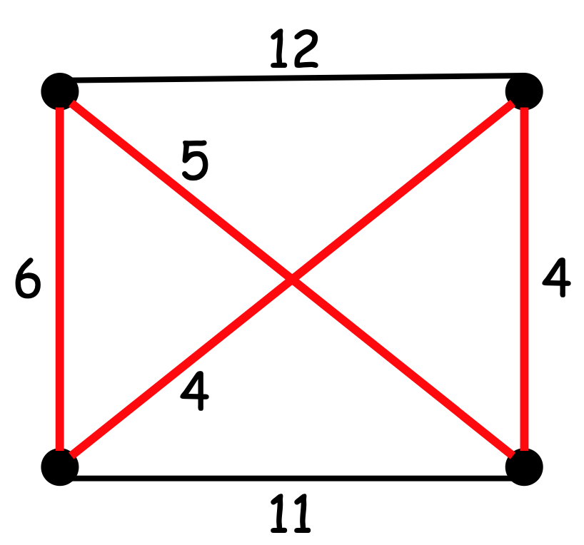
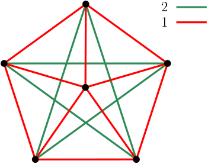
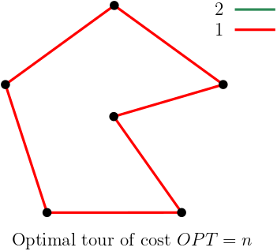
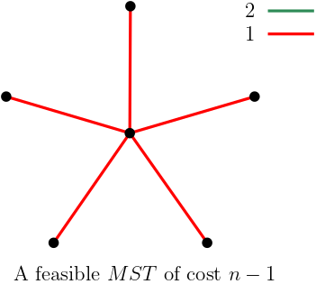
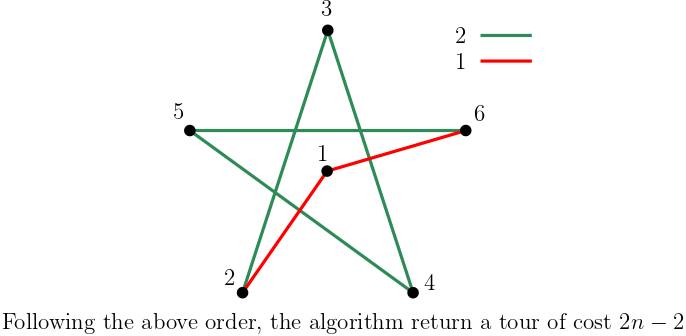

# Minimum Steiner Tree
- **Input**:
	- $G(V,E, c \geq 0)$
	- $R \subseteq V$ **required nodes**
	- $V \setminus R$ **steiner nodes**
- **Output**:
	- Uno spanning tree $T$ su che contiene tutti i nodi required $R$.
- **Goal**: $$\text{minimize COST}(t) = \sum_{e \in T} c(e)$$


Quando $R \equiv V$ allora la soluzione è un **MST**, e quindi risolvibile in **tempo polinomiale**.
Quando $R \neq V$ il problema è invece NP-hard.

- **Metric Steiner** instances: ^09eb19
	- $G$ è completo.
	- vale la disuguaglianza triangolare su ogni coppia di vertici incidenti. Dati $u,v,w$ allora $c(u,v) \leq c(u,w) + c(w,v)$

> **THM**
> È possibili ridurre il *minimum steiner tree* nel *minumum metric stiner tree* a meno di un fattore di approssimazione.
> 
> **Proof**:
> Sia $I=\langle G(V,E),c, R\subseteq V \rangle$ un'istanza del *Minimum Steiner Tree problem*.
> In **tempo polinomiale** possiamo ridurre l'istanza iniziale $I$ ad una [[#^09eb19|istanza metrica]] $I'$, come segue:
> - $G'=(V,E')$ è un grafo **completo** dove $c'(u,v) = \text{dist}_G(u,v)$
> - $R' \equiv R$
> Dato che per ogni arco $(u,v) \in E$ vale che $c'(u,v) \leq c(u,v)$, allora $\text{OPT}(I') \leq\text{OPT}(I)$
> 
> Possiamo **sempre** convertire uno stainer tree $T'$ per l'istanza metrica $I'$ in uno steiner tree $T$ per l'istanza semplice $I$, con *quasi* lo stesso costo.
> - rimpiazza ogni arco $(u,v) \in T'$ con lo *shortest path* tra $u$ e $v$ in $G$.
> - prendi un qualsiasi spanning tree $T$ per il nuovo sottografo.
> $$\text{cost}(T) \leq \text{cost}(T') \;\; \square$$


D'ora in avanti terremo in considerazione le sole **istanze metriche**.
> **Alg1**
> 1. Prendiamo il sottografo $G\left[ R \right]$ **indotto** da $R$.
> 2. Ritorna il **minimum spanning tree** sul sottografo indotto $G\left[ R \right]$.

^b68da3


> **THM**
> L'algoritmo [[#^b68da3|ALG1]] è 2-approssimante per il minimum steiner tree su **istanze metriche**.
> 
> **Proof**:
> Sia $T$ la soluzione ottima, ed $M$ il minimum spannin tree restituito da ALG1.
> **Raddoppiamo** gli archi di $T$ in due archi diretti ottenendo un **grafo Euleriano** $T'$.
> 
> 
> Consideriamo il **ciclo Euleriano** su $T'$.
> Il costo di questo cammino euleriano sarà esattamente $$\text{cost}(T') = \sum_{e \in T'} c(e) = 2 \cdot \sum_{e \in T} c(e) = 2 \cdot \text{cost}(T) = 2 \cdot \text{OPT}$$
> Seguendo il ciclo Euleriano su $T'$, creiamo un **cammino Hamiltoniano** $C$ sui soli nodi requested $R$.
> Essendo in una istanza metrica, possiamo prendere sempre un arco diretto tra due nodi, *"saltando"* i nodi non requested.
> Chiamiamo questi salti **shortcut**.
> 
> 
> 
> Avendo $C$ al più gli stessi archi di $T'$ allora $$\text{cost}(C) \leq \text{cost}(T')$$
> Togliendo un arco da $C$ otteniamo un albero ricoprente su tutto $R$, il quale però non può essere migliore di $M$ (in quanto $M$ è un minimum spanning tree su $R$).
> Perciò
> 	$$\text{cost}(M) \leq \text{cost}(C) \leq \text{cost}(T') = 2 \cdot \text{OPT} \; \; \square$$ 


## Tight Example
Consideriamo un grafo con $n+1$ vertici come il seguente:


- un nodo steiner centrale, con tutti archi di costo 1.
- $n$ nodi requested sui bordi, con i restanti archi di costo 2.

La soluzione ottima è quella composta dalla **Stella** centrata nell'unico nodo *steiner*.
Questa avrà valore $\text{OPT} = n$.

L'algoritmo invece, considerando il solo sottografo composto dai nodi di $R$, prenderà come soluzione il cammino di $n-1$ archi che percorre i bordi, con un costo totale di $2(n-1)$.

### State of the art


----
# Traveling Salesman Problem (TSP)
- **Input**:
	- un grafo **completo** $G(V,E)$, con pesi **non-negativi**.
- **Output**:
	- un ciclo **hamiltoniano** $C$.
- **Goal**: $$\text{minimize cost}(C) = \sum_{e \in E(C)}c(e)$$


**Metric TSP**: è possibile definire una istanza metrica anche per il TSP come per [[#^09eb19|steiner tree problem]].
Basta che i costi dei nodi rispettino la **disuguaglianza triangolare**. ^e43440


> **THM**
> Per qualsiasi funzione *polinomialmente computabile* $\alpha(n)$, trovare una $\alpha(n)$-apx di TSP è NP-hard.
> 
> **Proof**:
> Supponiamo per assurdo di avere un algoritmo $A$ che computa in tempo polinomiale una $\alpha(n)$-approssimazione per il TSP.
> 
> Riduciamo ora il problema del **[[#^db583b|Ciclo Hamiltoniano]]** al TSP ed usiamo $A$ per risolvere il problema.
> Sia $G=(V,E)$ un istanza per il problema del Ciclo Hamiltoniano.
> Creiamo una nuova istanza $H = (V,F,c)$ per TSP, t.c.:
> - $H = (V,F)$ è **completo**.
> - $$c(u,v) = \begin{cases}1 &(u,c) \in E\\n\cdot \alpha(n) &(u,v) \notin E\end{cases}$$
> Certamente avremo che:
> - Se $G$ ha un ciclo hamiltoniano, allora una soluzione ottima al TSP per l'istanza $H$ avrà valore $n$. $$OPT(H) = n$$
> - Se $G$ **non** ha un ciclo hamiltoniano, allora la soluzione ottima al TSP per l'istanza $H$ dovrà necessariamente usare un arco che non è in $G$, e quindi la soluzione avrà costo $> n \cdot \alpha (n)$. $$OPT(H) > n \cdot \alpha(n)$$
> Abbiamo quindi trovato un algoritmo che in **tempo polinomiale** decide il problema del Ciclo Hamiltoniano (assurdo) $\square$


```ad-tldr
title: Hamiltonian Cycle Problem
Dato un grafo $G=(V,E)$ **decidere** se esiste un ciclo che copre tutti i nodi.
```

^db583b

## Algoritmo 2-approssimante
Dato quindi che è inapprocciabile anche l'approssimazione per il TSP, consideriamo le [[#^e43440|istance metriche]].
Esse infatti sono computazionalmente **approcciabili** e **approssimabili**.

> **ALG2** (istanza metrica)
> 1. Trova un MST (*minimum spanning tree*) $T$ per $G$.
> 2. Raddoppia tutti gli archi di $T$ ottenendo un **grafo euleriano**.
> 3. Trova un **tour** euleriano $\tau$ su questo grafo.
> 4. Ritornaimo un ciclo emiltoniano $C$ che visita tutti i nodi di $G$ in ordine in cui appaiono in $\tau$.

> **THM**
> L'algoritmo è 2-approssimante per il TSP metrico.
> 
> **Proof**:
> Osserviamo che rimuovendo un arco dal TSP ottimo per la nostra istanza, otterremo un **albero**, il quale avrà ovviamente un costo peggiore di un MST.
> Ovvero $$\text{cost}(T) \leq OPT$$
> Perciò $$\text{cost}(C) \leq \text{cost}(\tau) \leq 2 \cdot \text{cost}(T) \leq 2 \cdot OPT \;\; \square$$

### Tight Example










```ad-note
- un grafo ha un cammino euleriano se tutti i vertici hanno grado **pari**.
- in ogni grafo non diretto, il numero di nodi di grado **dispari** è sempre **pari**.
```

## Algoritmo (3/2)-approssimante

> **ALG 3** (3/2-apx)
> 1. Triva un MST $T$ di $G$.
> 2. Calcola un **minimum cost perfect matching** $G$ per tutti i nodi $V'$ di grado **dispari** in $T$.
> 3. Aggiungi gli archi di $M$ a $T$.
> 4. Trova il tour euleriano $\tau$.
> 5. Trova il ciclo $C$ con gli shortcut che visita tutti i nodi di $\tau$.

> **Lemma**
> Sia $V' \subseteq V$, tale che $\vert V' \vert$ è **pari**.
> Sia $M$ un minimum cost perfect matching su $V'$.
> Allora $cost(M) \leq OPT/2$ del TSP.
> **Proof**:
> Partiamo da un $\tau^*$ soluzione ottima del TSP, e di cost OPT.
> Sia $\tau'$ un tour su $V'$ facendo shortcut su $\tau^*$.
> Allora $cost(\tau') \leq cost(t^*)$.
> 
> Osserviamo che $\tau'$ è un ciclo di numero pari di archi che compre $V'$.
> Se alterniamo gli archi di $\tau'$, troviamo due perfect matching $M_1, M_2$ di $V'$.
> Osserviamo che $$cost(M_1) + cost(M_2) = cost(\tau')$$
> Allora avremo che $$cost(M) \leq \min(cost(M_1), cost(M_2)) \leq \frac{1}{2}cost(\tau') \leq \frac{1}{2} OPT \; \; \square$$ 

> **THM**
> L'algoritmo ALG3 è $3/2$-apx.
> **Proof**
> $$cost(C) \leq cost(M) + cost(T) \leq \frac{1}{2}OPT + OPT = \frac{3}{2}OPT \;\; \square$$

==vedi esempio tight==


### State of the art
1. $3/2$
2. $3/2 - \varepsilon$ (**in media**) per $\varepsilon > 10^{-36}$.

