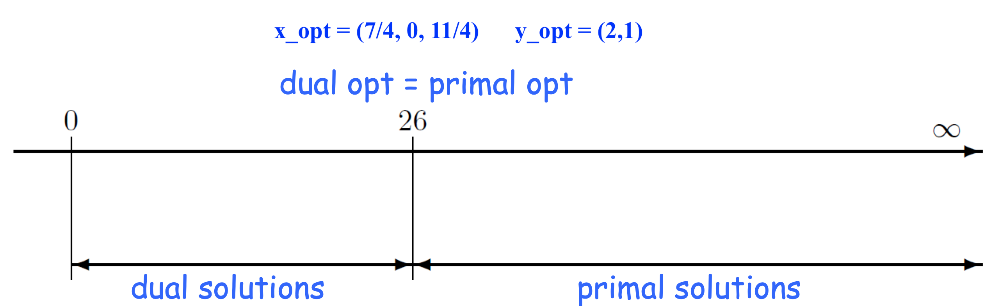
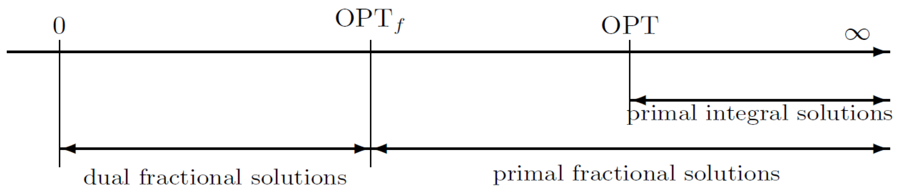
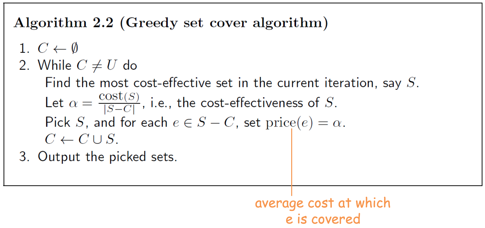

# Minimum Set Cover Problem
- **Inptu**
	- un universo $U = \lbrace e_1, ..., e_n \rbrace$ di $n$ elementi.
	- una collezione di **sottoinsiemi** di $U$, $\mathcal{S} = \lbrace S_1, ..., S_k \rbrace$.
	- ogni insieme $S$ ha un **costo positivo** $c(S)$.
- **Feasible Solution**
	- Una sottocollezione $\mathcal{C} \subseteq \mathcal{S}$ tale che ricopre tutto $U$. Ovvero $$U \equiv \bigcup_{S \in \mathcal{C}} S$$
- **Measure**: minimizzare $\text{cost}(\mathcal{C})$, ovvero $$\text{minimize} \sum_{S \in \mathcal{C}} c(S)$$
Definiamo i seguenti concetti:

> La **frequenza** di un oggetto $e$ è il numero di insiemi che lo contengono, ovvero $$\text{freq}(e) = \vert \lbrace S \in \mathcal{S} : e \in S \rbrace \vert$$

> Sia $f$ la **frequenza massima** $$f = \max_{e \in U} \text{freq}(e)$$ ^46c19e


Possiamo rappresentare questo problema come un problema di **Programmazione Lineare Intera** (*Integer LP*).

$$\begin{align}
\text{minimize} &\sum_{S \in \mathcal{S}} c(S) \cdot x_S\\
\text{subject to} &\sum_{S: e \in S} x_S \geq 1 &\forall e \in U\\
& x_S \in \lbrace 0,1 \rbrace &\forall S \in \mathcal{S}
\end{align}$$


Tale problema è di Integer LP perché abbiamo il vincolo di interezza $$x_S \in \lbrace 0,1 \rbrace \;\; \forall S \in \mathcal{S}$$ ^501cd9

# Tecnica del Roundig (LP-Relaxation)
L'idea della tecnica del **Rounding** è la seguente:
1. Prendiamo il problema che ci interessa.
2. Lo modelliamo come un problema di *Integer LP*.
3. **Rilassiamo** il vincolo di **iterezza**.
4. Risolvo l'istanza rilassata reale (si può fare in tempo polinomiale).
5. Alla fine faccio il **rounding del risultato**.

Per esempio nel caso [[#Minimum Set Cover Problem]] possiamo sostituire il [[#^501cd9|vincolo di interezza]] col vincolo $$x_S \geq 0 \land x_S \leq 1$$
Osserviamo che il vincolo $x_S \leq 1$ è **ridondante**, perché per minimizzare non convieme mai avere $x_S \geq 1$.
Ovvero presa una qualsiasi soluzione ammissibile con un $x_S \geq 1$ possiamo ottenere un'altra soluzione ammissibile di valore migliore, semplicemente ponendo $x_S = 1$.

La nuova formalizzazione sarà quindi la seguente $$\begin{align}
\text{minimize} &\sum_{S \in \mathcal{S}} c(S) \cdot x_S\\
\text{subject to} &\sum_{S: e \in S} x_S \geq 1 &\forall e \in U\\
& x_S \geq 0 &\forall S \in \mathcal{S}
\end{align}$$ ^c454d6


Usa soluzione ammissibile per questo nuovo problema è detta anche **fractional set cover**.

Sia $OPT_f$ una **soluzione frazionale** ammissibile per il set cover frazionario, e $OPT$ un set cover ottimo per l'istanza origiale (intera).

Ovviamente è vero che $$OPT_f \leq OPT$$ perché una soluzione ottima per l'istanza intera è anche una soluzione per l'istanza frazionale (ma non è detto il contrario). ^84fc1f


```ad-important
Per risolvere un problema di programmazine lineare possiamo usare i seguenti algoritmi:
- il **metodo del simplesso**, il quale è esponenziale nel caso peggiore ma **quasi-lineare** in pratica (vedi [[1 - Introduction#Linear Programming]]).
- il **metodo degli ellissoidi**, il quale è sempre polinomiale però in pratica poco efficiente (in pratica peggiore del simplesso, vedi [[1 - Introduction#^cebc7c|qui]]).
```

## Algoritmo f-approssimante per min-Set Cover

> **ALG f-apx**
> 1. Trova una soluzione ottima per l'[[#^c454d6|istanza LP-rilassata]].
> 2. Includi nella soluzione tutti gli insiemi $S$ per i quali $x_S \geq 1/f$.

> **TMH**
> La soluzione dell'algoritmo è **ammissibile** ed $f$-approssimante.
> 
> **Proof**:
> **La soluzione è ammissibile**.
> Prendiamo un qualsiasi elemento $e \in U$.
> Per [[#^46c19e|definizione]] di $f$, avremo che $e$ sarà contenuto in **al più** $\leq f$ insiemi, ovvero $$\text{freq}(e) \leq f$$
> <u>Sicuramente</u> $e$ è coperto nella soluzione **frazionaria**, perciò la somma degli $x_S$ che contengono $e$ fa **almeno** $\geq 1$.
> Ovvero è rispettato il vincolo $$\sum_{S \in \mathcal{S} \;:\; e \in S} x_S \geq 1$$
> 
> **Esempio**: consideriamo la seguente istanza 
> 
> 
> 
> Dato che $e \in S_1, S_2, S_3$, allora in una soluzione frazionaria ottima deve essere rispettato il vincolo $$x_{S_1} + x_{S_2} + x_{S_3} \geq 1$$
> Ma se la somma di queste tre variabili fa almeno 1, allora **almeno** una di esse avrà avalore **almeno** $1/3$, ovvero 1 diviso $\text{freq}(e)$.
> $$x_{S_1} + x_{S_2} + x_{S_3} \geq 1 \implies \exists i \in \lbrace1,2,3\rbrace \;:\; x_{S_i} \geq \frac{1}{3} = \frac{1}{\text{freq}(e)} \geq \frac{1}{f} \;\;$$
> Per come costruiamo la soluzione intera, almeno uno tra $S_1,S_2,S_3$ verrà inserito nella soluzione (perché $x_{S_i} \geq 1/f$), e questo è vero per ogni $e \in U$.
> Quindi tutti gli elementi verrano coperti dalla soluzione.
> 
> **La soluzione è f-approssimazione**.
> Basta osservare che la nuova soluzione ha valore $\leq f \cdot OPT_f \leq f \cdot OPT$ $\square$.


## Weighted Vertex Cover Problem
Osservare che il **Vertex Cover** è un caso particolare di **Set Cover**, dove:
- gli archi sono gli elementi da coprire.
- i nodi rappresentano gli insiemi di $\mathcal{S}$. Ovvero un nodo $v$ rappresenta l'insieme $S_v$ di tutti i suoi archi incidenti.

Un altro caso più generale (e interessante), è il **Weighted Vertex Cover**.
- **Inptu**
	- un grafo non diretto $G = (V,E)$
	- una funzione di costo sui <u>nodi</u> $c: V \to \mathbb{R}^+$
- **Feasible Solution**
	- Un sottoinsieme $U \subseteq V$ di nodi tale che ricopre tutti gli archi, ovver $$\forall (u,v) \in E \;\;\left[ u \in U \lor v \in U \right]$$
- **Measure**: minimizzare $\text{cost}(U)$, ovvero $$\text{minimize} \sum_{v \in U} c(v)$$

```ad-note
La frequenza $f$ di ogni elemento $e \in E$ è sempre $2$.
```

```ad-info
Dato che il [[#Weighted Vertex Cover Problem]] è un caso particolare di [[#Minimum Set Cover Problem]], allora l'[[#Algoritmo f-approssimante per min-Set Cover|algoritmo f-approssimante]] è anche un algoritmo 2-approssimante per Weighted Vertex Cover.
```

## Tight Example
La $f$-approssimazione è tight per l'algoritmo visto (non si può analizzare meglio).

Pensiamo a un'[[#Minimum Set Cover Problem|istanza di Set Cover]] come un **ipergrafo**, dove:
- gli elementi corrispondono a **iperarchi**, ovvero un iperarco è un sottinsieme  $X \in \mathscr{P}(V)$
- gli insiemi $S_1, S_2, ...$ sono i nodi.
- un vertice copre un iperarco $X \subseteq V$ se $v \in X$.

L'istanza di esempio è la seguente.

Siano $V_1, ..., V_k$ dei sottoinsiemi di $n$ elementi ciascuno.
L'ipergrafo corrispondente è tale che:
- abbiamo che $V$ è **partizionato** in $V_1, ..., V_k$, ognuno composto da $n$ nodi.
- abbiamo $n^k$ iperarchi, ognuno per ogni $k$-**upla** di nodi tra le partizione.
- ogni nodo ha costo 1.

Osserviamo che ogni iperarco $X$ (o elemento) è incidente ad **esattamente** $k$ nodi, perciò avremo **frequenza massima** esattamente $f = k$.

Una possibile soluzione frazionale ottima è $x_v = 1/k$ per ogni $V$, ottenendo come valore $OPT_f = n$.

Facendo il **rounding** della soluzione otterremo una soluzione intera con valore $k \cdot n$.
È facile vedere che una soluzione intera ottima che ha costo $n$ è quella in cui abbiamo $x_v = 1$ per ogni $v \in V_1$.

-----------
# Tecnica della Dualità
Prendiamo un problema di LP in **froma standard** (tutte le variabili $\geq 0$ e tutti i vincoli $\geq$).

$$\begin{align}
\text{minimize } z &= 7x_1 + x_2 +5x_3\\
y_1 &= x_1 - x_2 + 3x_3 \geq 10\\
y_2 &= 5x_1 + 2x_2 - x_3 \geq 6\\
&x_1, x_2, x_3 \geq 0
\end{align}$$

Sia $z$ una soluzione ottima a tale problema di LP.

Come posso stabilire un **upperbound** per $z$?
Come posso dire che $z \leq \alpha$?

Per esempio, consideriamo una generica **soluzione ammissibile** $x = (2,1,3)$.
Il valore di $x$ è $7 \cdot 2 + 1 \cdot 1 + 3 \cdot 5 = 30$.
Dato che $z$ è ottima, allora certamente avremo che $z \leq 30$.

Come posso invece dire che $z \geq \alpha$?
Porsi questa domanda, è utile per definire uno [[Note 0#^4eea88|schema di lower bound]].

Come fare invece per trovare una soluzione di valore $= \alpha$?
Questo modo non è pratico, perché sarebbe equivalente a trovare una soluzione ottima.
È possibile fare questo sfruttando una **soluzione ammissibile** per il **problema duale**.

$$\begin{align}
\text{maximize } w &= 10y_1 + 6y_2\\
x_1 &= y_1 + 5y_2 \leq 7\\
x_2 &= -y_1 + 2y_2 \leq 1\\
x_3 &= 3y_1 - y_2 \leq 5\\
&y_1, y_2 \geq 0
\end{align}$$

Si può dimostrare che le soluzioni ottime del primale e del duale hanno lo stesso valore ([[#^23547e|vedi dopo]]).
Perciò:
- sia $t$ una generica soluzione ammissibile del duale
- sia $w$ una soluzione ottima del duale
- sia $z$ una soluzione ottima del primale
Allora avremo che $$t \leq w = z$$


> **Problema Primale**
> I problemi primali sono della forma
> $$\begin{align}
\text{minimize } &\sum_{j=1}^{n} c_j x_j\\
\text{subject to } &\sum_{j=1}^{n} a_{i,j} x_j \geq b_i \;\; \forall i = 1,...,m\\
&x_j \geq 0 \;\; \forall j=1,..., n
\end{align}$$

> **Problema Duale**
> I problemi duali sono della forma
> $$\begin{align}
\text{maximize } &\sum_{i=1}^{m} b_i y_i\\
\text{subject to } &\sum_{i=1}^{m} a_{i,j} y_i \leq c_j \;\; \forall j = 1,...,n\\
&y_i \geq 0 \;\; \forall i=1,...,m
\end{align}$$


> **THM (LP-duality theorem)**
> Il programma primale ha un **ottimo** finito <u>se e solo se</u> il suo duale ha un **ottimo finito**.
> Inoltre, se $x = (x_1,...,x_n)$ e $y=(y_1,...,y_m)$ sono le due soluzioni **ottime** dei problemi primale e duale rispettivamente, allora concidono nel valore
> $$\sum_{j=1}^{n}c_j x_j = \sum_{i=1}^{m}b_i y_i$$

^23547e


> **Weak LP-duality theorem**
> Siano $x = (x_1,...,x_n)$ e $y=(y_1,...,y_m)$ due soluzioni **ammissibili** dei problemi primale e duale rispettivamente, allora è vero che
> $$\sum_{j=1}^{n}c_j x_j \geq \sum_{i=1}^{m}b_i y_i$$
> 
> **Proof**
> Dato che le due soluzioni sono ammissibili, andiamo a sostituire $c_j$ e $b_i$ opportunamente (a seconda dei vincoli lineari).
> $$\begin{align}
\sum_{j=1}^{n} c_j x_j
&\geq \sum_{j=1}^{n} \left[ \sum_{i=1}^{m} a_{i,j} y_i \right]x_j\\
&\geq \sum_{i=1}^{m} \left[ \sum_{j=1}^{n} a_{i,j} x_j \right]y_j\\
&\geq \sum_{i=1}^{m} b_iy_i \;\; \square
\end{align}$$

^a52246

---------
# Dual-Fitting
Iniziamo col definire il **duale** del [[#Minimum Set Cover Problem]] in froma [[#Tecnica del Roundig (LP-Relaxation)|rilassata]].
Il duale è

$$\begin{align}
\text{maximize} &\sum_{e \in U} y_e\\
\text{subject to} &\sum_{e \in S} y_e \leq c(S) &\forall S \in \mathcal{S}\\
& y_e \geq 0 &\forall e \in U
\end{align}$$

Possiamo vedere al problema duale come al **packing** degli oggetti di $U$, ovvero:
- vogliamo *"mettere"* più soldi possibili sugli oggetti $e \in U$.
- però non possiamo superare la *"capienza"* degli insiemi che contengono gli elementi (fare **overpacking**)

Grazie al [[#^a52246|Weak LP-duality theorem]] ogni soluzione <u>ammissibile</u> al duale rilassato sarà un **lowerbound** all'ottimo rilassato del primale $OPT_f$, il quale è un [[#^84fc1f|lowerbound]] all'ottimo $OPT$.



Ricordiamo [[Note 0#^489290|l'algoritmo greedy]] per min SetCover, visto in [[Note 0]]. 



Da tale solizione, ricaviamo ora una **soluzione ammissibile** per il duale come segue
$$\forall e \in U \;\; y_e := \frac{\text{price}(e)}{H_n}$$ dove $H_n$ è l'$n$-esimo valore della serie armonica. ^5300bd

> **Lemma**
> La soluzione $\mathbf{y}$ definita [[#^5300bd|sopra]] è una **soluzione ammissibile** per il problema duale.

> **Proof**
> Basta dimostrare che nessun insieme $S \in \mathcal{S}$ è **overpacked** dagli elementi di $\mathbf{y}$.
> 
> Sia $S$ un qualsiasi insieme di $k$ elementi, e consideriamo i suoi elementi $e_1, ..., e_k$ nell'<u>ordine in cui l'algoritmo greedy li copre</u>. Ovvero prima viene coperto $e_1$ poi $e_2$, ecc...
> 
> Prendiamo l'elemento $e_i$ coperto per $i$-esimo.
> In quel momento, in $S$ c'erano **almeno** $\geq k-i+1$ elementi **non coperti**.
> 
> $S$ può coprire $e_i$ ad un prezzo in media di **al più** $\leq \text{cost}(S)/(k-i+1)$.
> Per via della politica greedy, noi abbiamo che $$y_{e_i} = \frac{\text{price}(e_i)}{H_n} =  \frac{1}{H_n}\frac{c(S)}{\vert S \setminus C \vert} \leq \frac{1}{H_n}\frac{c(S)}{(k-i+1)}$$
> Applicando questa disuguaglianza a tutti gli elementi di $S$ avremo che $$\sum_{e_i \in S} y_{e_i} \leq \frac{c(S)}{H_n} \sum_{i=1}^{k}\frac{1}{i} \leq \underbrace{\frac{H_k}{H_n}}_{\leq 1} c(S) \leq c(S)$$ ovvero $S$ non è overpacked $\square$.


Analiziamo ora il fattore di approssimazione dell'[[Note 0#^489290|algoritmo greedy]] per min SetCover, sfruttando però la [[#Tecnica della Dualità]].

> **THM**
> L'[[Note 0#^489290|algoritmo greedy]] per il min SetCover ha un fattore di approssimazione di $H_n$.
> 
> **Proof**
> Sia $\mathbf{y}$ una generica soluzione ammissibile per il problema duale. Allora $$\text{costo del cover} = \sum_{e \in U} \text{price}(e) = H_n \sum_{e \in U} y_e \leq H_n \cdot OPT_f \leq H_n \cdot OPT \;\; \square$$