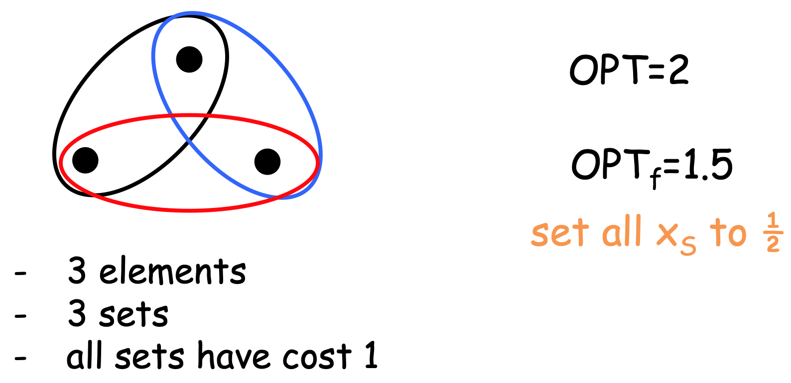

# Minimum Set Cover Problem
- **Inptu**
	- un universo $U$ di $n$ elementi.
	- una collezione di **sottoinsiemi** di $U$, $\mathcal{S} = \lbrace S_1, ..., S_k \rbrace$.
	- ogni insieme $S$ ha un **costo positivo** $c(S)$.
- **Feasible Solution**
	- Una sottocollezione $\mathcal{C} \subseteq \mathcal{S}$ tale che ricopre tutto $U$. Ovvero $$U \equiv \bigcup_{S \in \mathcal{C}} S$$
- **Measure**: minimizzare $\text{cost}(\mathcal{C})$, ovvero $$\text{minimize} = \sum_{S \in \mathcal{C}} c(S)$$
Definiamo i seguenti concetti:
- la **frequenza** di un oggetto $e$ è il numero di insiemi che lo contengono, ovvero $$\text{freq}(e) = \vert \lbrace S \in \mathcal{S} : e \in S \rbrace \vert$$
- sia $f$ la **frequenza massima** $$f = \max_{e \in U} \text{freq}(e)$$ ^46c19e


Possiamo rappresentare questo problema come un problema di **Programmazione Lineare Intera** (*Integer LP*).

$$\begin{align}
\text{minimize} &\sum_{S \in \mathcal{S}} c(S) \cdot x_S\\
\text{subject to} &\sum_{S: e \in S} x_S \geq 1 &\forall e \in U\\
& x_S \in \lbrace 0,1 \rbrace &\forall S \in \mathcal{S}
\end{align}$$


# Tecnica del Roundig (LP-Relaxation)
L'idea della tecnica del **Rounding** è la seguente:
- Prendiamo il problema che ci interessa.
- Lo modelliamo come *Integer LP*.
- **Rilassiamo** il vincolo di **iterezza**.
- Risolvo l'istanza rilassata reale (si può fare in tempo polinomiale).
- Alla fine faccio il **rounding del risultato**.

Per esempio nel caso [[#Minimum Set Cover Problem]] possiamo sostituire il vincolo di interezza col vincolo $$x_S \geq 0 \land x_S \leq 1$$
Osserviamo che il vincolo $x_S \leq 1$ è **ridondante**, perché per minimizzare non convieme mai avere $x_S \geq 1$.

La nuova formalizzazione sarà quindi la seguente $$\begin{align}
\text{minimize} &\sum_{S \in \mathcal{S}} c(S) \cdot x_S\\
\text{subject to} &\sum_{S: e \in S} x_S \geq 1 &\forall e \in U\\
& x_S \geq 0 &\forall S \in \mathcal{S}
\end{align}$$ ^c454d6


Usa soluzione ammissibile per questo nuovo problema è detta anche **fractional set cover**.

Sia $OPT_f$ una soluzione frazionale ammissibile per il set cover frazionario, e $OPT$ un set cover ottimo per l'istanza origiale (intera).

Avremo quindi che $$OPT_f \leq OPT$$ perché una soluzione ottima per l'istanza frazionaria è anche una soluzione per l'istanza intera (ma non è detto il contrario).



```ad-important
Per risolvere un problema di programmazine lineare possiamo usare i seguenti algoritmi:
- il **metodo del simplesso**, il quale è esponenziale nel caso peggiore ma **quasi-lineare** in pratica (vedi [[1 - Introduction#Linear Programming]]).
- il **metodo degli ellissoidi**, il quale è sempre polinomiale però in pratica poco efficiente (in pratica peggiore del simplesso, vedi [[1 - Introduction#^cebc7c|qui]]).
```

## Algoritmo f-approssimante per min-Set Cover

> **ALG f-apx**
> 1. trova una soluzione ottima per l'[[#^c454d6|istanza LP-rilassata]].
> 2. Includi nella soluzione tutti gli insiemi $S$ per i quali $x_S \geq 1/f$.

> **TMH**
> La soluzione dell'algoritmo è **ammissibile** ed $f$-approssimante.
> 
> **Proof**:
> **La soluzione è ammissibile**.
> Prendiamo un qualsiasi elemento $e$.
> Per [[#^46c19e|definizione]] di $f$, avremo che $e$ sarà contenuto in **al più** $\leq f$ insiemi.
> <u>Sicuramente</u> $e$ è coperto nella soluzione **frazionaria**, perciò la somma degli $x_S$ che contengono $e$ fa **almeno** $\geq 1$.
> 
> Esempio: consideriamo la seguente istanza 
> 
> 
> 
> Dato che $e \in S_1, S_2, S_3$, nella soluzione frazionaria *ottima* avevamo necessariamente che $$x_{S_1} + x_{S_2} + x_{S_3} \geq 1 \implies x_{S_i} \geq \frac{1}{3} = \frac{1}{\text{freq}(e)} \geq \frac{1}{f} \;\; i =1,2,3$$
> Quindi almeno uno degli insiemi che contiene $e$ deve necessariamente essere incluso nella soluzione (e questo vale per qualsiasi elemento $e$ di qualsiasi istanza).
> 
> **La soluzione è f-approssimazione**.
> Basta osservare che la nuova soluzione è $\leq f \cdot OPT_f \leq f \cdot OPT$ $\square$.

```ad-note
Rircordiamo che il Vertex Cover è un caso di Set Cover:
- i nodi sono gli insiemi $S$
- gli archi sono gli elementi $e \in U$.
```

==vedi weighted Vertex Cover==

### Tight Example
La $f$-approssimazione è tight per l'algoritmo visto (non si può analizzare meglio).

Osservare che Set Cover è equivalente al Vertex Cover su **ipergrafo**.
Abbiamo che:
- gli insiemi $S$ sono i nodi.
- gli elementi $e$ sono gli **iperarchi**.
- un vertice copre un iperarco $X \subseteq V$ se $v \in X$.

L'istanza è la seguente.
- abbiamo una partizione $V_1, ..., V_k$ ciascuno con $n$ nodi.
- abbiamo $n^k$ iperarchi, ognuno per ogni $k$-upla di nodi tra le partizione.

==da finire==

# Tecnica della Dualità
Prendiamo un problema di LP in **froma standard** (tutte le variabili $\geq 0$ e tutti i vincoli $\geq$).

$$\text{minimize} \;\; z = 7x_1 + x_2 + 5x_3$$
$$y_1 = x_1 - x_2 + 3x_3 \geq 10$$
$$y_2 = 5x_1 +2x_2 - 3x_3 \geq 6$$
$$x_1, x_2, x_3 \geq 0$$

Sia $z$ l'ottimo di tale problema.
Come posso stabilire un **upperbound** per $z$?
Come posso dire che $z \leq \alpha$?

Per esempio basta dire che $\alpha$ è una **soluzione ammissibile**.
Infatti essendo $z$ sia ammissibile che ottima, allora certamente $z \leq \alpha$.

Assodato questo, mi chiedo se $z \geq \alpha$?
Perché $\geq \alpha$: così ho uno **schema di lowerbound**.


==Per dire questo, mi basta trovare una **soluzione ammissibile** per il **problema duale**.==

$$\text{maximize} \;\; 10y_1 + 6y_2$$
$$y_1 + 5y_2 \leq 7$$
$$-y_1 + 2y_2 \leq 1$$
$$3y_1 - y_2 \leq 5$$
$$y_1,y_2 \geq 0$$


==vedi immagine==

> **THM (LP-duality theorem)**
> Il programma primale ha un **ottimo** finito iff il programma duale ha un **ottimo finito**, e inoltre i loro valori coincidono.
> $$\sum_{j=1}^{n}c_j x_j = \sum_{i=1}^{m}b_i y_i$$


> **Weak LP-duality theorem**
> $$\sum_{j=1}^{n}c_j x_j \geq \sum_{i=1}^{m}b_i y_i$$

# Dual-Fitting
Iniziamo con l'enuncirare il **duale** del set cover in LP-rilassato.
Il duale è
$$\text{maximize} \;\; \sum_{e \in U} y_e$$
$$\text{s.t.} \;\; \sum_{e: e \in S} y_e \leq \text{cost}(S) \;\; \forall S \in \mathcal{S}$$
$$y_e \geq 0 \;\; \forall e \in U$$


Il duale in questo caso consiste nel **packing** degli oggetti:
- vogliamo "mettere" più soldi possibili sugli oggetti $e \in U$.
- però non possiamo superare la "capienza" degli insiemi che contengono gli elementi (fare **overpacking**)

Osserviamo quindi che, ogni soluzione ammissibile al duale sarà un lowerbound ad $OPT_f$, il quale è un lowerbound a $OPT$.

Analiziamo ora il [[Note 0#^489290|l'algoritmo greedy]] per min SetCover.

> **Lemma**
> Sia $y$ una **soluzione ammissibile** per il primale.
> Definiamo quindi $\tilde{y} = y/H_n$.
> Allora $\tilde{y}$ è una soluzione ammissibile per il duale.

> **Proof**
> Basta dimostrare che nessun insieme è **overpacked** dagli elementi di $\tilde{y}$.
> Sia $S$ un insieme di $k$ elementi, e consideriamo i suoi elementi $e_1, ..., e_k$ nell'ordine in cui l'algoritmo greedy li copre.
> 
> Prendiamo l'elemento $e_i$ coperto per $i$-esimo in $S$.
> In quel momento, in $S$ c'erano **almeno** $\geq k-i+1$ elementi non coperti.
> 
> $S$ può coprire $e_i$ ad un prezzo in media di **al più** $\leq \text{cost}(S)/(k-i+1)$.
> Per via della politica greedy, noi abbiamo che $$\tilde{y}_{e_i} = \text{price}(e_i) \leq \text{cost}(S)/(k-i+1)$$
> Perciò $$y_{e_i} \leq \frac{1}{H_n}\frac{\text{cost}(S)}{(k-i+1)}$$
> In conclusione $$\sum_{e_i} y_{e_i} \leq \frac{OPT}{H_n} \;\; \square$$


==da finire==