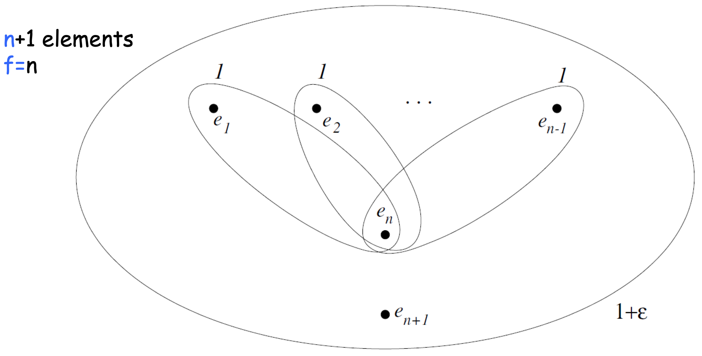
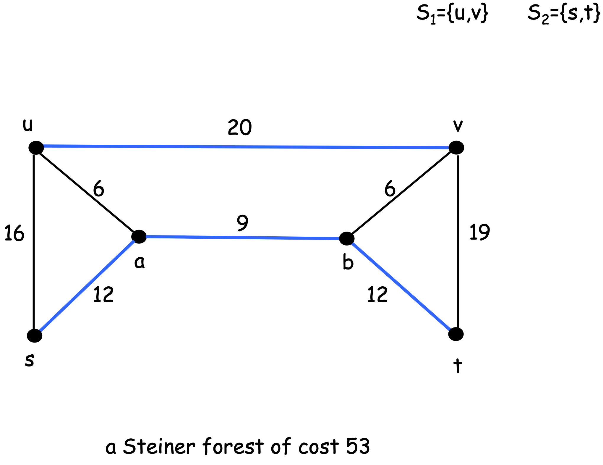
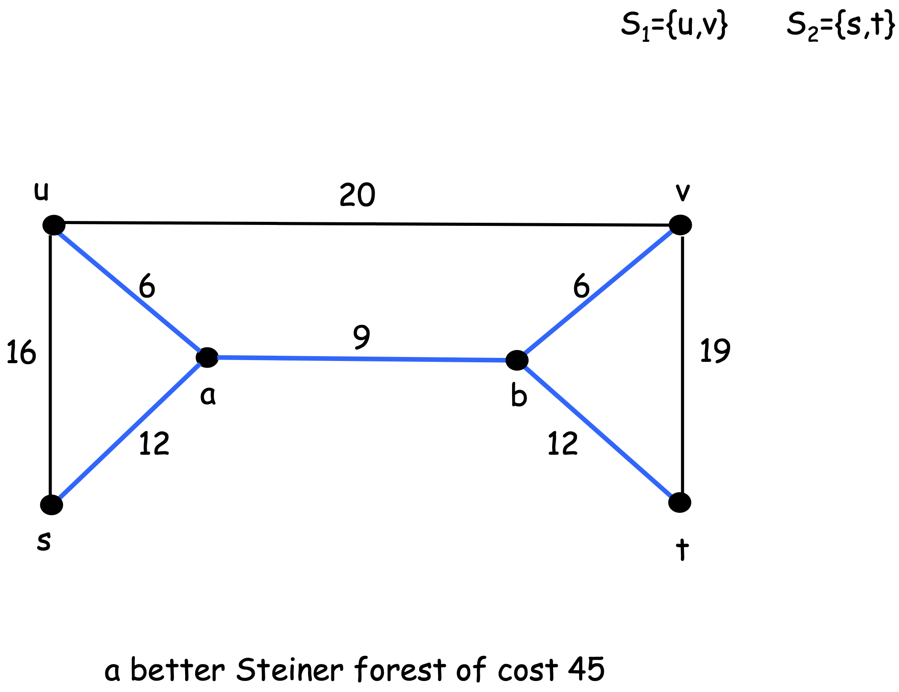

# Schema Primale-Duale
Un'idea intuitiva del **primal-dual schema** è la seguente:
- Iniziamo con:
	- una soluzione **non ammissibile** del problema **primale intero**.
	- una soluzione **ammissibile** del suo **duale**.
- Iterativamente:
	- **miglioriamo** la soluzione duale.
	- **miglioriamo** l'ammissibilità della soluzione primale.
	- finché non otteniamo una soluzione primale **ammissibile**.

Usiamo quindi il valore della soluzione duale come lowerbound al valore del primale, per garantire un fattore di approssimazione.

## Minimum Set Cover
Riconsideriamo il problema del [[ATA/Note 2#Minimum Set Cover Problem|Minimum Set Cover]].

La sua forma **primale intera** è
$$\begin{align}
\text{minimize} &\sum_{S \in \mathcal{S}} c(S) \cdot x_S\\
\text{subject to} &\sum_{S: e \in S} x_S \geq 1 &\forall e \in U\\
& x_S \in \lbrace 0,1 \rbrace &\forall S \in \mathcal{S}
\end{align}$$
La sua forma [[ATA/Note 2#Tecnica del Roundig (LP-Relaxation)|rilassata]] è invece
$$\begin{align}
\text{minimize} &\sum_{S \in \mathcal{S}} c(S) \cdot x_S\\
\text{subject to} &\sum_{S: e \in S} x_S \geq 1 &\forall e \in U\\
& x_S \geq 0 &\forall S \in \mathcal{S}
\end{align}$$
Infine la forma **duale rilassata** (ovvero il problema del [[ATA/Note 2#^86d69d|packing]]) è
$$\begin{align}
\text{maximize} &\sum_{e \in U} y_e\\
\text{subject to} &\sum_{e \in S} y_e \leq c(S) &\forall S \in \mathcal{S}\\
& y_e \geq 0 &\forall e \in U
\end{align}$$

## Algoritmo f-approssimante
Data una soluzione duale $y$, diciamo che un insieme $S$ è **tight** per la soluzione $y$ se $$\sum_{e \in S} y_e = c(S)$$ (abbiamo riempito tutto $S$ con i *"soldi dati"* ai suoi elementi).

**Idea**: prendiamo i soli insiemi tight.

> **ALG1 (f-approssimante)** 
> 1. Inizializza $x = 0, \;\; y = 0$.
> 2. Finché non ho un cover, prendi un qualsiasi elemento $e$ **non coperto**.
> 3. Alzo il valore $y_e$ finché non rendo tight un insieme $S$ che lo contiene.
> 4. Prendi gli insiemi diventati tight grazie ad $e$, li toglo e li aggiungo nella soluzione $x$. (ovvero pongo $x_S = 1$).
> 5. Ritorno $x$.

^04612f

==vedi esempio slides==

> **THM**
> L'**ALG1** è una $f$-approssimazione per il [[ATA/Note 2#Minimum Set Cover Problem|min Set Cover]].
> 
> **Proof**:
> Sicuramente $x$ è una soluzione ammissibile, in quanto per costruzione dell'algoritmo iteriamo finché non abbiamo ottenuto un cover.
> 
> Adesso affermiamo che $$\sum_{S \in \mathcal{S}}c(s) \cdot x_s \leq f \sum_{e \in U} y_e$$
> > **Idea**: pensiamo a $f \sum_{e \in U} y_e$ come dei **soldi** che possiamo spendere per comprare la soluzione ammissibile $x$.
> > Basta dimostrare che tali soldi sono sufficienti per comprare $x$.
> 
> Per ogni elemento $e$ distribuiamo $f \cdot y_e$ soldi.
> Dopodiché l'elemento $e$ paga $y_e$ soldi per ogni insieme $S$ nella soluzione $x$ che lo constiene (ovvero dove $x_S = 1$ t.c. $e \in S$).
> Dato che la freqeunza di $e$ è **al più** $\leq f$, $e$ ha sempre abbastanza soldi per pagare i suoi insiemi che lo contengono.
> 
> Inoltre dato che ogni insieme $S$ inserito nella soluzione è **tight**, allora $S$ sarà sempre pagato per intero dai suoi elementi.
> 
> In fine dato che $y$ è ammissibile, allora $\text{cost}(y) \leq \text{OPT}$ $\square$.

### Esempio tight



Supponiamo che l'[[#^04612f|algoritmo f-approssimante]] consideri per primo l'elemento $e_n$.
La variabile $y_{e_n}$ verrà alzata fino ad $1$, rendendo tight tutti gli $n-1$ isniemi di valore $1$.
Dopodiché, dato che $e_{n+1}$ è rimasto scoperto, verrà posto $y_{e_{n+1}} = \varepsilon$, ottenendo una soluzione di valore $n-1+\varepsilon$.

Ovviamente la soluzione ottima è qulla di costo $1 + \varepsilon$.

```ad-note
Osservare che in questo caso si usa la LP **solo** per l'analisi, ma non per la risoluzione.
```

---------
# Steiner Forset
- **Input**:
	- un grafo non diretto con costi non negativi, $G(V,E, c \geq 0)$.
	- una collezione di **sottoinsiemi disgiunti** $S_1,...,S_k \subseteq V$.
- **Feasible Solution**
	- una foresta $F$ tale che per ogni coppia di nodi $u,v$ appartenente ad uno stesso $S_i$, essi risultano essere **connessi**
- **Misura**: $$\text{minimze cost}(F) = \sum_{e \in E(F)} c(e)$$





```ad-note
Possiamo ricondure tale problema ad una **istanza metrica**, dove:
- $G$ diventa **completo**.
- gli archi rispettano la **disuguaglianza triangolare**.
```

Rappresentiamo una istanza del minimum Steiner Forest problem in *Integer LP*.
Introduciamo innanzitutto una *funzione di connettività* **connectivity requirement funciton** $r$, definita come
$$r(u,v) = \begin{cases}
1 &\exists S_i : u,v \in S_i\\
0 &\text{altrimenti}\\
\end{cases}$$


Definiamo ora una funzione $f$ per ogni **taglio** del grafo $G$.
Sia il taglio $\delta(A) := (A, \overline{A} \equiv V \setminus A)$.
Allora abbiamo
$$f(A) = \begin{cases}
1 &\exists u\in A, v \in \overline{A} : r(u,v) = 1\\
0 &\text{altrimenti}\\
\end{cases}$$

Formuliamo ora l'istanza in ILP

$$\begin{align}
\text{minimize } &\sum_{e \in E} c_e \cdot x_e\\
\text{subject to } &\sum_{e \in \delta(S)} x_e \geq f(S) &\forall S \subset V\\
&x_e \in \lbrace 0,1 \rbrace &\forall e \in E
\end{align}$$

Dove $\delta{(S)} = (S, V \setminus S)$.

```ad-note
Osservare che il numero di vincoli è **esponenziale**, in quanto dobbiamo considerare tutti i possibili tagli di $V$. Quindia avremo $2^{\vert V \vert}$ vincoli.
```


Consideriamo ora la verionse **rilassata** 
$$\begin{align}
\text{minimize } &\sum_{e \in E} c_e \cdot x_e\\
\text{subject to } &\sum_{e \in \delta(S)} x_e \geq f(S) &\forall S \subset V\\
&x_e \geq 0 &\forall e \in E
\end{align}$$
e il rispettivo **duale**
$$\begin{align}
\text{maximize } &\sum_{S \subset V} f(S) \cdot y_S\\
\text{subject to } &\sum_{S \; : \; e \in \delta(S)} y_S \leq c_e &\forall e \in E\\
&y_e \geq 0 &\forall S \subset V
\end{align}$$


1. Prendiamo un arco $e$ ed una **qualsiasi** variabile $y_S$. Diciamo che $e$ **sente** $y_S$ se $y_S > 0$ ed $e \in \delta{(S)}$.
2. Diremo che un insieme $S$ è **incrementato** (**raised**) in una soluzione **duale** se $y_S > 0$. Osserviamo che
	1. incrementare $S$ oppure $S'$ ha lo **stesso effetto** sia nei vincoli che nel costo.
	2. non ho alcun vantaggio ad incrementare $S$ se $f(S) = 0$. Perciò per ogni $f(S) = 0$ assumiamo $y_S = 0$.
3. Un arco $e$ è detto **tight** se la somma degli $y_S$ che lui **sente** è pari a $c(e)$.

Osserviamo che il duale cerca di massimizzare la somma degli $y_S$ soggetto al vincolo che nessun arco è **over-tight**.

Ad un qualsiasi istante, l'[[#^e748e6|algoritmo per il calcolo della Steiner Forest]] tiene una foresta $F$ (magari non ancora ammissibile come soluzione).

Diremo che un insieme $S$ è **non-soddisfatto** se
- $f(S) = 1$
- non ci sono archi nella foresta $F$ che attraversano il tagli $\delta{(S)}$. ^5ae4aa

Diremo che un insieme $S$ è **attivo** se ^678f95
1. è **non-soddisfatto**
2. è **minimale rispetto all'inclusione**. Ovvero non ci sono sottoinsiemi propri di $S$ che sono non-soddisfatti.

**OSS.** $F$ è **non ammissibile** $\iff$ esiste un sottoinsieme $S$ attivo.

> **Lemma**
> Un $S$ è [[#^678f95|attivo]] (i.e. non soddisfatto minimale) <u>se e solo se</u>
> - $S$ è una **componente connessa** nella foreste $F$ corrente.
> - $f(S) = 1$.
> 
> **Proof**
> Sia $S \subseteq V$ un insieme ancora **attivo** durante l'esecuzione dell'algoritmo.
> 
> Dato che $S$ è attivo, per [[#^5ae4aa|definizione]] non ci sono archi da $S$ a $V \setminus S$, perciò non può far parte di una componente connessa.
> Quindi necessariamente deve essere composta dall'unione di componenti connesse.
> 
> 
> ==da vedere dopo==

> **ALG2**
> 1. ==(**INIZIALIZATION**)== $F = \emptyset$, $y_S = 0$ per ogni $S \subseteq V$.
> 2. ==(**EDGE AUGMENTATION**)== finché ci sono ancora insiemi **non-soddisfatti**:
> 	1. prendi gli insiemi $S$ **attivi**.
> 	2. aumenta **simultaneamente** $y_S$ finché non staturo un arco $e$ (finché non diventa tight)
> 	3. aggiungi $e$ ad $F$, ovvero $F \leftarrow F \cup \lbrace e \rbrace$.
> 3. ==(**PRUNING**)== ritorna $F' = \lbrace e \in F \vert F \setminus \lbrace e \rbrace \text{ é NON ammissibile per il primale} \rbrace$.
^e748e6

```ad-info
title: Pruning Phase
Nella fase di **pruning**, rimuoviamo gli archi **ridondanti**.
Un arco $e$ è **ridondante** (ovvero non necessario) se $F \setminus \lbrace e \rbrace$ rimane ancora una soluzione ammissibile per il primale. Perciò posso rimuovere $e$.
```


> **THM**
> L'algoritmo [[#^e748e6|ALG2]] è 2-approssimante.
> 
> **Proof**
> La soluzione duale è ammissibile per costruzione, perché non ci sono archi **over-tight**.
> Perciò anche la soluzione primale $F'$ sarà ammissibile.
> 
> Affermiamo ora che $$\underbrace{\sum_{e \in F'} c(e)}_{\text{primal solution}} \leq 2 \cdot \underbrace{\sum_{S \in \mathcal{P}(S)} y_s}_{\text{dual solution}} \leq 2 \cdot OPT$$
> $$\sum_{e \in F'}c(e) = \sum_{e \in F'} \sum_{S: e \in \delta{(S)}}y_e = \sum_{S \in \mathcal{P}(S)} \sum_{e \in F' \cap \delta{(S)}} y_e = \sum_{S \in \mathcal{P}(S)} \text{deg}_{F'}(S) y_s$$
> dove $\text{deg}_{F'}(S)$ = numero di archi che appartengono al taglio $\delta{(S)}$ e sono stati inseriti in $F$.
> 
> Ora bisogna dimostrare che $$\sum_{S}\text{deg}_{F'}(S) y_s \leq 2 \sum_{S} y_e$$
> Dimostriamo un claim più forte:
> 
> > Ad ogni iterazione l'incremento del lato sinistro della sommatoria è sempre minore uguale di quello a destra.
> 
> Consideriamo una generica iterazione, e sia $\Delta$ l'incremento fatto sulle componenti attive.
> Avremo quindi che
> $$\sum_{S \text{ attivo}}\text{deg}_{F'}(S) \Delta \leq 2 \sum_{S \text{ attivo}} \Delta$$
> $$\implies \Delta \sum_{S \text{ attivo}}\text{deg}_{F'}(S) \leq 2 \Delta \text{(\# attivi)}$$
>  $$\implies \sum_{S \text{ attivo}}\text{deg}_{F'}(S) \leq 2 \text{(\# attivi)}$$
> ==da finire==


