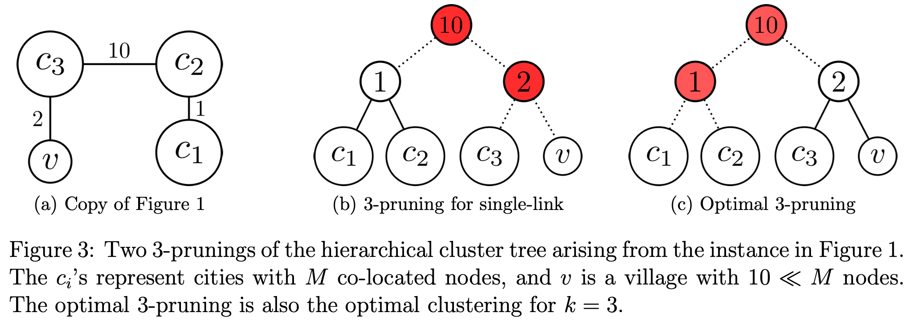

# Clustering in Pertubation-Stable Instances
Come in [[6 - Clustering in Approximation-Stable Instances]], introduciamo un nuovo concetto di **perturbazione** per le istanze di $k$-median clustering.

Non in tutti i casi i punti appartengono ad uno **spazio geometrico**.
Infatti quasi sempre si vogliono classificare punti che rappresentano oggetti, proteine, documenti, ecc... e quindi si definiscono funzioni di distanza **euristiche**, che non possono essere prese alla lettera.

Dato che quindi si possono definire differenti funzioni di distanza, ci aspettiamo che quelle "*buone*" non differiscano tra di loro di molto (diciamo al più di un fattore **costante moltiplicativo**).

Se tali funzioni di distanza sono "*buone*", inoltre, "*più o meno*" identificheranno lo stesso clustering come ottimo.

Innanzitutto, assumiamo che il **clustering target** $C^*_1, ..., C^*_k$ è l'unica istanza che **ottimizza la [[6 - Clustering in Approximation-Stable Instances#^cc98b0|funzione obiettivo]]**. ^85e465

> **Def. ($\gamma$-perturbation)**
> Una $\gamma$**-perturbazione** di una istanza $(X, d)$ del $k$*-median clustering problem* è una nuova istanza $(X, \tilde{d})$ dove le distanze tra ogni coppia di punti $x,y \in X$ sono scalate $$\tilde{d}(x,y) = \sigma_{xy} \cdot d(x,y)$$ di un fattore **arbitrario** $\sigma_{x,y} \in \left[1, \gamma\right]$.

^490cba

Riuscire a risolvere il problema, ovvero identificare il clustering ottimo $C^*_1, ..., C^*_k$, sotto una funzionde distanza $d$ **empirica** "*buona*", suggerisce che la soluzione è **insensibile** a piccole permutazioni di $d$.

In altre parole, la sensibilità dell'output ai dettagli della funzione distanza $d$ suggerisce che è stata posta la domanda sbagliata (ricordiamo che la soluzione è [[#^85e465|unica]]).

> **Def. ($\gamma$-stable instace)**
> Per ogni $\gamma \geq 1$, diremo che una istanza $(X,d)$ è $\gamma$**-stable** se a fronte di una qualsiasi $\gamma$[[#^490cba|-perturbazione]] $(X, \tilde{d})$, la soluzione **ottima** $C^*_1, ..., C^*_k$ rimane invariata.

^a9d2c7

Il nostro obiettivo è quello di dimostrare che per ogni $\gamma$ <u>sufficientemente grande</u> esiste un **algoritmo polinomiale** che ricava la soluzione ottima per ogni istanza $\gamma$[[#^a9d2c7|-stable]].

```ad-warning
Ricorda che tale problema è **NP-Hard** nelle istanze peggiori.
```


```ad-summary
- L'[[6 - Clustering in Approximation-Stable Instances#^d2b2c2|Approximation stability]] formalizza l'idea che un clustering con valore **quasi ottimo** rispetto alla funzione obiettivo, deve essere **strutturalmente simile** alla soluzione ottima.
- La [[#^a9d2c7|Pertubation Stability]] invece formalizza l'intuizione che la soluzione ottima deve essere **robusta** a fronte di pertubazioni della funzione di distanza.
```

---------
# Single-Link Clustering
Il **Single-Link** è un noto algoritmo di clustering.
L'idea è di pensare allo spazio metrico (l'istanza) $(X,d)$ come un grafo **completo** e **pesato**, dove i pesi degli archi sono definiti dalla funzione di distanza $d$.

L'algoritmo **SL** esegue l'[algoritmo di Kruskal](https://en.wikipedia.org/wiki/Kruskal%27s_algorithm) per trovare il [Minimum Spanning Tree](https://en.wikipedia.org/wiki/Minimum_spanning_tree) (o MST), con la differenza che l'algoritmo viene fermato quando ci sono solamente $k$ componenti connesse.
In pratica non vengono aggiunti gli ultimi $k-1$ archi che verrebbero aggiunti dall'agoritmo di Kruskal.

```ad-note
Inutile osservare che l'algoritmo SL è **polinomiale**.
```

Quello che vorremmo poter dimostrare è

> per $\gamma$ *sufficientemente grande*, l'algoritmo SL computa computa (in tempo *polinomiale*) la soluzione **ottima** per il problema $k$-median clustering per ogni istanza $\gamma$-[[#^a9d2c7|stable]].

^d3bbdb

Purtroppo esistono dei controesempi che smentiscono la [[#^d3bbdb|precedente affermazione]].

> **Controesempio**
> Supponiamo di avere 3 *città*, ciascuna avente $M$ abitanti (con $M$ molto grande), e un piccolo villaggio con solamente $10$ abitanti.
> 
> 
> 
> Se $k=4$ è facile catalogare le persone, $M$ persone per ogni città più le $10$ nel piccolo villaggio.
> 
> Anche con $k=3$ è facile trovare il clustering ottimo, basta definire un clustering per ogni città, e poi riassegnare il piccolo villaggio alla *citta più vicina*.
> Per esempio, modellizzando l'istanza sottoforma di grafo, potemmo avere una situazione del genere
> 
> 
> Clusterizzando in tale maniera, avremo che solamente i $10$ abitanti del villaggio potrebbero essere classificati male, venendo così costretti a "*percorrere*" un percorso di $2$ (per un massimo di $20$).
> 
> Eseguendo l'algoritmo SL su tale istanza (e con $k=3$) otterremo che le due citta di destra verrebbero unite in un unico grande cluster, mentre il piccolo villaggio genererebbe un cluster a sé, il che è <u>parecchio differente dalla soluzione ottima</u>.
> 
> 
> Con questa classificazione invece, avremo che $M$ persone di una grande città vengono classificate male e perciò costrette a percorrere una distanza di $1$ (con un surplus totale di $M >> 20$).

^4ee98d

------
# Single-Link++
Descriviamo ora il **Single-Link++** (o **SL++**), una versione più sofisticata del [[#Single-Link Clustering]].

Il primo step è quello di eseguire l'[algoritmo di Kruskal](https://en.wikipedia.org/wiki/Kruskal%27s_algorithm) per intero.

Dall'ordine di esecuzione dell'algoritmo di Kruskal si può generare un **hierarchical cluster tree** $H$.

  ^32e5ce

L'albero gerarchico $H$ ha $n$ **foglie**, rappresentanti i nodi di $G$.
Ognuno degli $n-1$ archi selezionati dall'algoritmo di Kruskal corrispone esattamente ad un **nodo interno** dell'albero $H$.
Ognuno di questi nodi interni è etichetatto con il **peso** del rispettivo arco di $G$.
Inoltre ognuno dei nodi interni di $H$ ha **esattamente** due figli (quindi $H$ è un albero **binario**).

Osservare che le foglie di un qualsiasi sottoalbero di $H$ corrispondono ad una **componente** connessa che appare in qualche punto dell'esecuzione dell'algoritmo di Kruskal.
Per esempio, guardando la [[#^32e5ce|precedente figura]], abbiamo che il sottoalbero radicato in "1" rappresenta la prima componente connessa (con più di un nodo) $\{u, x\}$ che viene generata al primo passo dell'algoritmo, perché il primo arco aggiunto è proprio $(u,x)$ con **peso minimo** $w(u,x) = 1$.

> **Def. ($k$-pruning)**
> Un $k$**-pruning** di $H$ (con $k \geq 1$) è il $k$-clustering indotto dalla rimozione di un insieme $S$ di $k-1$ **nodi interni** di $H$, partendo dall'**alto**.
> Ovvero se $x \in S$ allora certamente avremo che $\text{parent}(x) \in S$.

```ad-important
title: Note
Osserva che un $k$-proning genera **esattamente** $k$ sottoalberi disgiunti, in quanto ogni nodo interno ha esattamente 2 figli.

Di conseguenza un $k$-pruning genera un **partizionamento** delle foglie di $H$ (o nodi di $G$), ottenendo così un $k$-clustering.
```

Per $k=1,2$ esiste **solamente un** $k$-pruning.
Invece per $k > 2$ ne esistono molteplici, ognuno dei quali può indurre un $k$-clustering di "*qualità*" differenti!

Consideriamo l'albero gerarchico $H$ generato da SL++ sull'istanza del [[#^4ee98d|controesempio]], ed eseguiamo un 3-pruning.



Osseviamo che rimuovendo il nodo interno etichettato con "2" genera la stessa soluzione dei SL semplice, mentre rimuovendo quello etichettato con "1" genera quella ottima.

Quindi il **secondo step** dell'algoritmo SL++ è quello di calcolare il $k$-pruning **ottimale**, su tutti i possibili $k$-clustering indotti da tutti i possibili $k$-pruning.

Per fortuna questo step può essere implementato in **tempo polinomiale** tramite un algoritmo di programmazione dinamica (vedi [ESERCIZIO]).

> **Theorem**
> Per ogni istanza $\gamma$-[[#^a9d2c7|stabile]] di $k$-median clustering, con $\gamma > 3$, l'algoritmo SL++ computa la **soluzione ottima**.

## When Does Single-Link++ Succeed?
Identifichiamo in questa sezione le **condizioni sufficienti** per le quali l'algoritmo SL++ riesce a trovare una soluzione ottima per una istanza.

Una prima condizione necessaria affinché SL++ computi la soluzione ottima $C^*_1, ..., C^*_k$ è la seguente

> **(1)** per ogni $i$, il cluster ottimo $C^*_i$ appare sottoforma di componente connessa in quelche punto dell'esecuzione dell'algoritmo di Kruskal.

^300893

Infatti a seguito di un $k$-pruning rimarranno dei sottoalberi di dell'albero gerarchico $H$, e tali sottoalberi corrispondono a componenti connesse che appaiono durante l'esecuzione dell'algoritmo di Kruskal.
Perciò se esiste un $C^*_i$ per il quale non vale la condizione [[#^300893|(1)]], allora SL++ non potrà ma identificarlo e di conseguenza non potrà trovare la soluzine ottima.

Un'altra proprietà è la seguente

> **(2)** per ogni $i$, per ogni <u>sottoinsieme proprio</u> $A \subsetneq C^*_i$ dell'$i$-esimo cluster ottimo avremo che il punto $x \in X \setminus A$ **più vicino** all'insieme $A$ si trova all'interno di $C^*_i$ (e non fuori).
> 
> Più formalmente, sia $$x = \arg \min_{x \in X \setminus A} d(x, A)$$ allora avremo che $x \in C^*_i \setminus A$.

^dc6716


Supponiamo che la nosrta istanza soddisfi [[#^dc6716|(2)]].
Fissiamo un cluster ottimo $C^*_i$ generico e consideriamo la prima iterazione di Kruskal che aggiunge un arco tra un nodo $a \in C^*_i$ e un nodo $x \in X \setminus C^*_i$.
Dato che tale arco è il primo di questa tipologia, allora la componente connessa $A$ del nodo $a$ è un sottoinsieme di $C^*_i$.
Per definizoine di Kruskal, il punto $x$ è il più vicino ad $A$ nell'insieme $X \setminus A$.
Dato che $x \notin C^*_i$, allora la condizione [[#^dc6716|(2)]] allora implica che l'insieme $A$ **non può essere** un sottoinsieme proprio di $C^*_i$, ovvero $A \equiv C$.
Ovvero, se abbiamo la condizione [[#^dc6716|(2)]], abbiamo identificato un'iterazione di Kruskal in cui è presente per intero la componente $C^*_i$.

> [[#^dc6716|(2)]] $\implies$ [[#^300893|(1)]]

## Proof
Vedremo adesso che qualsiasi istanza $\gamma$-[[#^a9d2c7|stabile]] di $k$-median clustering, con $\gamma > 3$, soddisfa la condizione [[#^dc6716|(2)]], e di conseguenza anche la [[#^300893|(1)]].
Ovvero il SL++ potrà identificare il $k$-clustering ottimo $C^*_1, ..., C^*_k$.

### Step 1

### Step 2

### Step 3