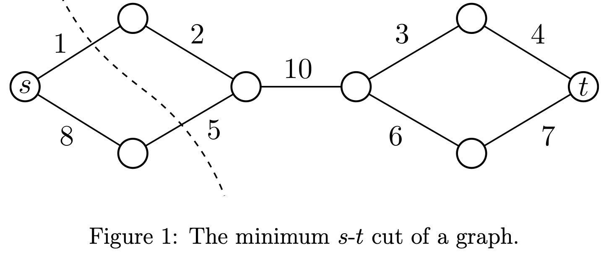
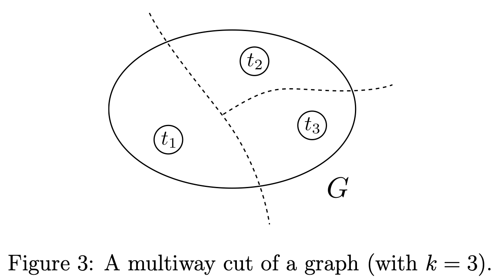

# Exact Recovery in Stable Cut Instances
In questa sezione vedremo un tema introdotto implicitamente in [[7 - Clustering in Pertubation-Stable Instances]]: la **exact recovery**.

La domanda di interesse in questione è:

> dato un algoritmo $A$, per quali istanze $A$ risolve il problema in maniera **esatta**?

Per esempio noi sappiamo che l'[[7 - Clustering in Pertubation-Stable Instances#Single-Link|Single-Link++]] ritrova una **soluzione ottima** per ogni istanza [[7 - Clustering in Pertubation-Stable Instances#^a9d2c7|3-stabile]] del [[6 - Clustering in Approximation-Stable Instances#k-Median Problem|k-median clustering]].

Noi considereremo l'algoritmo $A$ in questione come un algoritmo già pronto e implementato a nostra disposizione (come un risolutore di *programmazione lineare*).
Questo perché generalmente (in pratica) progettare un nuovo algoritmo da zero è spesso l'ultima risorsa.
Quello che vogliamo fare invece prendere un algoritmo già noto e cercare di dire qualcosa di più raffinato rispetto all'analisi *worst-case*.

Più in generale siamo interessati a spiegare in quali situazioni problemi *NP-hard* possono essere risolti in maniera **esatta** in **tempo polinomiale** tramite la programmazione lineare.

Per riscaldarci, analizzeremo problemi di **taglio su grafi**, sotto però l'assunzione di $\gamma$-[[7 - Clustering in Pertubation-Stable Instances#^a9d2c7|stabilità]].

-----
# The Minimum $s$-$t$ Cut Problem
Una istanza del  **Minimum** $s$-$t$ **Cut Problem** è composta da:
- Un grafo **non diretto** $G=(V,E)$
- Un nodo **sorgente** $s \in V$
- Un nodo **destinazione** $t \in V$
- Una **funzione di costo** $c_e > 0$ **positiva** per ogni arco $e \in E$

L'obiettivo è quello di trovare un $(s-t)$-cut, ovvero una **partizione** $(A, \overline{A})$ di $V$, tale che $s \in A$ e $t \in \overline{A}$ e tale che **minimizza** la somma dei costi degli archi del taglio.

$$\overline{A} \equiv V \setminus A$$
$$A \equiv \arg \min_{A \subset V}\bigg\lbrace \sum_{e \in (A, \overline{A})}  c_e \; : s \in A \land t \in \overline{A} \bigg\rbrace$$


 ^ec4325

```ad-note
È possibile risolvere questo problema in **tempo polinomiale**.
Per esempio, sfruttando il Max-flow/Min-cut theorem](https://en.wikipedia.org/wiki/Max-flow_min-cut_theorem), possiamo risolvere tale problema tramite un semplice algoritmo di **flustto** (come l'[algoritmo di Ford–Fulkerson](https://en.wikipedia.org/wiki/Ford–Fulkerson_algorithm)).
```

Vedremo come poter modellizzare tale problema come un problema di **Programmazione Lineare**.

```ad-important
Per semplicità che la soluzione ottima sia **unica** (tanto è possibile generalizzare).
```

## $s$-$t$ Min-Cut as LP Problem
Abbiamo due insiemi di **variabili decisionali**.

Per prima, abbiamo una variabile decisionale **non negativa** $x_e \geq 0$ per ogni arco $e \in E$, con la semantica che
- $x_e = 1$ se l'arco $e$ appartiene al taglio
- $x_e = 0$ altrimenti

Dopodiché abbiamo una variabile decisionale **non negativa** $d_v \geq 0$ per ogni nodo $v \in V$, con la semantica che
- $d_v = 0$ se il nodo $v$ appartiene alla partizione $A$ in cui si trova la sorgente $s$
- $d_v = 1$ se il nodo $v$ appartiene alla partizione $\overline{A}$ in cui si trova la destinazione $t$

Data tali semantiche, due **vincoli** ovvi sono $$\begin{align}d_s &= 0\\d_t &= 1\end{align}$$

Un vincolo un può più interessante rafforza la proprietà che se due estremi di un arco $e = (u,v)$ appartengono a due versanti apposti, allora $e$ fa parte del taglio.
$$\begin{align}
x_e &\geq d_u - d_v\\
x_e &\geq d_v - d_u
\end{align} \;\;\; \forall e=(u,v) \in E$$

Osservare che tale vincolo è equivalente a singolo vincolo $x_e \geq \vert d_u - d_v \vert$.
Per visualizzare il perché di questo vincolo, supponiamo di avere due estremi di uno stesso arco $e = (u,v)$ in due versanti opposti.
Senza perdita di generalità, diciamo che $d_u = 0$ e $d_v = 1$ (il caso opposto è simmetrico).
Supponiamo per assurdo che $x_e = 0$.
Se così fasse, allora non rispetteremo il voncolo $x_e \geq d_v - d_u$.
Perciò per forza $x_e = 1$, ovvero appartiene al taglio.

Infine, la funzione obiettivo è la seguente $$\min \sum_{e \in E} c_e x_e$$
Denotiamo questa modellizzazione del problema in programmazione lineare col termine **LP1**.

È evidente che qualsiasi $(s-t)$-cut $(A, \overline{A})$ induce una **soluazione ammissibile** per **LP1** composta da soli 0-1.
Infatti, poniamo $d_v = 0$ per ogni $v \in A$, $d_v = 1$ per ogni $v \in \overline{A}$, $x_e = 1$ per ogni $e \in (A, \overline{A})$ e $x_e = 0$ per tutti gli altri.

```ad-warning
Viceversa però, esistono soluzioni ammissibili di **LP1** che non corrispondono a un $(s-t)$-cut.

Per esempio consideriamo l'istanza in [[#^ec4325|immagine]], poniamo $x_e = \frac{1}{5}$ per ogni arco $e$, e $d_v = \frac{h_v}{5}$ dove $h_v$ è il numero di *salti* che distanziano il nodo $v$ dalla sorgente $s$.
In tal caso vengono rispettati tutti i vincoli, però non tale soluzione ammissibile non corrisponde a nessun taglio.
```


```ad-important
I problemi di programmazione lineare possono essere risolti in efficientemente, sia praticamente che teoricamente.

> **Fact 1** Esiste un algoritmo polinomiale per i problemi di programmazione lineare.
```

> **Proposition 1**
> Per ogni istanza $X$ di $s$-$t$ Min-Cut che ammette una **unica soluzione ottima**, allora riducendo tale istanza ad una istanza $Y$ di tipo **LP1** avremo che l'unica soluzione ottima di $Y$ opportunamente codificata equivale al $s$-$t$ taglio minimo per $X$.

^0d39b5

Il punto chiave della [[#^0d39b5|Proposizione 1]] è che, anche se l'area delle soluzioni ammissibili comprende un'infità di soluzioni che non corrispondono in $(s-t)$-cut, la soluzione ottima invece corrisponde in una soluzione **intera** dalla quale si può ricavare un taglio.

Prima di provare tale affermazione, indichiamo con $C^* \subseteq E$ l'$(s-t)$-cut **minimo**, e con $C$ un generico $(s-t)$-cut.
Indichiamo con $$\Delta(C) = \sum_{e \in C \setminus C^*} c_e - \sum_{e \in C^* \setminus C} c_e$$ la quantità di costo di $C$ in **eccesso** rispetto a $C^*$.
Alternativamente possiamo definirlo come $$\Delta(C) = \text{cost}(C) -  \text{cost}(C^*)$$

Dato che $C^*$ è per definizione ottimo, avremo che $$\Delta(C) \geq 0$$ per ogni $(s-t)$-cut $C$.

Infine, dato che per assunzione $C^*$ è unico, avremo che $$\Delta(C) = 0 \iff C \equiv C^*$$ ^bb7b39

Analogamente per una soluzione ottima $(\hat{\mathbf{x}}, \hat{\mathbf{d}})$ per **LP1**, indichiamo con $\Delta(\hat{\mathbf{x}})$ la misura in cui il valore della funzione obiettivo della soluzione intera corrispondente a $C^*$ supera quello di $\hat{\mathbf{x}}$.
Più chiaramente, sia $(\mathbf{x}^*, \mathbf{d}^*)$ la codifica opportuna in programmazione lineare di $C^*$.
Allora $\Delta(\hat{\mathbf{x}})$ è definito come
$$\begin{align}
\Delta(\hat{\mathbf{x}}) &= \text{cost}(\hat{\mathbf{x}}, \hat{\mathbf{d}}) - \text{cost}(\mathbf{x}^*, \mathbf{d}^*)\\
\\
&= \sum_{e \notin C^*} c_e \hat{x}_e - \sum_{e \in C^*} c_e (1 - \hat{x}_e)
\end{align}$$

Dato che $(\mathbf{x}^*, \mathbf{d}^*)$ è una soluazione **ammissibile** per **LP1**, e dato che $(\hat{\mathbf{x}}, \hat{\mathbf{d}})$ è ottima, avremo che $$\Delta(\hat{\mathbf{x}}) \leq 0$$

> **Lemma 1**
> Esiste un algoritmo **probabilistico** che computa un (*random*) $(s-t)$-cut $C$ tale che, per ogni arco $e \in E$, $$P(e \in C) = \hat{x}_e$$ e $$P(e \notin C) = 1 - \hat{x}_e$$

^91cb8a

Assumendo che il [[#^91cb8a|Lemma 1]] sia vero, dimostriamo la [[#^0d39b5|Proposizione 1]].

> **Proof of Proposition 1**
> Assumiamo che [[#^91cb8a|Lemma 1]] sia vero, e sia $C$ il *random* $(s-t)$-cut generato da tale algoritmo.
> In media il valore di $\Delta(C)$ sarà
> $$\begin{align}
\mathbb{E}\left[ \Delta(C) \right]
&= \mathbb{E}\left[ \text{cost}(C) - \text{cost}(C^*) \right]\\
&= \sum_{e \in C \setminus C^*} c_e \cdot P(e \in C) - \sum_{e \in C^* \setminus C} c_e \cdot P(e \notin C)\\
&= \sum_{e \in C \setminus C^*} c_e \hat{x}_e - \sum_{e \in C^* \setminus C} c_e (1 - \hat{x}_e)\\
&= \Delta(\hat{\mathbf{x}})\\
&\leq 0
\end{align}$$
> Dato che $\Delta(C)$ è sempre non negativa a meno che $C \equiv C^*$ ([[#^bb7b39|vedi]]), e dato che in media esso assume valore $\leq 0$, allora avremo che, **con probabilità 1**, l'algoritmo restituisce esattamente $C^*$ $\square$.

```ad-important
Importante osservare che, dato che l'algoritmo probabilistico del [[#^91cb8a|Lemma 1]] induce la soluzione ottima $C^*$, allora avremo necessariamente che $(\hat{\mathbf{x}}, \hat{\mathbf{d}})$ è una **soluzione intera** composta da soli 0-1.
```

> **Proof of Lemma 1**
> Sia $(\hat{\mathbf{x}}, \hat{\mathbf{d}})$ la soluzione ottima per **LP1**.
> Intuitivamente, l'algoritmo in questione espande una *"bolla"* centrata in $s$ fino a una dimensione casuale, e tutto ciò che è incluso nella bolla apparterrà alla partizione della sorgente.
> 
> 1. Campiona uniformemente a caso un "*raggio*" $r \in (0, 1)$.
> 2. $A \equiv \lbrace v \in V: \hat{d}_v \leq r \rbrace$
> 3. Return $C = (A, V \setminus A)$
> 
> Dato che $d_s = 0$ e $d_t = 1$ certamente $C$ è un $(s-t)$-cut (con probabilità 1).
> 
> Consideriamo ora un generico arco del taglio $e = (u, v) \in C$.
> Assumiamo senza perdita di generalità che $u \in A$ e $v \in \overline{A}$ (il caso simmetrico è analogo).
> Allora avremo che
> $$\begin{align}
P(e \in C)
&= P(u \in A \cap v \notin A)\\
&= P(\hat{d}_u \leq r, \hat{d}_v > r)\\
&= P(r \in \left[ \hat{d}_u, \hat{d}_v \right))\\
&= \hat{d}_v - \hat{d}_u\\
&\leq \hat{x}_e
\end{align}$$
> Per concludere l'uguaglianza basta dimostrare che l'ottimalità di $(\hat{\mathbf{x}}, \hat{\mathbf{d}})$ implica che $\hat{x}_e = \vert \hat{d}_u - \hat{d}_v \vert$ per ogni arco $e = (u,v) \in E$.
> 
> Supponiamo <u>per assurdo</u> che esiste un arco $e = (u,v) \in E$ tale che $\hat{x}_e > \vert \hat{d}_u - \hat{d}_v \vert$.
> Se così fosse, possiamo ricavare da $(\hat{\mathbf{x}}, \hat{\mathbf{d}})$ una soluzione migliore, semplicemente ponendo $\hat{x}_e = \vert \hat{d}_u - \hat{d}_v \vert$, ottenendo così una soluzione con un valore minore e contraddicendo l'ottimalità di $(\hat{\mathbf{x}}, \hat{\mathbf{d}})$.
> 
> Perciò avremo che $P(e \in C) = \hat{x}_e$, e di conseguenza $P(e \notin C) = 1 - \hat{x}_e$ $\square$.

----
# Stable Instances of the Minimum Multiway Cut Problem
In questa sezione vedremo come riportare il risultato della [[#^0d39b5|Proposizione 1]] a una generalizzazione *NP-hard* del problema $s$-$t$ Min-Cut problem, sostituendo l'assunzione di **unicità della soluzione ottima** con un'assunzione di **stabilità su perturbazioni** della soluzione ottima, e dimostrando ancora che è possibile ricavare la soluzione ottima tramite programmazione lineare.

Una istanza del **Minimum Multiway Cut Problem** è composta da:
- Un grafo **non diretto** $G=(V,E)$
- Una **funzione di costo** $c_e > 0$ **positiva** per ogni arco $e \in E$
- Un sottoinsieme $k$ di nodi $\lbrace t_1, ..., t_k \rbrace \subseteq V$ detti **terminali**

Un **multiway cut** è un **partizionamento** di $V$ in $k$ sottoinsiemi $S_1, ..., S_k$ tali che $t_i \in S_i$ per ogni $i = 1, ..., k$.

L'obiettivo è trovare un *multiway cut* $S_1, ..., S_k$ che minimizzi la dimensione degli archi del taglio $(S_1, ..., S_k)$.
$$(S_1, ..., S_k) \equiv \lbrace (u,v) \in V : u \in S_i, v \in S_j, 1 \leq i < j \leq 2 \rbrace$$
$$\text{cost}(S_1, ..., S_k) = \sum_{e \in (S_1, ..., S_k)} c_e$$

> [!note]
> Il problema [[#The Minimum $s$-$t$ Cut Problem|s-t Min-Cut]] è un caso particolare del Minimum Multiway Cut Problem con $k = 2$.

```ad-tldr
Minimum Multiway Cut Problem è *NP-hard* per ogni $k \geq 3$.
```



Poiché il problema è *NP-hard*, non ci aspettiamo di recuperare una soluzione ottima utilizzando la programmazione lineare anche nel caso peggiore.
Ma possiamo farlo sotto un'ipotesi di stabilità, analogamente a come abbiamo fatto in [[7 - Clustering in Pertubation-Stable Instances]].

> **Def. ($\gamma$-perturmation)**
> Una $\gamma$-**perturbazione** di una istanza $\langle G=(V,E), c : E \to \mathbb{R}^+, t_1, ..., t_k \rangle$ del *Minimum Multiway Cut Problem* è una nuova istanza $\langle G=(V,E), \tilde{c} : E \to \mathbb{R}^+, t_1, ..., t_k \rangle$ (derivante dalla prima) tale che ogni costo originale $c_e$ è rimpiazzato da uno **perturbato** $\tilde{c}_e = \sigma_e \cdot c_e$, per qualche valore $\sigma_e \in \left[ 1, \gamma \right]$.

^6bd4b1

> **Def. ($\gamma$-stable instace)**
> Sia $\langle G=(V,E), c : E \to \mathbb{R}^+, t_1, ..., t_k \rangle$ una istanza del *Minimum Multiway Cut Problem*, con **soluzione ottima** $(S^*_1, ..., S^*_k)$.
> Per ogni $\gamma \geq 1$, diremo che tale istanza è $\gamma$**-stable** se a fronte di una qualsiasi $\gamma$[[#^6bd4b1|-perturbazione]], la soluzione $(S^*_1, ..., S^*_k)$ rimane **ottima**.

^946a69

## Minimum Multiway Cut Problem as LP Problem
Definiamo ora una codifica **LP2** del problema in *programmazione lineare*, la quale è una **estensione** di [[#$s$-$t$ Min-Cut as LP Problem|LP1]].

Come prima abbiamo un insieme di **variabili decisionali** $x_e \geq 0$ per ogni arco $e \in E$, le quali indicano (come prima) quale arco $e$ appartiene al taglio.

Per ogni nodo $v \in V$, abbiamo ora l'**insieme** di variabili decisionali $d^k_v, ..., d^k_v \geq 0$, le quali intuitivamente vengono intese come:
- se $d^i_v = 1$ allora il nodo $v$ appartiene alla partizione $S_i$.
- per tutte le altre partizioni $j \neq i$ invece $d^j_v = 0$.

Il primo insieme di **vincoli** indicano che ciascun terminale è assegnato alla sua partizione $$d^i_{t_i} = 1 \;\; \forall i = 1, ..., k$$
Per ogni altro nodo $v$ invece, insistiamo sul fatto che siano completamente assegnati (quantomeno **frazionatamente**) alle diverse partizioni $$\sum_{i = 1}^{k} d^i_v = 1 \;\;\; \forall v \in V$$

Poi vogliamo che ogni arco $e$ che ha due estremi in due partizioni differenti, deve necessariamente appartenere al taglio.
Per ogni $e = (u,v) \in E$ abbiamo
$$\begin{align}y^i_e &\geq d^i_u - d^i_v\\ y^i_e &\geq d^i_v - d^i_u\end{align}$$
La variabile $y^i_e$ è solamente una **variabile ausiliare**.
Questo vincolo afferma che la differenza nella misura in cui i due estremi $u,v$ dell'arco $e$ sono assegnati alla partizione $S_i$ dovrebbe contribuire nella misura in cui $e$ apparteine al taglio.

Infine abbiamo per ogni arco $e \in E$ il vincolo $$x_e = \frac{1}{2} \sum_{i=1}^{k} y^i_e$$
Osserviamo che, se entrambi gli estremi di un arco $e$ sono assegnati **interamente** a due partizioni differenti $S_h, S_\ell$ (con $h \neq \ell$), avremo che $y^h_e = y^{\ell}_e = 1$ e che quindi $\sum_{i=1}^{k} y^i_e = 1$, e questo giustifica il fattore $1/2$ (noi vogliamo che $0 \leq x_e \leq 1$).

```ad-note
Ogni *multiway cut* $S_1, ..., S_k$ induce una soluzione intera (0-1) per **LP2**.
Per ogni arco del taglio basta porre $x_e = 1$, e per tutti gli altri invece $x_e$.
Invece, pergni partizine $S_i$ e per ogni nodo $v \in S_i$ porre $d^i_v = 1$ e $d^j_v = 0$ (per $j \neq i$).
```


## Main Result

> **Theorem**
> Per ogni istanza $\gamma$[[#^946a69|-stabile]] di *Multiway Minimum Cut Problem* con $\gamma > 4$, la soluzione al problema **LP2** corrispone ad un multiway cut **ottimo** (*opportunamente decodificato*).

Sia $C^* = (S^*_1, ..., S^*_k)$ l'**unico** multiway cut **ottimo** (e $\gamma$-stabile con $\gamma > 4$).
Sia invece $C$ un generico multiway cut ammissibile.

Definiamo allora $$\Delta_4(C) = \sum_{e \in C \setminus C^*} c_e - 4 \sum_{e \in C^* \setminus C} c_e$$ o in alternativa $$\Delta_4(C) = \text{cost}(C) - \text{cost}(C^*) - 3 \cdot \text{cost}(C^* \setminus C)$$
Certamente abbiamo che $$\Delta_4(C^*) = 0$$

> **Lemma 2**
> Sia $C^*$ il multiway cut **ottimo**, e $C \not\equiv C^*$ un altro multiway cut ammissibile.
> Se l'istanza in questione è $\gamma$[[#^946a69|-stabile]] con $\gamma > 4$ allora avremo che $$\Delta_4(C) > 0$$

> **Proof of Lemma 2**
> [TODO]

Sia $(\hat{\mathbf{x}}, \hat{\mathbf{y}}, \hat{\mathbf{d}})$ la soluzione **ottima** per **LP2**.
Come prima definiamo $$\Delta(\hat{\mathbf{x}}) = \sum_{e \notin C^*} c_e \hat{x}_e - \sum_{e \in C^*} c_e (1 - \hat{x}_e)$$
E dato che $C^*$ è ottima abbiamo che $$\Delta(\hat{\mathbf{x}}) \leq 0$$

> **Lemma 3**
> Esiste un algoritmo **probabilistico** che computa un (*random*) multiway cut $C$ tale che, per ogni arco $e \in E$, $$P(e \in C) \leq 2\hat{x}_e$$ e $$P(e \notin C) \geq \frac{1 - \hat{x}_e}{2}$$


