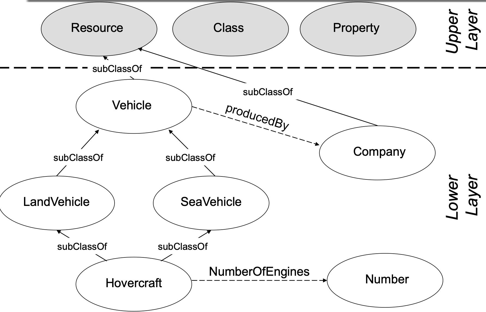

Purtroppo [[RDF]] non consente di definire le relazioni a un livello di astrazione più alta.
Per esempio non consente di specificare **categorie** di oggetti con le rispettive **proprietà**, **restrizioni** e **relazioni tra le categorie**.

**RDF Schema** (o **RDFS**) estende RDF, consentendo di definire **Classi**, **Sottoclassi**, **Prorpietà**, **Sottoproprietà**, **Vincoli**, **range**, **domini**, ...

Grazie a questa estensione, RDF può essere considerato a tutti gli effeti un linguaggio per la rappresentazione della conoscenza, perché consente descrivere le entità, le relazioni tra loro, e tutte le entità astratte con relativa proprietà e relazioni.

Il vocabolario principale di RDFS introduce i seguenti termini principali:
- **rdfs:Resource** Tutte le cose descritte attraverso espressioni RDF sono risorse e sono considerate istanze della classe rdfs:Resource. rdfs:Resource può essere vista una **superclasse** di tutte le classi.
- **rdfs:Class** Rappresenta il generico concetto di **tipo** o **categoria**. Le classi sono univocamente definite dall'insieme delle proprie istanze. Perciò due classi che hanno lo stesso insieme di stanze sono definite **equivalenti**.
- **rdf:type** Questo elemento esiste già nel vocabolario RDF, ma in RDFS lega le risorse alle categorie (classi) a cui appartengono. È analogo al costrutto **instanceOf** del design orientato agli oggetti (OO).
- **rdf:Property** Anche questo termine viene dal vocabolario RDF, e rappresenta il sottoinsieme di tutte le risorse RDF che sono proprietà di un'altra risorsa.
- **rdfs:subClassOf** Questa è una relazione di **incusione** tra class. Se $A$ è `rdfs:subClassOf` $B$ allora $A$ è un **sottoinsieme** di $B$. È una proprietà transitiva.
- **rdfs:subPropertyOf** Questa proprietà è usata per indicare che una proprietà è una specializzazione di un'altra proprietà.
- **rdfs:range** Dichiara che tutti i valori che può assumere una certa proprietà appartengono ad una data classe. 
- **rdfs:domain** Dichiara che tutte le risorse caratterizzate da una certa proprietà appartengono ad una data classe.

Esistono anche dei termini utili per commentare/documentare una base di conoscenza, anche se non sono particolarmente utili per la semantica.
- **rdfs:comment**: il modo più generale per commentare qualcosa. In genere fornisce una definizione in linguaggio naturale della risorsa che la contiene.
- **rdfs:label**: fornisce (singoli) termini per descrivere una risorsa.
- **rdfs:seeAlso**: contiene un puntatore ad un'altra risorsa che contiene ulteriori informazioni circa il soggetto di tale proprietà
- **rdfs:isDefinedBy**: è una sottoproprietà di **rdfs:seeAlso** e punta alla risorsa che descrive la proprietà soggetto.

Per esempio, supponiamo di avere la classe `Person` con sottoclasse `Provider`.
La codifica in RDF/XML sarà
```xml
<rdfs:Class rdf:ID="Provider">
	<rdfs:subClassOf rdf:resource="#Person"/>
<rdfs:Class />
```

## Schema di esempio


```turtle
@prefix : <http:/example.com/> .
@prefix rdf: <http://www.w3.org/1999/02/22-rdf-syntax-ns#> .
@prefix rdfs: <http://www.w3.org/2000/01/rdf-schema#> .

:Vehicle a rdfs:Class ;
	rdfs:subClassOf rdfs:Resource .

:LandVehicle a rdfs:Class ;
	rdfs:subClassOf :Vehicle .

:SeaVehicle a rdfs:Class ;
	rdfs:subClassOf :Vehicle .

:Hovercraft a rdfs:Class ;
	rdfs:subClassOf :LandVehicle, :SeaVehicle .

:numberOfEngines a rdfs:Property ;
	rdfs:domain :Hovercraft ;
	rdfs:range xsd:integer ;
	rdfs:comment "This property states how many engines the hovercraft has"@en .

:Company a rdfs:Class ;
	rdfs:subClassOf rdfs:Resource .

:producedBy a rdfs:Property ;
	rdfs:domain :Vehicle ;
	rdfs:range :Company ;
	rdfs:label "Vehicle Producer"@en .
```
