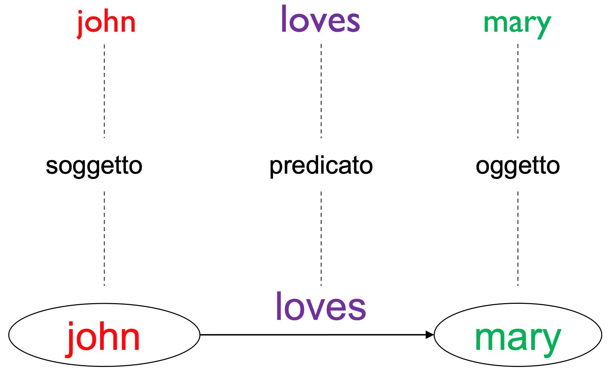
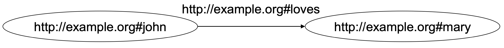
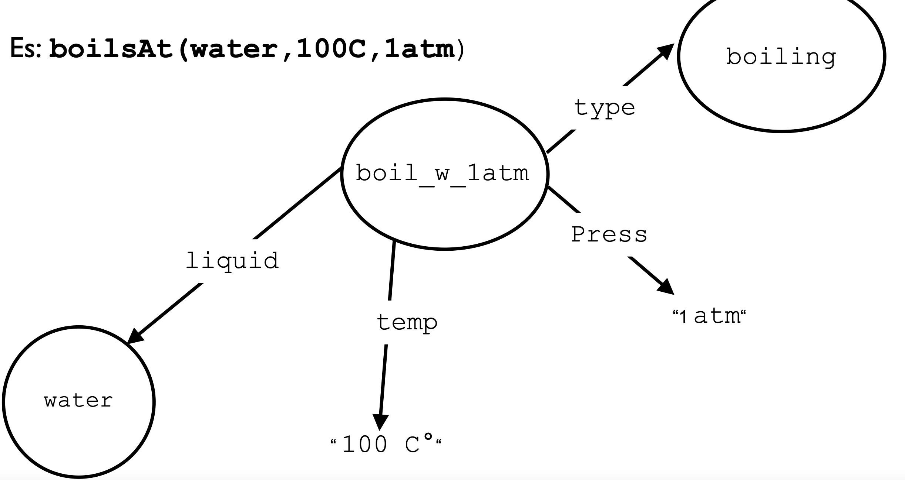
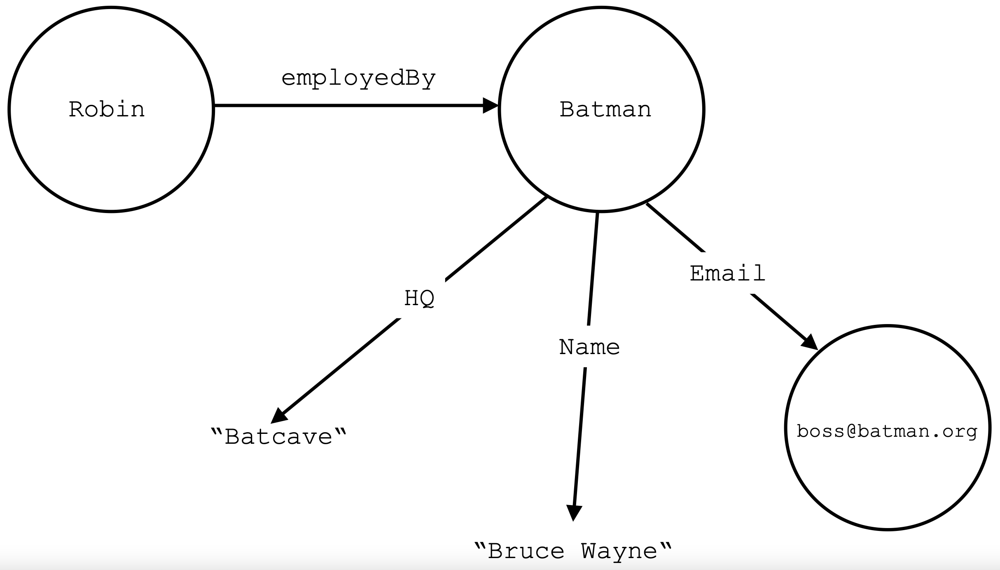

Il **Resource Description Framework** (**RDF**) è lo strumento base proposto da [W3C](https://it.wikipedia.org/wiki/W3C "W3C") per la codifica, lo scambio e il riutilizzo di metadati strutturati e consente l'interoperabilità semantica tra [applicazioni](https://it.wikipedia.org/wiki/Applicazioni "Applicazioni") che condividono le informazioni sul [Web](https://it.wikipedia.org/wiki/Web "Web").

Tutto in RDF è **univocamente identificato** da **IRI** (*Internationalized Resource Identifier*).

Il modello di dati in RDF è formato da **risorse**, **proprietà** e **valori**.
Le **proprietà** sono delle **relazioni** che legano tra loro **risorse** a **valori** o **altre risorsa**, e sono anch'esse identificate da IRI.
Un **valore**, invece, è un **tipo di dato primitivo**, che può essere una stringa contenente l'IRI di una risorsa.

L'unità base per rappresentare un'informazione in RDF è lo **statement**.
Uno **statement** è una **tripla** del tipo $$\langle\text{Soggetto}, \text{Predicato}, \text{Oggetto}\rangle$$dove
- il soggetto è una risorsa
- il predicato è una proprietà
- l'oggetto è un valore (e quindi anche un IRI che punta ad un'altra risorsa).

Un insieme di triple può essere visto come un **grafo RDF** diretto etichettato, nel quale ogni tripla assume la seguente forma:


L'**indipendenza**, la **condivisibilità** e la **scalabilità** sono date da RDF tramite il fatto che <u>tutto</u> su RDF è una **risorsa**.
- le prorpietà sono risorse
- i valori possono essere risorse
- le triple possono essere risorse

# Componenti di una Tripla
I componenti di una **tripla** possono essere:
- un **IRI** (*Internationalized Resource Identifier*), ovvero una **stringa UNICODE** conforme a RFC 3987, che identifica univocamente una **risorsa**.
- un **literal**, ovvero un valore di tipo primito, generalmente una **stringa** o un **IRI**
- un **blank node** (o **bnode**)

Ci sono alcuni vincoli sull’uso di IRI, blank node e literal in una tripla:
- Il **soggetto** può essere un **IRI** o un **bnode**
- Il **predicato** può essere un **IRI**
- L’**oggetto** può essere un **IRI**, **bnode** o **literal**



Si usano gli IRI per due motivi in particolare:
- un IRI è univoco a livello globale, e ogni occorrenza di IRI punta alla stessa risorsa
- essendo unico, è possibile **deferenziarlo** e far sì che punti al linked data

# Dataset
Il concetto di **dataset** è simile al concetto di **base di dati** nei classici sistemi di basi di dati.

Dato che le collezioni di triple rappresentano dei dati orientati, allora possiamo definire un dataset come l'insieme di:
-  Un **default graph**(senza nome)
- Zero o più **named graph**. Ogni named graph è una coppia formata da un IRI (il nome del grafo) e da un grafo RDF.

Perciò a questo punto invece di parlare di triple, parliamo di **quadruple** del tipo $$\langle\text{Graph-name},\text{Soggetto}, \text{Predicato}, \text{Oggetto}\rangle$$

# Semantica RDF
Una tripla in un grafo RDF rappresenta una **asserzione** all'interno del mondo dei nostri dati.
Il **significato** di un grafo RDF è quindi la **congiunzione logica degli statement** associati alle triple.

Più precisamente la logica RDF è una logica del primo ordine del tipo **esistenziale-congiuntiva**, ovvero si può affermare che esiste qualcosa che è vera ma non si può dedurre se una cosa è falsa se non esiste (**ipotesi del mondo aperto**).
- non ammette la negazione (**NOT**)
- non ammette la disgiunzione (**OR**)

Cosa inusuale per un linguaggio che rappresenti una restrizione della logica del primo ordine, RDF permette asserzioni riguardanti relazioni:

```prolog
type(loves, social_relation)
loves(Tom, Mary)
```

Una tripla può anche contenere **bnode**, che si comportano come variabili quantificate esistenzialmente:

```prolog
loves(?x, Mary)
```
ci dice che *"qualcuno ama Mary"* o, più precisamente, che *"qualcosa ama Mary"*.

La combinazione di diverse asserzioni, tramite l’unificazione delle variabili, ci permette di esprimere conoscenza complessa, ma non completamente istanziata:
```prolog
gender(?x, male) AND loves(?x, Mary)
```   
ci dice che *"Mary è amata da un maschio"*.

# Relazione n-arie
Tramite la combinazione di relazioni binarie è possibile definire relazioni di qualsiasi arità.

Prendiamo per esempio la relazione
```prolog
boilsAt(water, 100c°, 1atm)
```
che dice che l'acqua, sotto una atmosfera, bolle a 100c°.

Può essere espressa in binario come
```prolog
type(boil_at_1atm, boiling)
pressure(boil_at_1atm, 1atm)
temperature(boil_at_1atm, 100c°)
liquid(boil_at_1atm, water)
```



# Sintassi
Tra le **sintassi** più importanti che implementano RDF abbiamo **RDF/XML** e **Turtle**.

**RDF/XML** è un sintassi di RDF basata appunto su XML.
Grazie all'espressività di XML è possibile mascherare la rigorosa notazione a trieple mediante costrutti sintattici più sofisticati.

**Turtle** è una sintassi molto più semplice e meno espressiva di XML, che però consente solamente di definire grafi RDF validi.
Grazie a queste caratteristiche Trutle è considerata essere un'alternativa molto migliore di RDF/XML.

## Esempio serializzazioni
Consideriamo il seguente grafo di relazioni


La relativa serializzazione RDF/XML sarà
```xml
<rdf:RDF
	xml:base = "http://www.Batman.org"
	xmlns:rdf = "http://www.w3.org/1999/02/22-rdf-syntax-ns#"
	xmlns:mySchema = "http://www.Batman.org/mySchema/">
	
	<rdf:Description rdf:about = "http://www.Batman.org#Robin/"> 
		<mySchema:employedBy rdf:resource = "#Batman"/>
	</rdf:Description>
	
	<rdf:Description rdf:ID = "Batman">
		<mySchema:HQ>Batcave</mySchema:HQ>  
		<mySchema:Name>Bruce Wayne</mySchema:Name>
		<mySchema:Email rdf:resource = "mailto:boss@batman.org" />
	</rdf:Description>
	
</rdf:RDF>
```

Abbiamo che le risorse possono essere identificate da un `rdf:about` o un `rdf:ID`.
L'`rdf:about` necessita di specificare l'itero IRI, mentre `rdf:ID` antecede al valore dell'id il path di base `xml:base`.
Perciò nel nostro esempio `rdf:ID = "Batman"` sarà equivalente a `rdf:about = "http://www.Batman.org#Batman"`.

La sintassi in Turtle sarà invece
```turtle
@base <http://www.Batman.org> .
@prefix mySchema: <http://www.Batman.org/mySchema/> .

<http://www.Batman.org#Robin> mySchema:employedBy <#Batman> .

<#Batman> mySchema:HQ "Batcave" ;
          mySchema:Name "Bruce Wayne" ;
          mySchema:Email <mailto:boss@batman> .
```