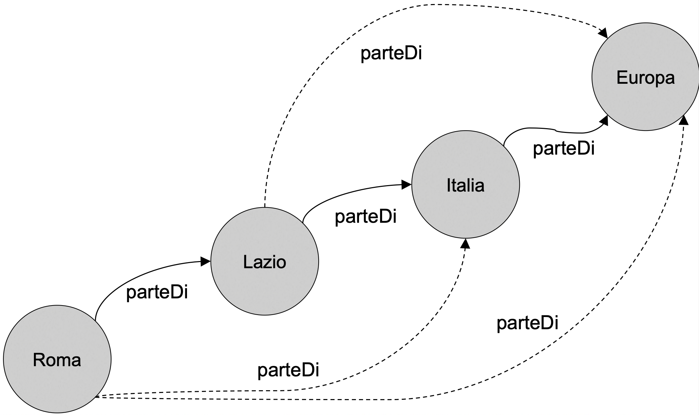
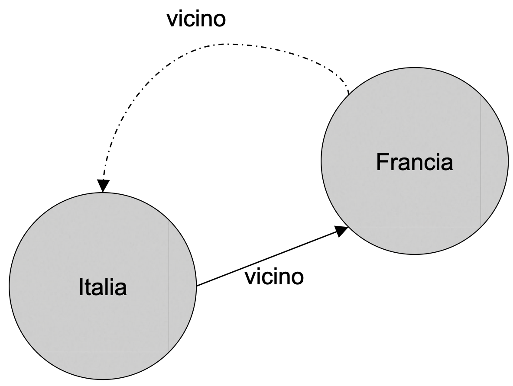
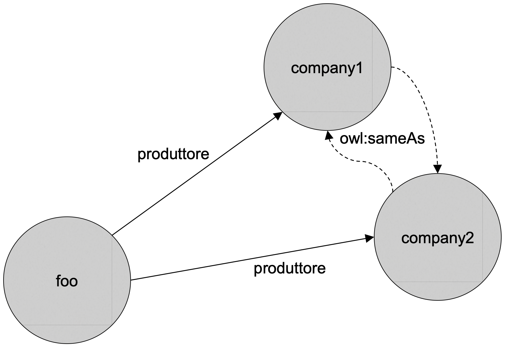
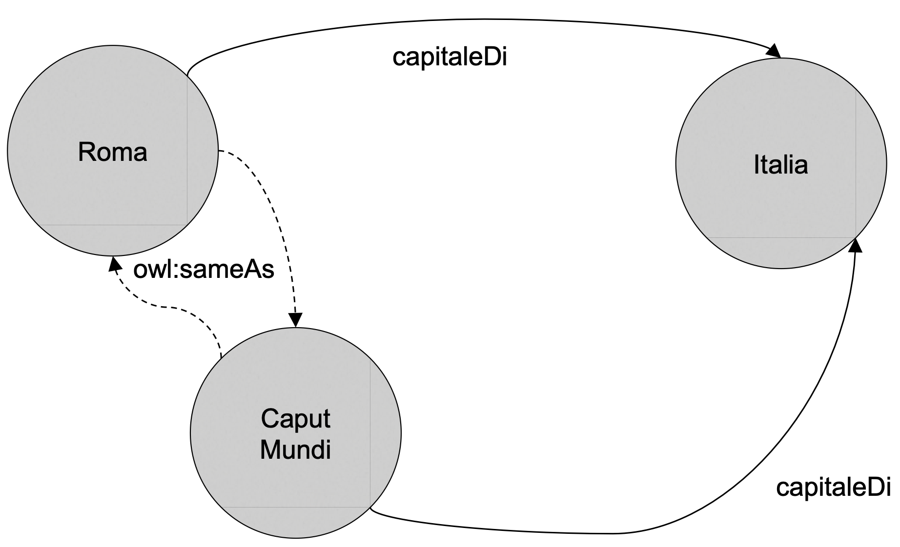

# Classi
Anche in OWL una **classe** rappresenta una **raccolta** di oggetti.
Una classe può essere una **sottoclasse** di un'altra, ereditando le caratteristiche dalla sua **superclasse**.
In notazione **description logic** (o **DL**) con $A \sqsubseteq B$ che $A$ è una sottoclasse di $B$.

Tutte le classi sono sottoclassi di `owl:Thing`, la **superclasse radice**, denotata con $\top$.
Perciò in DL $A \sqsubseteq \top$ à una tautologia.
```xml
<!-- Definizione esplicita di classe -->
<owl:Class rdf:ID="Person" />

<!-- Modo per descrivere le istanze di una classe -->
<Person rdf:ID="manuel" />

<owl:Thing rdf:ID="manuel">
	<rdf:type rdf:resource="#Person" />
</owl:Thing>
```

# Proprietà
Una **proprietà** è una caratteristica di una classe, ovvero una **relazione binaria** diretta che specifica un attributo per tutte le istanze di quella classe.
Le proprietà possono avere caratteristiche logiche, come ad esempio ad esempio la transitività, la simmetria, l'inversa ecc...
Le proprietà possono anche avere [[RDF Schema#^70b359|domini]] e [[RDF Schema#^e58a30|intervalli]].

## Datatype Property
Le **datatype property** sono relazioni tra **istanze** di classi e **valori letterali** RDF o tipi di dati dello schema XML.
```xml
<!-- proprietà che mette in relazione le istanze di tipo persona con le stringhe (ovvero i nomi delle persone) -->
<owl:DatatypeProperty rdf:ID="nome">
	<rdfs:domain rdf:resource="#Persona" />
	<rdfs:range rdf:resource="&xsd;string" />
</owl:DatatypeProperty>

<!-- classe Range, dove gli estremi di un intervallo sono dei float -->
<owl:Class rdf:ID="Range" />

<owl:DatatypeProperty rdf:ID="min">
	<rdfs:domain rdf:resource="#Range"/>
	<rdfs:range rdf:resource="http://www.w3.org/2001/XMLSchema#float"/>
</owl:DatatypeProperty>

<owl:DatatypeProperty rdf:ID="max">
	<rdfs:domain rdf:resource="#Range"/>
	<rdfs:range rdf:resource="http://www.w3.org/2001/XMLSchema#float"/>
</owl:DatatypeProperty>
```

## Object Property
Le **object property sono relazioni tra istanze di due classi**.
Ad esempio, OwnedBy può essere una proprietà del tipo di oggetto della classe Vehicle e può avere un intervallo che è la classe Person.
```xml
<owl:Class rdf:ID="Persona" />

<rdfs:Property rdf:ID="conosce" />
	<rdfs:domain rdf:resource="#Persona" />
	<rdfs:range rdf:resource="#Persona" />
<rdfs:Property/>

<owl:ObjectProperty rdf:ID="ama">
	<rdfs:domain rdf:resource="#Persona" />
	<rdfs:range rdf:resource="#Persona" />
	<rdfs:subPropertyOf rdf:resource="#conosce" />
</owl:ObjectProperty>
```

```turtle
:Persona rdf:type owl:Class .

:conosce rdf:type rdfs:Property ;
	rdfs:domain :Persona ;
	rdfs:range :Persona .
```


## Annotation Property
Una **annotation property** è fuori dalla semantica dell’ontologia.
Servono solo per commentare l’ontologia.

## Esempio Descrizione 
```xml
<Persona rdf:ID="armando">  
	<conosce rdf:resource="#manuel" />  
	<nome rdf:datatype="&xsd;string">Armando</nome>
</Persona>

<owl:Thing rdf:ID="manuel">
	<rdf:type rdf:resource="#Persona" />
	<nome rdf:datatype="&xsd;string">Manuel</nome>
</owl:Thing >
```

```turtle
:Armando rdf:type :Persona;
	:conosce :Manuel ;
	:nome "Armando"^^xsd:string .

:Manuel a owl:Thing ;
	rdf:type :Persona ;
	:nome "Manuel"^^xsd:string .
```

# Different From
La proprietà `owl:differentForm` collega risorse a risorse, e **specifica** che due IRI si riferiscono a due risorse **differenti**, definendo quindi dei sottoinsiemi di risorse in cui <u>non</u> vale la [[OWL#^963225|no-unique-name assumption]].

```xml
<Opera rdf:ID="Don_Giovanni"/>

<Opera rdf:ID="Nozze_di_Figaro">
	<owl:differentFrom rdf:resource="#Don_Giovanni"/>
</Opera>

<Opera rdf:ID="Cosi_fan_tutte">
	<owl:differentFrom rdf:resource="#Don_Giovanni"/>
	<owl:differentFrom rdf:resource="#Nozze_di_Figaro"/>
</Opera>
```

```xml
<Persona rdf:ID="armando">  
	<owl:differentFrom rdf:resource="#manuel" />
	<owl:differentFrom rdf:resource="#andrea" />
</Persona>

<owl:Thing rdf:ID="manuel">
	<owl:differentFrom rdf:resource="#andrea" />
</owl:Thing>

<owl:Thing rdf:ID="andrea" />
```

```turtle
:Armando rdf:type :Persona ;
	owl:differentFrom :Manuel, :Andrea .

:Manuel rdf:type owl:Thing ;
	owl:differentFrom :Andrea .

:Andrea rdf:type owl:Thing .
```

# All Different
Nei casi in cui le risorse **distinte** sono molto è sconveniente usare `owl:differentFrom`.
OWL offre quindi la classe `owl:AllDifferent`, nella quale è definita la [[#Object Property|object property]] `owl:distinctMembers`.
La proprietà `owl:distinctMembers` mette in relazione entità della classe `owl:AllDifferent`, vincolando che sono differenti risorse, (come [[#Different From|owl:differentFrom]]).

```xml
<owl:AllDifferent>
	<owl:distinctMembers rdf:parseType="Collection">
		<Opera rdf:about="#Don_Giovanni" />
		<Opera rdf:about="#Nozze_di_Figaro" />
		<Opera rdf:about="#Cosi_fan_tutte" />
		<Opera rdf:about="#Tosca" />
	    <Opera rdf:about="#Turandot" />
	    <Opera rdf:about="#Salome" />
	</owl:distinctMembers>
</owl:AllDifferent>
```

```xml
<owl:AllDifferent>
	<owl:distinctMembers rdf:parseType="Collection">
		<owl:Thing rdf:about="#armando" />
		<owl:Thing rdf:about="#manuel" />
		<owl:Thing rdf:about="#andrea" />
	</owl:distinctMembers>
</owl:AllDifferent>
```

```turtle
:x rdf:type owl:AllDifferent ;
	owl:distinctMembers (:Armando :Manuel :Andrea) .
```

# Descrizione di classi
Ci sono molteplici modi per definire una [[#Classi|classe]] in OWL.
-   In maniera implicita come se fosse una risorsa, usando un **IRI**.
-   In maniera esplicita, enumerando in maniera esaustiva l'insieme delle sue istanza.
-   Definendo una **restrizione** sulle sue proprietà.
-   Tramite **operatori insiemistici** tra classi (unione, intersezione e complemento).

## Descrizione tramite nome
Il modo più semplice per definire una classe è in maniera implicita, come se fosse una risorsa
```xml
<owl:Class rdf:ID="Human" />
```

```turtle
<Human> rdf:type owl:Class .
```

In DL $$\text{Human}$$

## Descrizione tramite enumerazione
Un altro per definire una classe è tramite un'**enumerazione** esaustiva di tutte le sue istanze.
```xml
<owl:Class rdf:ID="Continente">
	<owl:oneOf rdf:parseType="Collection">
		<owl:Thing rdf:about="#Europa"/>
		<owl:Thing rdf:about="#Africa"/>
		<owl:Thing rdf:about="#Asia"/>
		<owl:Thing rdf:about="#America"/>
		<owl:Thing rdf:about="#Oceania"/>
		<owl:Thing rdf:about="#Antartide"/>
	</owl:oneOf>
</owl:Class>
```

```turtle
:Continente rdf:type owl:Class ;
	owl:oneOf (:Europa :Africa :Asia :America :Oceania :Antartide) .
```

In DL $$\lbrace \text{Europa, Africa, Asia, America, Oceania, Antartide} \rbrace$$

## Descrizione tramite restrizioni su proprietà
Definiamo una classe come l'insieme di tutti gli individui che soddisfano certe restrizioni sull’uso di una proprietà.
Abbiamo due tipi di vincoli:
- vincoli sul **valore** di una proprietà.
- vincoli sulla **cardinalità** di una proprietà.

### Restrizioni sul valore
#### Quantificatore universale owl:allValuesFrom
Possiamo definire una classe come tutte quelle istanze tali che i valori di una certa proprietà (nell'esempio `hasParent`) appartengono **tutte** a una classe o datatype specificato.
```xml
<!-- tutte le istanze di quegli individui i cui genitori sono tutti umani -->
<owl:Restriction>
	<owl:onProperty rdf:resource="#hasParent"/>
	<owl:allValueFrom rdf:resource="#Human"/>
</owl:Restriction>

<!-- equivalente a RDFS -->
<rdfs:Class>
	<rdfs:Property rdf:ID="hasParent">
		<rdfs:range rdf:resource="#Human"/>
	</rdfs:Property>
</rdfs:Class>
```

```turtle
:x owl:equivalentClass [
	rdf:type owl:Restriction ;
	owl:onProperty :hasParent ;
	owl:allValuesFrom :Human
] .
```

In DL $$\forall \text{ hasParent } . \text{ Human}$$
#### Quantificatore esistenziale owl:someValuesFrom
Possiamo definire una classe come tutte quelle istanze tali che i **alcuni** valori di una certa proprietà (nell'esempio `hasParent`) appartengono a una classe o datatype specificato.
```xml
<!-- un insieme di tutte quelle istanze tali che hano almeno un genitore fisico -->
<owl:Restriction>
	<owl:onProperty rdf:resource="#hasParent"/>
	<owl:someValuesFrom rdf:resource="#Physician"/>
</owl:Restriction>

<!-- non esiste equivalente in RDFS -->
```

```turtle
:x owl:equivalentClass [
	rdf:type owl:Restriction ;
	owl:onProperty :hasParent ;
	owl:someValuesFrom :Physician
] .
```

In DL $$\exists \text{ hasParent } . \text{ Physician}$$

#### Uguaglianza sui valori
Possiamo definire una classe come tutte quelle istanze tali che una certa proprietà (nell'esempio `hasParent`) ha almeno un valore semanticamente uguale a quello indicato (nel nostro esempio `clinton`).
```xml
<owl:Restriction>  
	<owl:onProperty rdf:resource="#hasParent" />
	<owl:hasValue rdf:resource="#clinton" />
</owl:Restriction>
```

```turtle
:x owl:equivalentClass [
	rdf:type owl:Restriction ;
	owl:onProperty :hasParent ;
	owl:hasValue :clinton
] .
```

In DL $$\text{hasParent} \ni \text{clinton}$$


### Restrizioni sulla cardinalità
#### Massima cardinalità
```xml
<owl:Restriction>
	<owl:onProperty rdf:resource="#hasParent" />
	<owl:maxCardinality rdf:datatype="&xsd;nonNegativeInteger">
		2
	</owl:maxCardinality>
</owl:Restriction>
```

```turtle
:x owl:equivalentClass [
	rdf:type owl:Restriction ;
	owl:onProperty :hasParent ;
	owl:maxCardinality "2"^^xsd:nonNegativeInteger 
] .
```

In DL $$\leq 2 \text{ hasParent}$$

#### Minima cardinalità
```xml
<owl:Restriction>
	<owl:onProperty rdf:resource="#hasParent" />
	<owl:minCardinality rdf:datatype="&xsd;nonNegativeInteger">
		2
	</owl:minCardinality>
</owl:Restriction>
```

```turtle
:x owl:equivalentClass [
	rdf:type owl:Restriction ;
	owl:onProperty :hasParent ;
	owl:minCardinality "2"^^xsd:nonNegativeInteger 
] .
```

In DL $$\geq 2 \text{ hasParent}$$

#### Specifica cardinalità
```xml
<owl:Restriction>
	<owl:onProperty rdf:resource="#hasParent" />
	<owl:cardinality rdf:datatype="&xsd;nonNegativeInteger">
		2
	</owl:cardinality>
</owl:Restriction>
```

```turtle
:x owl:equivalentClass [
	rdf:type owl:Restriction ;
	owl:onProperty :hasParent ;
	owl:cardinality "2"^^xsd:nonNegativeInteger 
] .
```

In DL $$= 2 \text{ hasParent}$$

## Tramite operatori insiemistici
### Intersezione
```xml
<owl:Class>
	<owl:intersectionOf rdf:parseType="Collection">
		<owl:Class rdf:about="#LandVehicle" />
		<owl:Class rdf:about="#SeaVehicle" />
	</owl:intersectionOf>
</owl:Class>
```

```turtle
:x owl:equivalentClass [
	rdf:type owl:Class ;
	owl:intersectionOf ( :LandVehicle :SeaVehicle )
] .
```

In DL $$\text{LandVehicle } \sqcap \text{ SeaVehicle}$$
### Unione
```xml
<owl:Class>
	<owl:unionOf rdf:parseType="Collection">
		<owl:Class rdf:about="#LandVehicle" />
		<owl:Class rdf:about="#SeaVehicle" />
	</owl:unionOf>
</owl:Class>
```

```turtle
:x owl:equivalentClass [
	rdf:type owl:Class ;
	owl:unionOf ( :LandVehicle :SeaVehicle )
] .
```

In DL $$\text{LandVehicle } \sqcup \text{ SeaVehicle}$$

### Complemento
```xml
<owl:Class>
	<owl:complementOf>
		<owl:Class rdf:about="#Meat"/>
	</owl:complementOf>
</owl:Class>
```

```turtle
:x owl:equivalentClass [
	rdf:type owl:Class ;
	owl:complementOf :Meat
] .
```

In DL $$\lnot \text{ Meat}$$

---------
# Assiomi sulle classi
OWL supporta i seguenti **assiomi** (o **relazioni**) tra classi
- `rdfs:subClassOf`
- `owl:equivalentClass`
- `owl:disjointWith`

## Sottoclasse
Ereditato da [[RDF Schema]]
```xml
<owl:Class rdf:ID="aClass">
	<rdfs:subClassOf>
        <!-- class expression ... -->
	</rdfs:subCassOf>
</owl:Class>

<owl:Class rdf:ID="aClass">  
	<rdfs:subClassOf rdf:resource="[class IRI]" />
</owl:Class>
```

```xml
<!-- ESEMPIO: class expression -->
<owl:Class rdf:ID="VinoBianco">
	<rdfs:subClassOf>
		<owl:Class>
			<owl:intersectionOf parseType="Collection">
				<owl:Class rdf:about="#Vino" />
				<owl:Restriction>
					<owl:onProperty rdf:resource="colore" />
					<owl:hasValue rdf:datatype="&xsd;string">
						bianco
					</owl:hasValue>
				</owl:Restriction>
			</owl:intersectionOf>
		</owl:Class>
	</rdfs:subClassOf>
</owl:Class>

<!-- ESEMPIO: class reource -->
<owl:Class rdf:id="VinoBianco">
	<rdfs:subClassOf rdf:resource="Vino" />
</owl:Class>
```

```turtle
# ESEMPIO: class expression
:VinoBianco rdfs:subClassOf [
	rdf:type owl:Class ;
	owl:intersectionOf (
		:Vino
		[
			rdf:type owl:Restriction ;
			owl:onProperty :colore ;
			owl:hasValue "bianco"^^xsd:string
		]
	)
] .

# ESEMPIO: class reource
:VinoBianco rdfs:subClassOf <http://other.com/WhiteWine>
```

In DL $$\text{VinoBianco} \sqsubseteq (\text{Vino } \sqcap (\text{colore} \ni \text{bianco}))$$

## Equivalenza
```xml
<owl:Class rdf:ID="aClass">
	<owl:equivalentClass>
        <!-- class expression ... -->
	</owl:equivalentClass>
</owl:Class>

<owl:Class rdf:ID="aClass">  
	<owl:equivalentClass rdf:resource="[class IRI]" />
</owl:Class>
```

```xml
<!-- ESEMPIO: class expression -->
<owl:Class rdf:ID="VinoBianco">
	<owl:equivalentClass>
		<owl:Class>  
			<owl:intersectionOf parseType="Collection">
				<owl:Class rdf:about="#Vino" />
				<owl:Restriction>
					<owl:onProperty rdf:resource="colore" />
					<owl:hasValue rdf:datatype="&xsd;string">
						bianco
					</owl:hasValue>
				</owl:Restriction>
			</ owl:intersectionOf>
		</owl:Class>
	</owl:equivalentClass>
</owl:Class>

<!-- ESEMPIO: class reource -->
<owl:Class rdf:id="VinoBianco">  
	<rdfs:owl:equivalentClass rdf:resource="http://other.com/WhiteWine" />
</owl:Class>
```

```turtle
# ESEMPIO: class expression
:VinoBianco owl:equivalentClass [
	rdf:type owl:Class ;
	owl:intersectionOf (
		:Vino
		[
			rdf:type owl:Restriction ;
			owl:onProperty :colore ;
			owl:hasValue "bianco"^^xsd:string
		]
	)
] .

# ESEMPIO: class reource
:VinoBianco owl:equivalentClass <http://other.com/WhiteWine>
```

In DL $$\text{VinoBianco} \equiv (\text{Vino } \sqcap (\text{colore} \ni \text{bianco}))$$


## Disgiunzione
In OWL è possibile dire che due classi sono **disgiunte**, ovvero che NON hanno istanze in comune
```xml
<owl:Class rdf:ID="aClass">
	<owl:disjointWith>
        <!-- class expression ... -->
	</owl:disjointWith>
</owl:Class>

<owl:Class rdf:ID="aClass">  
	<owl:disjointWith rdf:resource="[class IRI]" />
</owl:Class>
```

```xml
<owl:Class rdf:ID="Animale">  
	<owl:disjointWith rdf:resource="#Vegetale" />
	<owl:disjointWith rdf:resource="#Fungo" />
</owl:Class>

<owl:Class rdf:ID="Vegetale">
	<owl:disjointWith rdf:resource="#Fungo" />
</owl:Class>

<owl:Class rdf:ID="Fungo" />
```

```turtle
:Animale rdf:type owl:Class ;
	owl:disjointWith :Vegetale, :Fungo .

:Vegetale rdf:type owl:Class ;
	owl:disjointWith :Vegetale, :Fungo .

:Fungo rdf:type owl:Class .
```

In DL
- $$(\text{Animale } \sqcap \text{ Vegetale}) \equiv \perp$$
- $$(\text{Animale } \sqcap \text{ Fungo}) \equiv \perp$$
- $$(\text{Vegetale } \sqcap \text{ Fungo}) \equiv \perp$$

---------
# Caratteristiche sulle proprietà
Con OWL è possibile esprimere varie carateristiche sulle proprietà:
- `owl:TransitiveProperty`
- `owl:SymmetricProperty`
- `owl:FunctionalProperty`
- `owl:inverseOf`
- `owl:InverseFunctionalProperty`

## Transitività
È possibile definire la proprietà di **transitività** di una proprietà.
```xml
<owl:TransitiveProperty rdf:ID="parteDi" />

<owl:ObjectProperty rdf:ID="parteDi" >
	<rdf:type rdf:resource="&owl;TransitiveProperty" />
</owl:ObjectProperty>
```

```turtle
:parteDi rdf:type owl:TransitiveProperty .
```



## Simmetria
È possibile definire la proprietà di **simmetria** di una proprietà.
```xml
<owl:SymmetricProperty rdf:id="vicino" />

<owl:ObjectProperty rdf:id="vicino" >
	<rdf:type rdf:resource="&owl;SymmetricProperty" />
</owl:ObjectProperty>
```

```turtle
:vicino rdf:type owl:SymmetricProperty .
```



## Functional Property
Una **proprietà funzionale** è una proprietà tale che può avere un **unico valore** $y$ per ogni istanza $x$.
Perciò, se per una proprietà funzionale, abbiamo due coppie $(x,y)$ e $(x,z)$ allora deve essere necessariamente vero che $y \equiv z$.

```xml
<owl:FunctionalProperty rdf:ID="produttore" />

<owl:ObjectProperty rdf:ID="produttore" >
	<rdf:type rdf:resource="&owl;FunctionalProperty" />
</owl:ObjectProperty>
```

```turtle
:produttore rdf:type owl:ObjectProperty .
```

Ovviamente una relazione funzionale è una **object property**, in quanto un datatype non può essere funzionale.
Infatti se ho due coppie $(x,1)$ e $(x,2)$ non posso dire che $1 \equiv 2$.



## Inversa
È anche possibile dire che una relazione è l'**inversa** di un'altra.
Per esempio $$X \text{ hasChild } Y \iff Y \text{ hasParent } X$$

```xml
<owl:ObjectProperty rdf:ID="hasChild">
	<owl:inverseOf rdf:resource="#hasParent"/>
</owl:ObjectProperty>
```

```turtle
:hasChild owl:inverseOf :hasParent .
```

## Inversa Funzionale
Se una proprietà è definita **inversa funzionale** allora l'**oggetto** di una relazione definisce **univocamente** il **soggetto**.
Perciò se per una relazione inversa funzionale abbiamo le coppie $(x_1,y)$ e $(x_2,y)$ allora necessariamente deve essere vero che $x_1 \equiv x_2$.

```xml
<owl:InverseFunctionalProperty rdf:ID="capitaleDi" />


<owl:ObjectProperty rdf:ID="capitaleDi" >
	<rdf:type rdf:resource="&owl;InverseFunctionalProperty" />
</owl:ObjectProperty>
```

```turtle
:capitaleDi rdf:type owl:InverseFunctionalProperty .
```

