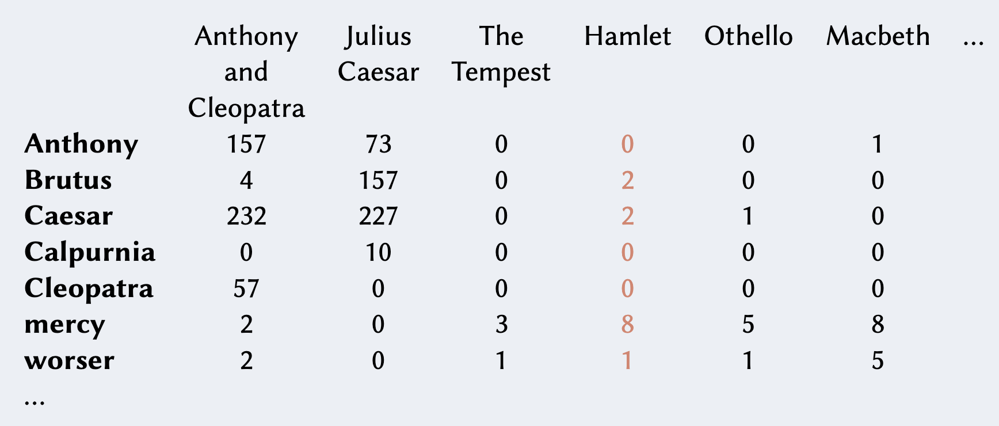

Un modo alternativo al [[Jaccard coefficient]] che tiene anche conto della **frequenza dei termini** per determinare la rilevanza dei documenti, è il semplice modello a **bag of words**.

Per rappresentare la collezione usiamo una semplice [[Binary Term-Document Incidence Matrix]] dove però invece di avere 0-1, abbiamo la **frequenza** del termine nel documento.

Perciò, sia la **term frequency** $\text{tf}_{t,d}$ il numero di volte in cui il termine $t$ appare nel documento $d$: la sua **frequenza**.

Definiamo una matrice $\text{terms} \times \text{docs}$, dove nella cella $(i,j)$ è presente il valore $\text{tf}_{i,j}$.
Questa matrice è anche detta **Count Matrix** o **Term-Frequency Matrix** ^6f3674



I documenti sono quindi rappresentati come un insieme di **vettori** in $\mathbb{N}^{\vert V \vert}$, dove $V$ è l'insieme dei termini (o vocaboli).

Possiamo sfruttare queste **term frequency** basandoci sull'idea che maggiore è il valore $\text{tf}_{t,d}$ maggiore il documento $d$ è **rilevante** rispetto al termine $t$.

```ad-attention
Questo metodo è **naive**, in quanto non tiene conto della **semantica** della query.

Infatti se cerco:
- `il gatto morde il cane`
- `il cane morde il gatto`

tale modello restituisce lo stesso risultato, attribuendo lo stesso voto agli stessi documenti.
```

Osservare però che in realtà la rilevanza di un documento $d$ rispetto al termine $t$ non cresce **linearmente** rispetto alla sua frequenza $\text{tf}_{t,d}$.
Se un termine è presente 10 volte in un documento $A$ e una volta in un documento $B$, non è vero che $A$ è esattamente 10 volte più rilevante rispetto a $B$.
Mi aspetto che affinché $A$ sia 10 volte più rilevante rispetto a $B$ deve essere che $\text{tf}_{t,A}$ è **ordini di grandezza** più grande rispetto a $\text{tf}_{t,B}$.

Ancora, se $\text{tf}_{t,A} = 300,000$ e $\text{tf}_{t,B} = 300,012$ mi aspetto che $A$ e $B$ abbiamo praticamente la stessa rilevanza.

Pericò applichiamo una **scalatura non lineare** nelle sequenze, così da misurare le frequenze solamente tra **scale di risoluzione significative**.

$$w_{t,d} = \begin{cases}
1 + \log_{10}{(\text{tf}_{t,d})} &\text{if } \text{tf}_{t,d} > 0\\
0 &\text{otherwise}
\end{cases}$$

Definiamo in fine lo **score** di un documento $d$ rispetto a una query $d$ come
$$\text{tf-score}(q,d) = \sum_{t \in q \cap d} w_{t, d}$$

Se tale coefficiente è pari a 0 vuol dire che nessun termine di $q$ è presente di $d$.