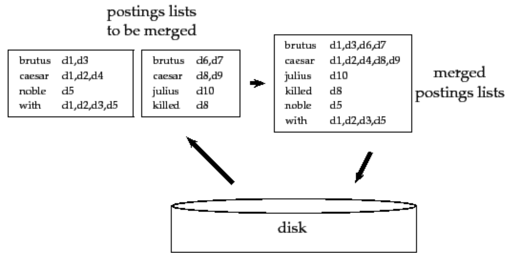

Per piccole collezioni di documenti possiamo costruire un intero [[Inverted Index|indice]] in memoria.
Però generalmente non capita mai di essere in grado di farlo, perché le collezioni di documenti sono troppo grandi, e di conseguenza c'è un numero enorme di termini nell'indice.
Per questo abbiamo bisongo di utilizzare il disco come memoria di appoggio.

```ad-note
Ovviamente stiamo assumendo che riusciamo a tenere per intero l'indice su disco.
Questo però non è sempre vero.
```

Un primo passo per rendere la costruzione dell'indice più efficiente è quella di rappresentare i termini come **termID** numerici, anzichè come stringhe.
Possiamo costruire la mappa `termine->termID` "*on the fly*" man mano che processiamo i documenti e costruiamo l'indice.
Oppure possiamo farlo con un approccio in "*2-fasi*", ovvero prima processiamo la mappa `termine->termID` e poi costruiamo l'indice.

Usiamo come dataset d'esempio

Symbol | Statistic | Value
:---:|---|---
$N$| number of documents | $800,000$
$T_{avg}$| avg. number of tokens per document | $200$
$M$ | terms | $400,000$
$T$ | number of tokens in the entire collection | $100,000,000$
\ | avg. # bytes per token (incl. spaces/punct.) | $6$
\ | avg. # bytes per token (without spaces/punct.) | $4.5$
\ | avg. # bytes per term | $7.5$

Dato che staimo assumendo che la memoria RAM non è sufficiente per costruire l'indice per intero, abbiamo bisogno di un **external sorting algorithm**, ovvero un algoritmo che usi il disco come memoria asuliaria.

```ad-important
Ovviamente per avere prestazioni accettabili, tale agloritmo deve **minimizzare** il numero di accessi su disco e il numero di operazioni di **seek**, tenendo conto del fatto che operazioni di lettura/scrittura su aree di memoria sequenziali sono più efficienti di operazioni di seek (come [[Index construction#^31e9e5|già discusso]]).
```

Una prima soluzione è il **blocked sort-based indexing algorithm** o **BSBI**, il quale ha il seguente funzionamento:
1. **partiziona** la collezione di documenti in blocchi di dimensione uguale, in modo tale che ciascun blocco può essere caricato in memoria.
2. sequenzialmente, ordina le coppie `termID->docID` per ogni blocco, caricandone uno per volta in memoria.
3. man mano salva su disco i blocchi ordinati.
4. a coppie **fonde** i blocchi intermedi, finché non verrà generato l'indice completo finale.

```julia
mutable struct Buffer
	buffsize::Int
	content::AbstracVector{Char}
	function Buffer(buff_size::Int)
		return new(buff_size, Vector{Char}(undef, buff_size))
	end
end

mutable struct Document
	io::IOStream
	current_buffer::IOBuffer
	name::String
	function Document(fname::String)
		io = open(fname, "r+")
		#current_buffer = read(io) |> IOBuffer
		return new(io, IOBuffer(), fname)
	end
end

current_block(document::Document)::IOBuffer = document.current_buffer
parse_current_block(document::Document)::String = document |> current_block |> take! |> String

function next_block!(document::Document; size=1024)::Bool
	document.current_buffer = read(document.io, size) |> IOBuffer
	return document.current_buffer.size > 0
end

function bsbi_index_construction(documents::AbstracVector{Document}; buff_size=1024)
	files = File[]
	for document ∈ documents
		while next_block!(document, size=buff_size)
			parsed_block::String = parse_current_block(document)
			inverted_block::Vector{Pair} = bsbi_invert!(parsed_block) # to do
			f = write_block_to_disk(inverted_block)
			push!(files, f)
		end
	end
	merged_blocks_file = merge_blocks(files)
	return merged_blocks_file
end
```

Ricapitolando, l'algoritmo costruisce delle coppie `termID -> docID` accumulandoli in memoria finché non verrà riempito un blocco.
Ovviamente la dimensione del blocco è fatta a posta per poter entrare per intero in memoria.
Una volta completato il blocco, esso verrà scritto in memoria, e così facendo per ogni documento.

```ad-note
Ogni singolo blocco è di per se un indice già pronto e finito, con *termini* e relative *posting list* già ordinati.
```

Nello step finale, l'algoritmo effettua un **merge** di tutti i blocchi in un unico grande indice.
Ovviamente, dato che i blocchi vengono fusi a due a due, si arriva a un punto in cui non sarà possibile caricare in memoria i nuovi indici intermedi temporanei.
Perciò, anche l'operazione di merge è effettua "*a blocchi*".




## Efficienza
### Merge di due posting list
Per fortuna è possibile effettuare il merge di due posting list di uno stesso termine in tempo efficiente, semplicemente enumerando i documenti in base al loro ordine di arrivo.

Per esempio, supponiamo di avere i documenti `docA, docB, docC` e i soli termini `term1, term2, term3, term4, term5`.
Assegnamo come *docID* i valori in base al loro ordine di arrivo
- docID\[docA\] = 1
- docID\[docB\] = 2
- docID\[docC\] = 3

Supponiamo che ogni blocco può tenere al più 3 paia `termID->docID`, e supponiamo per esempio che i documenti generino rispettivamente 3,1 e 2 blocchi

```json
// PROCESSING DOCUMENT A
// block 1
[
"term1": 1,
"term3": 1,
"term5": 1,
],

// block 2
[
"term1": 1,
"term2": 1,
"term3": 1,
]

// block 3
[
"term1": 1,
]

// PROCESSING DOCUMENT B
// block 4
[
"term1": 2,
"term4": 2,
],

// PROCESSING DOCUMENT C
// block 5
[
"term2": 3,
"term4": 3,
"term5": 3,
],

// block 6
[
"term4": 3,
"term5": 3,
]
```
> Osserviamo che i `docID` presenti in un generico blocco $i$ saranno certamente **minori o uguali** a quelli nel blocco $i+1$. Perciò basterà semplicemente **appendere** le due liste
```json
// first step merging
// block 1 MERGED block 2
[
"term1": [1,1],
"term2": [1]
"term3": [1,1],
"term5": [1],
],


// block 3 MERGED block 4
[
"term1": [1,2],
"term4": [2],
],

// block 5 MERGED block 6
[
"term2": [3],
"term4": [3,3],
"term5": [3,3],
]
```

```json
// second step merging
// merged blocks: 1,2,3,4
[
"term1": [1,1,1,2],
"term2": [1]
"term3": [1,1],
"term4": [2],
"term5": [1],
],

// merged blocks: 5,6
[
"term2": [3],
"term4": [3,3],
"term5": [3,3],
]
```

```json
// final step merging
// merged blocks: 1,2,3,4,5,6
[
"term1": [1,1,1,2],
"term2": [1,3]
"term3": [1,1],
"term4": [2,3,3],
"term5": [1,3,3],
],
```

```json
// removing duplicates in linear time
// final index
[
"term1": [1,2],
"term2": [1,3]
"term3": [1],
"term4": [2,3],
"term5": [1,3],
],
```

### Merge di due blocchi
Abbiamo visto che, dato un termine fare il merge di due sue posting list si può fare in maniera efficiente.
Valutiamo ora in quanto tempo, dati due blocchi è possibile fare il merge dei loro termini.

Se utiliziamo come struttura dati un [Log-structured merge-tree](https://en.wikipedia.org/wiki/Log-structured_merge-tree) è possibile effetuare il merge in tempo logaritmico


### Performace complessive
Alla fine le operazioni più dispendiose ricadono nell'**ordinare** i termini in ogni bocco.
Dato che il numero $M$ di termini è limitato dal numero totale di token $T$, avremo una complessità dell'ordine di $$O(M \log{M}) \in O(T \log{T})$$