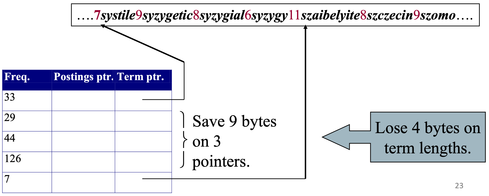

Un'idea per diminuire la grandezza dei un puntatori nella struttura [[Dictionary as a String|dictionary-as-a-string]] è quella di preservare un puntatore per ogni $k$ termini.

Così facendo, riduco la grandezza dei puntatori e il loro numero di un fattore $k$.

C'è però bisogno di salvare la lunghezza di ogni termine, per sapere quanti bytes leggere.
Per fortuna un solo byte extra mi basta per salvare tale numero, in quanto non esistono parole più lunghe di $2^8 = 256$ caratteri.

