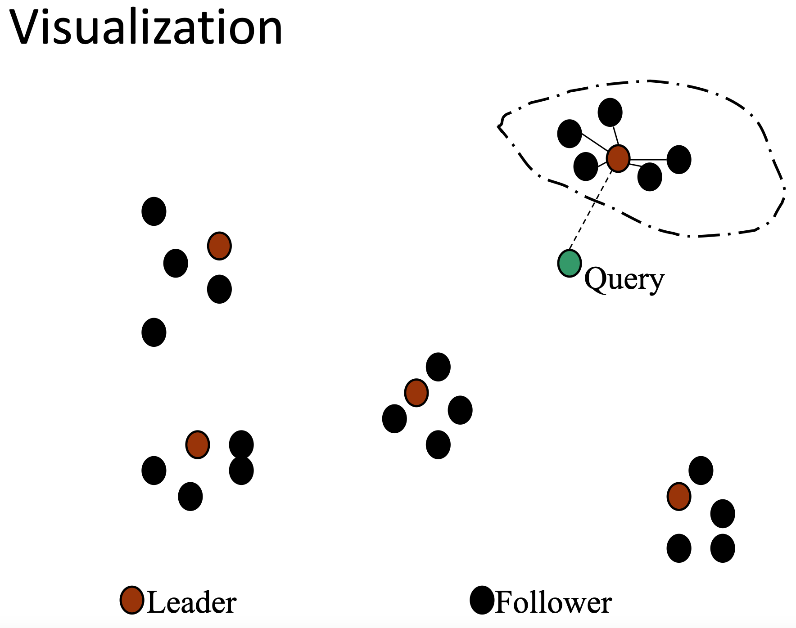

Se modelliamo i documenti in uno **spazio metrico**, possiamo osservare che documenti che trattano gli stessi argomenti tendono a **raggrupparsi** in aree vicine.
Questo è il noto fenomeno del **clustering**, in cui dati correlati tra loro tendono a raggruparsi in gruppi *coerenti* tra loro, detti **cluster** o **comunità**.

Perciò una idea ragionevole è quella di considerare per il calcolo dello [[Scoring, term weighting & the vector space model|scoring]] i soli documenti che appartengono al cluster al quale la query è più *"vicina"*.




Purtroppo il problema della clusterizzazione è un problema spesso **[[1 - Introduction#Clustering|computazionalmente intrattabile]]**.

Esistono tecniche che però generalmente producono risultati accettabili in pratica e che non necessitano di troppe risorse computazionali.

Facciamo un [[Random Sample#Random Sample|campione casuale]] di $\sqrt{N}$ documenti, e li *"elegiamo"* a **leader**.
Dopodiché precomputiamo i cluster assegnando i documenti al leander **più vicino**.
Indichiamo come **follower** i documenti che non sono leader.

Più formalmente, sia $L$ l'insieme dei leaner $l_1, ..., l_{\lceil \sqrt{N} \rceil}$.
Applicando la regola *"associa ogni documento al leader più vicino"* otterremo che $$\sum_{d \in c} \min_{l \in L}{\lbrace \text{dist}(d, l) \rbrace}$$ dove $\text{dist}: c \times c \to \mathbb{N}$ è la **metrica** del nostro spazio.

```ad-note
Campionando $L$ **uniformemente a caso** avremo come dimensione **media** dei cluster $\approx \sqrt{N}$.
```


Data quindi una query $q$ espressa come punto nello spazio metrico della collezione, identifichiamo il leader $l$ più vicino a $q$ ed effettuiamo il **ranking** sui soli $k$ documenti **followers** del leader $l$.

```ad-note
Se un cluster dovesse contenere **meno** di $k$ documenti, si potrebbe estendere la ricerca rispetto al **secondo** leader più vicino a $q$, e così via...
```

I vantaggi del campionare i leader in maniera **uniformemente a caso** sono:
- è un metodo veloce.
- dato che $\sqrt{N}$ è un campione sufficientemente grande, allora $L$ riflette abbastanza bene la distribuzione dei documenti.

```ad-warning
Osservare che questo metodo è [[Efficient Scoring#Safe vs non-safe ranking|non safe]] in quanto non c'è nessuna garanzia che nel cluster preso in considerazione siano presenti tutti i top $k$ documenti.
```

# Generalizzazione
Nel precedente approccio precomputavamo cluster **disgiunti** tra loro: ogni follower è associato a un solo leader.

Potrebbe capitare però di avere documenti che sono ugualmente di dastanti da più di un leader.
Ciò può voler significare che tali leader sono ugualmente rappresentativi del documento in questione.


Perciò un metodo generale è quello di associare un documento **folower** a $b_1 \geq 1$ documenti leader.

Invece per la query consideriamo i $b_2 \geq 1$ leader più vicini a $q$.