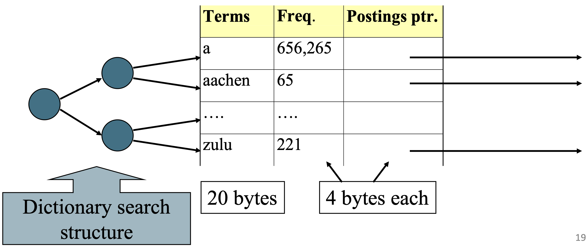

Una prima soluzione semplice per rappresentazione di un indice è quella di usare un **albero di ricerca** implementato come **vettore unidimensionale**.

Ogni **foglia** di quest'albero rappresenta una entry del dizionario.

Ongi entry necessiterà quindi di:
- 20 bytes per rappresentare i **termini**
- 4 bytes per la **doc frequency**
- 4 bytes per i **puntatori** alle aree di memoria in cui si trovano le **posting lists**.

Dato che usiamo 28 byte per ogni termine nel nostro dizionario, avremo che per un dizionario di circa 400.000 termini la memoria usata è circa $11.2$ MB.

## Problemi
Purtroppo usare 20 bytes per preservare i termini può essere troppo dispendioso, per esempio per articoli o preposizioni.
Inoltre ci sono (rarissimi) termini che possono superare i 20 caratteri: *supercalifragilisticexpialidocious* oppure *hydrochlorofluorocarbons*.

Inoltre è importante osservare che la **lunghezza media** dell'**inglese scritto** è di crica 4.5 caratteri, mentre quella di tutte le parole inglesi è crica 8 caratteri, ben sotto i 20 usati nella nostra struttra.