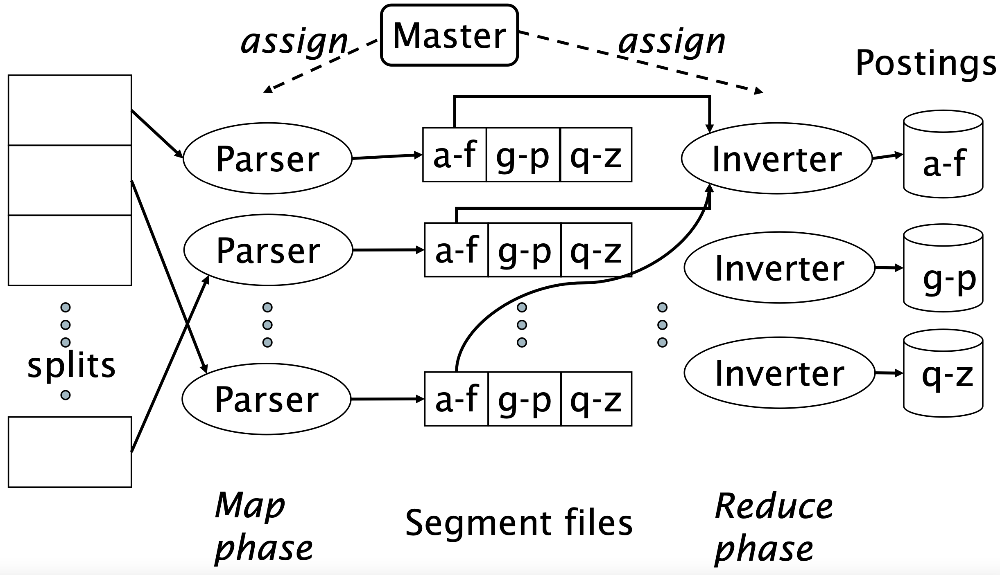

In molti contesti, come per esempio il World Wide Web, una sola macchina non è sufficiente per poter costruire e mantenere un indice di tutta la collezione di documenti.
Si fa quindi utilizzo di un grande cluster di computer interconnessi, e di **algoritmi distribuiti** per l'indicizzazione.
Non solo l'indice viene costruito in maniera distribuita, ma viene anche partizionato e distribuito su svariate macchine.
Perciò anche gli algoritmi di retriveal dei documenti saranno distribuiti.
Per il momento discutiamo però solo la costruizione dell'indice.

```ad-info
title: Massive Data Center
Supponiamo di avere un sistema distribuito non-fault-tollerant (si blocca se una macchina si rompe) con 1000 nodi, ognuno con una garanzia di funzionamento del 99.9\%.

A prima vista, questo ci può sembrare un sistema estramamente stabile.
Però, per quanto tempo in realtà il sistema è funzionante?

La probabilità che il sistema sia funzionante è pari alla probabilità che tutti nodi funzionino, ovvero $p = 0.999^n \approx 37\%$.
Invece la probabilità che non funzioni è pari alla probabilità che almeno una macchina non funzioni, o in altri termini $1 - p \approx 63\%$.

In poche parole, per circa $2/3$ del tempo il sistema sarà non funzionante!
```


La costruizione di un indice distribuito è una semplice applicazione del paradigma **MAP-REDUCE**.

Abbiamo una macchina **Master** considerata <b><u>stabile</u></b>, la divide il processo di costruizione in **task paralleli**, e li assegna alle altre macchine coordinandone il lavoro.

```ad-important
title: Vantaggi
- Il primo vantaggio di questo metodo è che quando una macchina è "libera", le si può sempre assegnare un nuovo task, ottimizzando così i tempi.

- Il secondo vantaggio è che il sistema diventa **fault-tollerant**. Se una macchina si rompe mentre sta processando un task basterà semplicemente riassegnare il suo task ad un'altra macchina in funzione.
```


Più precisamente il processo segue i seguenti passaggi:
1. Il **master** partiziona i documenti in $n$ sottoinsiemi detti **splits**.
2. Il **master** assegna man mano gli splits a macchine (libere) dette **Parser**.
3. I **parser** leggono i documenti e generano un inseme di coppie **term-docID**, tutte partizionate in $j$ **segmente**. Per esempio per $j=3$ si possono partizionare i termini per range di lettere tipo, del tipo `a-f`, `g-p` e `q-z`.
4. Infine, delle macchine dette **Inverter** prendono tutte i postings di un **segmento** e creano delle posting list per i termini di tale segmento, salvandolo **localmente** sul proprio disco.

In tale processo la fase di **Map** è data in mano ai **parser**, i quali **trasformano** gli splits in segmenti.
La fase di **Reduce** è invece incaricata agli **inverter**, i quali **fondono** i segmenti in indici (parziali).



### Document-partioned distributed index
Quello che abbiamo precedentemente descritto è la costruzione di un indice distribuito **term-partitioned**, ovvero nel quale ogni macchina mantiene un indice per un sottointervallo di termini.

Purtroppo però tale approccio potrebbe avere una distribuzione degli indici parecchio sbilanciata.
Infatti quasi sempre campita che ci sono range con termini molto più frequenti di altri.

Una tecinca per bilanciare meglio il carico, è quella di partizionare i **segmenti** per range di **documenti**, e non per termini.
Questa tecnica è più scalabile e bilanciata, ed è quella generalmente usata per i serach engine sul web.