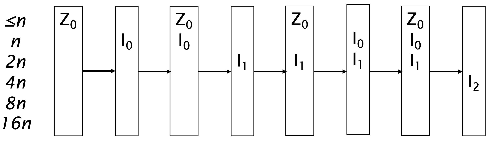
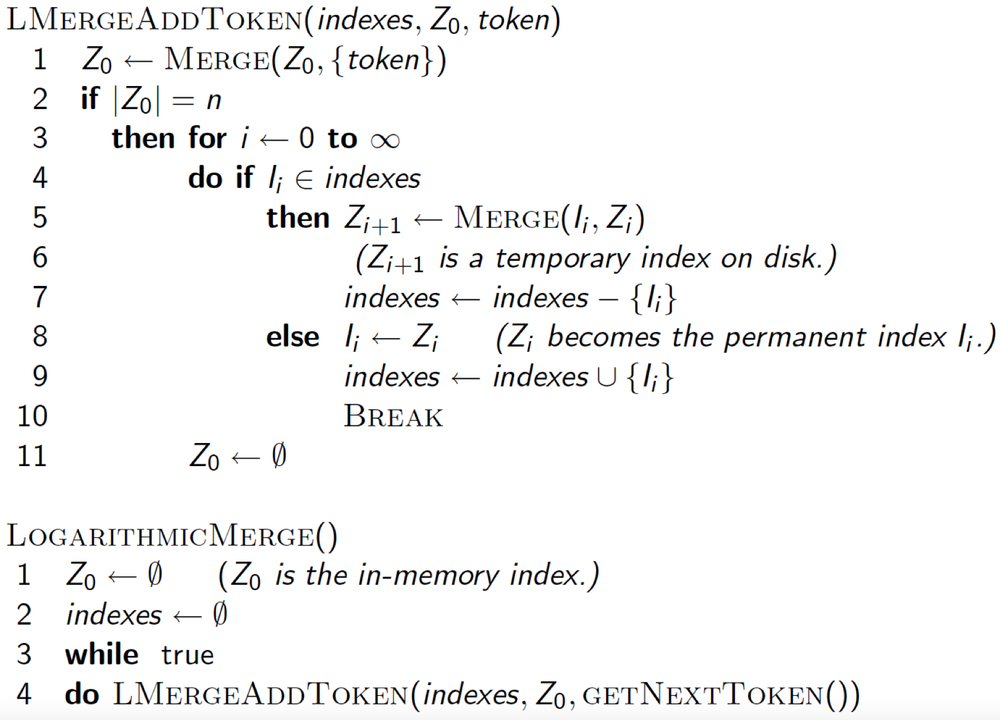

Finora abbiamo assunto di avere collezioni di documenti del tutto statiche o che cambiano raramente.
Molte collezioni di documenti però cambiano frequentemente, con molte operazioni di inserimento, rimozione e modifica dei documenti.
Ciò significa che bisogna aggiungere nuovi termini all'indice, oppure che bisogna modificare posting list già esistenti.

-------
## Trivial Approach
Un primo approccio semplice per l'implementazione di un indice **dinamico** è quello di ricostruire **periodicamente** (per esempio ogni giorno) l'indice da zero.
Tale approccio va bene se abbiamo poche operazioni di modifica della collezione, e se non abbiamo necessità di indicizzare un nuovo documento nel brevissimo termine.

### Vantaggi
Metodo semplice ed economico (computazionalmente parlando).

### Svantaggi 
Non possiamo ricercare immediatamente un documento appena inserito, dobbiamo aspettare la reindicizzazione.

------
## Auxiliary and Main index
Se invece necessitiamo di ricercare documenti appena inseriti e non possiamo aspettare la ricostruzione dell'indice, possiamo salvare i nuovi documenti in un **indice ausiliario** temporaneo in memoria, il quale verrà periodicamente fuso con quello principale.

Per effettuare quindi una ricerca, basterà interrogare entrambi gli indici (principale e ausiliaro) per poi fondere i due insiemi risultanti.

Per quanto riguarda l'operazione di rimozione, possiamo utilizare un **bit-vector** per identificare quale documento risulta essere rimosso 1, oppure no 0.
Possiamo applicare tale vettore come **filtro** per la nostra ricerca, semplicemente ignorando tutti quei documenti per i quali il relativo bit è posto ad 1.

### Vantaggi
Metodo molto più flessibile e dinamico del [[#Trivial Approach]]

### Svantaggi
A seguito di molti inserimenti abbiamo troppe operazioni di merge.
Inoltre l'operazione di merge risulta essere efficiente se e solo se preserviamo le posting lists in file differenti: in tal caso basta effettuare una operazione di append sui singoli file.

Purtroppo però si incorre in un numero eccessivamente alto di file nel file system, e questo è un problema per i sistemi operativi.
Lo schema **one-file-per-postings-list** è intrattabile perché molti file systems non gestiscono efficientemente un numero troppo elevato di file.
Infatti potrebbe capitare che abbiamo abbastanza spazio di archiviazione per tutto l'indice, però purtroppo il nostro SO non è in grado di gestire così tanti files.

La cosa ideale sarebbe quella di avere l'indice su un singolo grande file.

## Logarithmic Merge
Per ovviare al problema del [[#Simple Approach|precedente metodo]], possiamo tenere in memoria una **serie di indici**, un grande il **doppio** del precedente.

Supponiamo di avere in memoria gli indici $I_0, I_1, ..., I_k$, con dimensioni $$\vert I_i \vert = n \cdot 2^i \;\; \forall i = 0, ..., k$$
Nel frattempo teniamo in memoria un indice $Z$, finché esso non avrà raggiunto dimensione $n$.
A quel punto lo scriviamo in memoria.

Abbiamo ora due indici (quasi) della stessa dimensione: $Z$ e $I_0$.
Fondiamoli e otteniamo un nuovo indice $I_1'$, di dimensione $\vert I'_1 \vert = 2n$
A questo punto, abbiamo di nuovo due indici della stessa dimensione, $I'_1$ e $I_1$.
Fondiamoli nuovamente, e otteniamo un nuovo indice di dimensione $4n$.
Fondendo quindi ogni volta le coppie di indice di dimensioni paragonabili, otterremo nuovo unico grande indice $I_{k+1}$ di dimensione $\vert I_{k+1} \vert \approx n \cdot 2^{k+1}$.

Così facendo, otteniamo un **numero logaritmico** di operazione di merge, **ammartizzando** così il numero di operazioni.

------
## Analisi

### Auxiliary and Main index
Analizziamo per prima l'efficienza del [[#Auxiliary and Main index|metodo semplice]].
Come parametri abbiamo
- $T = \text{\# posting lists}$ (complessivo nell'intera collezione).
- $n = \text{size of auxiliary index}$. (il numero di posting list che riesco a tenere in memoria in media).

Perciò, il numerot totale di indici di ausiliari che si creeranno sarà $T/n$.

Usando quindi $O(T/n)$ indici ausiliari, la costruzione di quello principale sarà $\Theta(T^2/n)$, in quanto nel caso peggiore ognuna delle $T$ posting list verrà modificata in ognuno dei $O(T/n)$ indici ausiliari.

Le query invece hanno invece un running time di **costante** $O(1)$.
Infatti in tempo costate prendo le posting list dai due indici (principale e ausiliari), li appendo e li restituisco.

### Logarithmic Merge
Nel [[#Logaritmic Merge]] invece eseguiamo **al più** $\log_2{(T/n)}$ operazioni merge tra gli inidici ausiliari.

Dato che l'operazione di merge di due indici ausiliari ha un **costo lineare** nel numero  di posting lists (basta effettuare l'**append** di due posting list per uno stessot termine), avremo una running time di $\Theta(T\log{(T/n)})$.

L'operazione di query peggiora leggermente.
Infatti, a seguito di una query, devo necessariamente interpellare tutti gli $O(\log{(T/n)})$ indici ausiliari e quello principale, per poi appendere sequenzialmente le risposte.

-----
## Real-Time search at Twitter
Nel caso di social media come **twitter**, abbiamo un'**altissima** frequenza di operazioni in scirttura e lettura dei docuemtni (tweet).

Una caratteristica importante dei tweet (in quanto documenti) non è tanto il contenuto di, quanto l'autore ma soprattutto la **data**.
Infatti, non mi interessa leggere i tweet del 2010 di una celebrità, mi interessa di più quello di oggi o di ieri.

Se creiamo le posting list come abbiamo sempre fatto, ovvero **appendendo** i nuovi documenti, le query risulterebbero **estremamente infeccienti** se voglio poi ordinare i tweet per data in maniera decrescente.

Infatti, il motore di ricerca di twitter, usa una politica di tipo **LIFO** per le posting lists, trascurando il contenuto di essi.

Al massimo, come ulteriore indice per i tweet, vengono considerati gli **hashtag**.