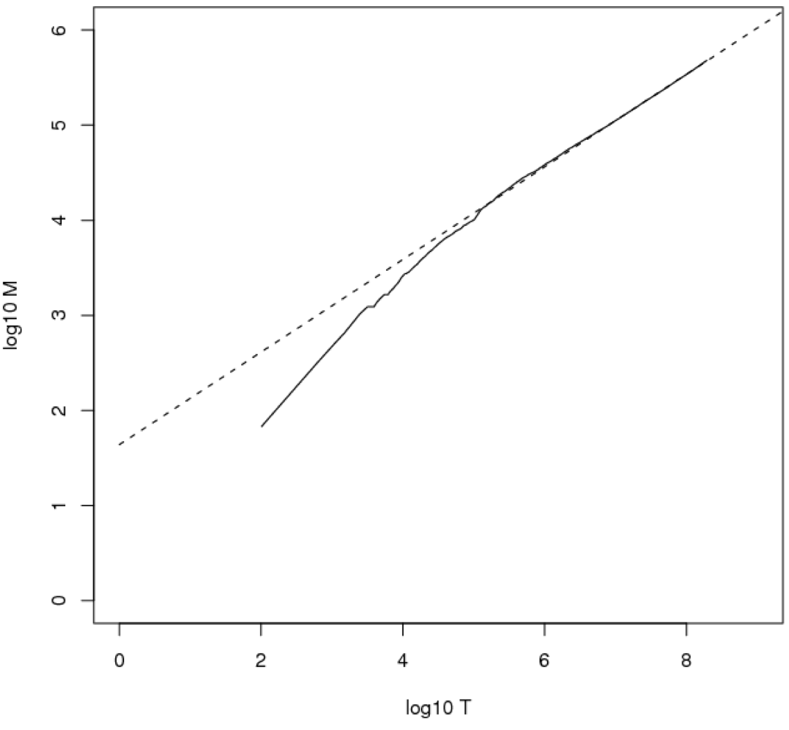
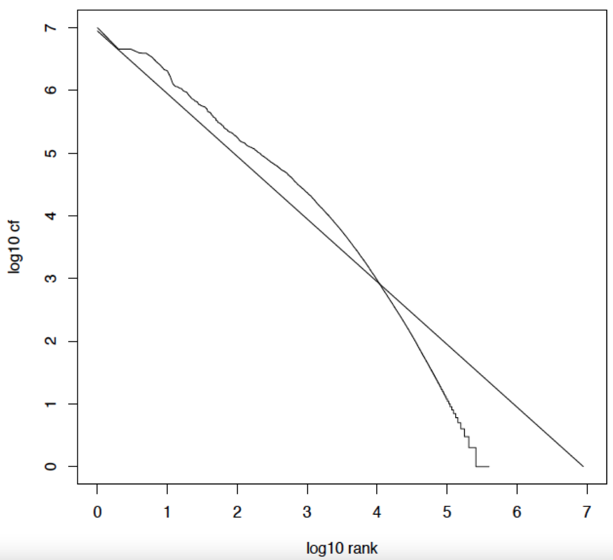

Quali sono i benefici nel **comprimere** un indice, a parte il risparmio di memoria?

Il primo vantaggio è il fatto che possiamo avere in ram più infromazioni: possiamo fare più **caching** in ram.
Ciò implica una maggiore efficienza nelle operazioni, in quanto avremo meno necessità di accedere al disco.

Il secondo vantaggio è che la compressione dei dati consente un maggiore trasferimento di informazioni nelle singole operazioni di lettura da disco a ram.

```ad-info
Alcuni efficienti algoritmi di decompressione funzionano così velocemente sull'hardware moderno che è più veloce trasferire e decomprimere un blocco di dati **compresso** dal disco alla ram anziché trasferire lo stesso blocco di dati ma in forma **non** compressa.
```

Importante tenere in considerazione quali sono le necessità di un sistema IR.
Infatti, potremmo usare algoritmi di compressione che riducono drasticamente la quantità di spazio usata.
Purtroppo però nei sistemi di IR si vogliono fare un numero elevato di operazioni sui dati, perciò comprimere e decomprimere ogni volta i dati potrebbe risultare estramemente inefficiente per i nostri tasks (**troppo overhead**).

Quello che si vuole è quindi definire dei metodi di compressione delle informazioni, che però ci consentano di operare **direttamente** sui dati già in forma compressa (senza dover decomprimere).

Infatti, mentre la codifica di **Huffman** è **general purpose**, sono stati definiti algoritmi di compressione estremamente specifici ed ottimizzati per gli indici dei moto di IR.

Richiamando i valori della [[Blocked sort-based indexing#^21c93f|tabella dei valori]], vediamo come variano le dimensioni delle strutture dati già viste applicando le tecniche di ottimizzazioni discusse.


> [!tldr] Lossless vs. lossy compression
> Esistono due tipi di compressione: **Lossless** e **Lossy**.
> Nella prima, non abbiamo perdita di informazioni.
> Nella seconda invece si può ottenere maggiore compressio, a scapito però della perdita di alcune informazioni, che non potrenno essere recuperate in fase di decompressione.

------
## Vocabulary size vs Collection Size

### Heaps' Law
Si vuole stiamere la dimenzione del **vocabolario** della nostra collezione, ovvero il **numero di termini** $M$ che occorrono.

Sia $T$ il numero di **token** nella nostra collezione.
Allora il numero $M$ di **termini** empiricamente segue la seguente funzione $$M \approx kT^b$$
dove $k,b$ sono parametri definiti come
- $30 \leq k \leq 100$
- $b \approx 0.5$

Facendo il grafico di tipo **log-log** otterremo la formula $$\log{M} = \log{k} + b \log{T}$$ ovvero una **retta** di ptendenza $b$.



Consideriamo sempre il dataset [[Blocked sort-based indexing#^21c93f|RCV1]].
In questo caso abbiamo 
- $M = 400.000$
- $T = 100.000.000$
- $k = 10^{1.64} \approx 43.65$
- $b = 0.495 \approx 0.5$

Avremo quindi che $$400.000 = M \approx kT^b \approx 398107$$
```ad-example
title: Exercise
Calcola la dimensione $M$ del vocabolario nel seguente scenario:

- Guardando una collesione di **pagine web** osserviamo che ci sono $3.000$ **termini differenti** nei primi $10.000$ **tokens** e $30.000$ termini differenti nei primi $1.000.000$.

- Assumiamo che un search engine indicizza un totale di $20.000.000.000$ ($2 \times 10^{10}$) pagine, ognuna contenente $200$ tokens **in media**.

Qual è la dimensione **stimata** dalla legge di *Heaps* del vocabolario della nostra collezione?

------

**Soluzione:** il numero di termini $T$ in media nella nostra collezione sarà $$T = (2 \times 10^{10}) \times 200 = 4 \times 10^{12}$$

Osservando che i termini crescono come un terzo dei tokens, voglio che
$$3.000 \approx 10.000/3 \approx 30 \times 10.000^{b}$$ con $b = 0.5$.

Stessa cosa per $T = 1.000.000$.

Perciò, ponendo $k = 30$ e $b = .5$ avremo che $$M \approx k T^b = 30 \times (4 \times 10^{12})^{0.5} = 6 \times 10^7 = 60.000.000$$
```

## Zipf’s law
Si vuole ora stimare la **distribuzione** dei termini tra i documenti della collezione.
Questo ci aiuta a caratterizzare le proprietà utili alla progettazione di algoritmi di compressione degli indici.

**Enumeriamo** i termini $t_1, t_2, ...$ in ordine **non decrescente di frequenza**.
Ovvero $t_1$ è il termine più frequente di tutti nella nostra collezione, $t_2$ è il secondo più frequente, e così via...

Perciò secondo la legge di **Zipf**, la frequenze $\text{cf}_i$ del termine $i$-esimo all'interno della nostra collezione è proporzionale a $$\text{cf}_i \propto \frac{1}{i}$$

> [!note]
> Osservare che dato $\text{cf}_1$ avremo che
> - $\text{cf}_2 \propto \frac{\text{cf}_1}{2}$
> - $\text{cf}_3 \propto \frac{\text{cf}_1}{3}$
> - $...$
> - $\text{cf}_i \propto \frac{\text{cf}_1}{i}$

Perciò, sia $c$ il **fattore  costante di proporzionalità**, riformuliamo la distribuzione come $$\text{cf}_i = c \cdot i^{-1}$$

Importante osservare che tale distribuzione segue una [[2 - Power Law#Power Law|power law]] con esponente $1$.

Infatti applicando il grafico **log-log** avremo $$\log{\text{cf}_i} = \log{c} - \log{i}$$


------
# Dictionary compression
Un fattore importante che influisce sulle prestazioni delle query in un sistema di IR è il numero di operazioni su disco.
Perciò si vuole cercare di preservare in memoria quanta più porzione di **dizionario** possibile.

In questa parte verranno proposti dei metodi per comprimere i **dizionari**, ovvero quella parte dell'indice che preserva i **termini**, le loro **frequenze** e i **puntatori alle posting lists**.

- [[Dictionary storage]] (naïve approach)
- [[Dictionary as a String]]
- [[Blocked storage]]
- [[Front Coding]]

### RCV1 dictionary compression summary

**Technique** | **Size in MB**
---|---
Dictionary storage | 11.2
Dictionary-as-a-String | 7.6
\+ blocking con $k = 4$ | 7.1
\+ blocking \+ front coding | 5.9

Purtroppo non possiamo comprimere di più senza **perdita d'informazione**, oppure senza dover **decomprimere** per accedere al dizionario (noi non vogliamo perdere tempo nella decompressione).

# Postings file compression
Generalmente l'insieme delle **posting lists** è ordini di grandezza più grande dei dizionari (10 o 100 volte).

Se usiamo i **docID** per identificare i documenti, sappiamo che per $800.000$ documenti mi serviranno $\lceil \log_2{800.000} \rceil = 20$ bits.

Il nostro obiettivo è però usare **meno** di 20 bit per docID.

La prima osservazione è che termini come `arachnocentric` appaiono "*una volta su un milione*" nella mia collezione, diciamo di 1.000.000 di documenti.
Perciò $\lceil \log_2{1.000.000} \rceil = 20$ bits mi vanno bene per rappresentare l'unico docID in cui il termine `arachnocentric` appare.

Invece il termine `the` appare potenzialmente in **ogni** documento, perciò la sua posting lists sarà grande $1.000.000 \times 20bits = 2MB$ (troppo dispendioso!).
Si può fare di meglio.

- [[Gap encoding]]
- [[Variable byte codes]]
- [[Gamma code]]