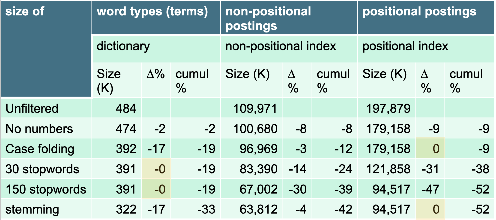

Quali sono i benefici nel **comprimere** un indice, a parte il risparmio di memoria?

Il primo vantaggio è il fatto che possiamo avere in ram più infromazioni: possiamo fare più **caching** in ram.
Ciò implica una maggiore efficienza nelle operazioni, in quanto avremo meno necessità di accedere al disco.

Il secondo vantaggio è che la compressione dei dati consente un maggiore trasferimento di informazioni nelle singole operazioni di lettura da disco a ram.

```ad-info
Alcuni efficienti algoritmi di decompressione funzionano così velocemente sull'hardware moderno che è più veloce trasferire e decomprimere un blocco di dati **compresso** dal disco alla ram anziché trasferire lo stesso blocco di dati ma in forma **non** compressa.
```

Importante tenere in considerazione quali sono le necessità di un sistema IR.
Infatti, potremmo usare algoritmi di compressione che riducono drasticamente la quantità di spazio usata.
Purtroppo però nei sistemi di IR si vogliono fare un numero elevato di operazioni sui dati, perciò comprimere e decomprimere ogni volta i dati potrebbe risultare estramemente inefficiente per i nostri tasks (**troppo overhead**).

Quello che si vuole è quindi definire dei metodi di compressione delle informazioni, che però ci consentano di operare **direttamente** sui dati già in forma compressa (senza dover decomprimere).

Infatti, mentre la codifica di **Huffman** è **general purpose**, sono stati definiti algoritmi di compressione estremamente specifici ed ottimizzati per gli indici dei moto di IR.

Richiamando i valori della [[Blocked sort-based indexing#^21c93f|tabella dei valori]], vediamo come variano le dimensioni delle strutture dati già viste applicando le tecniche di ottimizzazioni discusse.


> [!tldr] Lossless vs. lossy compression
> Esistono due tipi di compressione: **Lossless** e **Lossy**.
> Nella prima, non abbiamo perdita di informazioni.
> Nella seconda invece si può ottenere maggiore compressio, a scapito però della perdita di alcune informazioni, che non potrenno essere recuperate in fase di decompressione.

------
## Vocabulary size vs Collection Size

### Heaps' Law
Si vuole stiamere la dimenzione del **vocabolario** della nostra collezione, ovvero il **numero di termini**.

Sia $T$ il numero di **token** nella nostra collezione.
Allora il numero $M$ di **termini** empiricamente segue la seguente funzione $$M \approx kT^b$$
dove $k,b$ sono parametri definiti come
- $30 \leq k \leq 100$
- $b \approx 0.5$

Facendo il grafico di tipo **log-log** otterremo la formula $$\log{M} = \log{k} + b \log{T}$$ ovvero una **retta** di ptendenza $b$.


Consideriamo sempre il dataset [[Blocked sort-based indexing#^21c93f|RCV1]].
In questo caso abbiamo 
- $M = 400.000$
- $T = 100.000.000$
- $k = 10^{1.64} \approx 43.65$
- $b = 0.495 \approx 0.5$

Avremo quindi che $$400.000 = M \approx kT^b \approx 398107$$
## Zipf’s law
Si vuole ora stimare la **distribuzione** dei termini tra i documenti della collezione.
