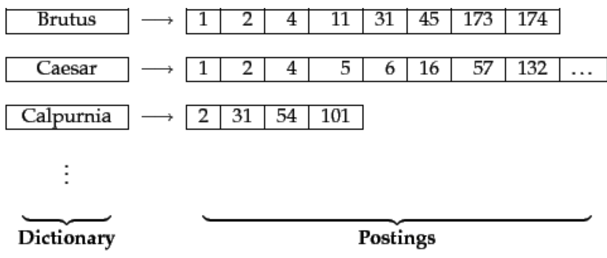
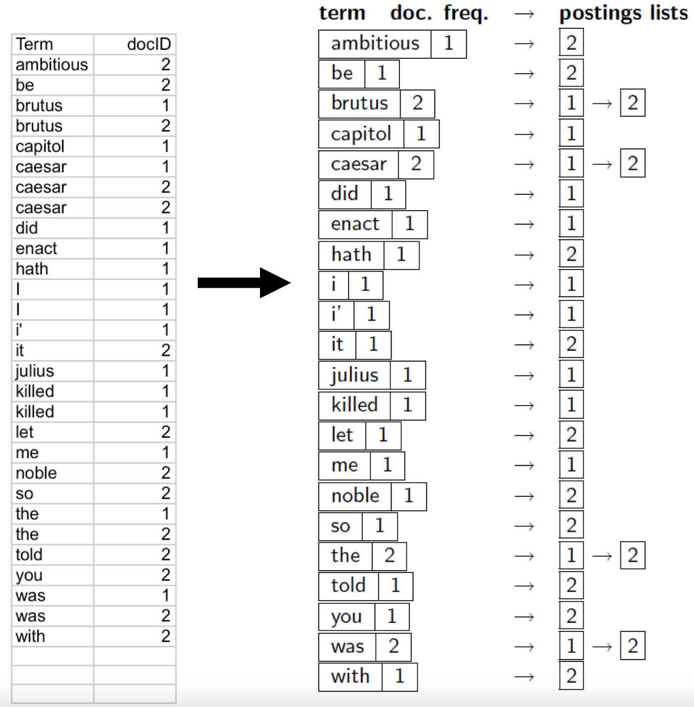

Un'osservazione che si può fare è che la [[Binary Term-Document Incidence Matrix|matrice d'incidenza]] per molti **termini d'interesse** (nomi, luoghi, ecc...) è piena di zeri, ovvero è **sparsa**.

```ad-note
Certamente per molti termini, come gli articoli, ci sono molti 1.
Però generalemte non si fanno query in cui richiedo tutti i documenti con il termine `the`, perché certamente tutti i documenti saranno compresi nella risposta.
```

Perciò, quello che si può fare per ottimizzare, possiamo pensare di usare un **dizionario** di termini (detto anche **vocabolario** o **lexicon**), dove per ogni termine conserviamo una **lista di documenti** nei quali occorrono.
Tale lista è anche detta **posting list**. ^5dc20c



```ad-important
Nella costruzione di un indice inverso, assumiamo che viene costruito in modo tale che sia i termini sia le loro posting lists sono mantenute **oridnate**.
```

```ad-note
Anche se in termini di efficienza è dispendioso mantenere l'ordinamento a fronte di **inserimenti** e **rimozioni**.

Però nell'almbito dell IR non si vuole gestire un numero elevato di inserimenti, rimozioni o update.
```

---------------
# Inverted Index Construction
## Tokenization
Data la sequanza di caratteri che compongono un documento, il task della **tokenizzazione** è il task di *"spezzare"* tale sequenza in pezzi (detti **toke**).
Generalmente questi token sono le parole che compongono le frasi.

- **Input**: *Friends, Romans, Countrymen, lend me your ears;*
- **Output**: `Friends`, `Romans`, `Countrymen`, `lend`, `me`, `your`, `ears`

Un **token** è un'istanza di una sequenza di caratteri in un particolare documento che sono raggruppati come un'utile unità semantica per l'elaborazione.
Per esempio *"Michael Jackson"* è meglio trattarlo come un **singolo token** `Michael Jackson`  perché è più utile al task di IR.

Un **tipo** è la classe di tutti i token che contengono la stessa sequenza di caratteri.
Nel nostro caso possiamo avere il tipo:
- `Michael Jackson`, `Michael jackson`, `michael Jackson`, `michael jackson`, `MICHAEL JACKSON`, ...

Un **termine** è invece un elemento di un tipo, generalmente **normalizzato**, il quale viene usato nel nostro motore di IR.

Il problema del task della tokenizzazione è:

> Qual è il miglio modo di generare token?

Consideriamo il seguente esempio

	Mr. O'Neill thinks that the boys' stories about Chile's capital aren't amusing.

Come trattiamo il cognome `O'Neil`?
Quale dei seguenti modi è più corretto?
- `neil`  
- `oneil`  
- `o'neil`  
- `o'`, `neil`  
- `o`, `neil`  

E per `aren't`?
- `aren't`
- `arent`
- `are`, `n't`
- `aren`, `t`

Oppure, se tokenizzo rimuovendo tutti i punti, potrebbe capitare che la parola "*U.S.A.*" venga decomposta in tre token inutili `u`, `s` e `a`.

Questo è un processo delicato, e bisogna tenere in considerazione tutti i casi particolare che si desidera gestire.

```julia
# my document
document::String = "Mr. O'Neill thinks that the boys' stories about Chile's capital aren't amusing."

# trivial tokenization
tokens::Vector{String} = document |> split |> (d -> replace.(d, "." => "", "'" => "")) .|> lowercase
```

## Dropping common terms: stop words
Ci sono termini che sono contenuti in **ogni** documento, come pre esempio gli articoli, le congiunzioni, le proposizioni, ecc...

Per esempio, se ricerco la frase *"President of the United States"* gli unici termini realmente utili alla ricerca sono *"President"* e *"United States"*.
Infatti, molto probabilmente la mia ricerca sarà un query del tipo $$\text{president } \land \text{ united states}$$
Perciò, possiamo pensare di rimuovere tutte quelle parole con altissima frequenza in una lingua, e che non hanno utilità ai fini di una ricerca.
Tali parole sono dette **stop words**.

```julia
stop_words = ["the", "that", "an", "a", "an", "at"]

filter!(t -> t ∉ stop_words, tokens)
```

## Normalization (equivalence classing of terms)
La **normalizzazione** dei token è il processo di *canonizzazione* dei token, ovvero si riducono i token si cerca di raggruppare token differenti che rappresentano una stessa cosa in un unico token.

Per esempio, io voglio che se ricerco `U.S.A.` oppure ricerco `USA` ottengo lo stesso risultato dal mio motore di IR.

Il modo più comune di standardizzare è quello di definire **classi di equivalenza** tra termini.
Se per esempio entrambi i termini `anti-discriminatory` e `antidiscriminatory` sono entrambi *mappati* nel termine `antidiscriminatory`, allora tutte le query che li comprendono avranno come risultato lo stesso insieme di documenti.

```julia
equivalen_class = Dict(
           "Windows" => ["Windows"],
           "windows" => ["Windows", "windows", "window"],
           "window" => ["window", "windows"],
           "u.s.a." => ["usa", "united states"],
           "usa" => ["usa", "united states"],
           "anti-discriminatory" => ["antidiscriminatory"],
           "antidiscriminatory" => ["antidiscriminatory"],
           ...
           )
```

## Stemming and Lemmatization
[TODO]

-------------
# Implementazione degli operatori
Assumiamo sempre che le [[#^5dc20c|posting lists]] siano **ordinate** per indice di documento.
Tale assunzione è **essenziale** per l'analisi delle prestazioni.

```julia
function is_sorted(a::AbstractVector{T})::Bool where T
	for i=1:length(a)-1
		a[i] > a[i+1] && return false
	end
	true
end
```

## Intersection

```julia
function intersect(
		L₁::AbstractVector{T},
		L₂::AbstractVector{T}
	)::AbstractVector{T} where T
	"""
		- **complexity**: 2*min(length(L₁), length(L₂))
		- **output size**: 0 ≤ length(result) ≤ min(length(L₁), length(L₂))
	"""
	
	# @assert is_sorted(L₁) && is_sorted(L₂) "Posting lists MUST be sorted!"
	
	result = T[]
	i, j = 1, 1
	while i ≤ length(L₁) && j ≤ length(L₂)
		if L₁[i] == L₂[j]
			push!(result, L₁[i])
			i += 1
			j += 1
		elseif L₁[i] < L₂[j]
			i += 1
		else
			j += 1
		end
	end
	
	result
end
```

## Union
```julia
function union(
		L₁::AbstractVector{T},
		L₂::AbstractVector{T}
	)::AbstractVector{T} where T
	"""
		- **complexity**: length(L₁) + length(L₂)
		- **output size**: max(length(L₁), length(L₂)) ≤ length(result) ≤ length(L₁) + length(L₂)
	"""
	
	# @assert is_sorted(L₁) && is_sorted(L₂) "Posting lists MUST be sorted!"
	
	result = T[]
	i, j = 1, 1
	while i ≤ length(L₁) && j ≤ length(L₂)
		if L₁[i] == L₂[j]
			push!(result, L₁[i])
			i += 1
			j += 1
		elseif L₁[i] > L₂[j]
			push!(result, L₁[i])
			i += 1
		else
			push!(result, L₂[j])
			j += 1
		end
	end
	
	if i > length(L₁)
		append!(result, L₂[j:end])
	elseif j > length(L₂)
		append!(result, L₁[i:end])
	end
	
	result
end
```

## Difference
```julia
function difference(
		L₁::AbstractVector{T},
		L₂::AbstractVector{T}
	)::AbstractVector{T} where T
	"""
		- **complexity**: length(L₁) + length(L₂)
		- **output size**: 0 ≤ length(result) ≤ length(L₁)
	"""
	
	# @assert is_sorted(L₁) && is_sorted(L₂) "Posting lists MUST be sorted!"
	
	result = T[]
	i, j = 1, 1
	while i ≤ length(L₁) && j ≤ length(L₂)
		if L₁[i] < L₂[j]
			push!(result, L₁[i])
			i += 1
		elseif L₁[i] > L₂[j]
			j += 1
		else
			i += 1
			j += 1
		end
	end
	
	j > length(L₂) && append!(result, L₁[i:end])
	
	result
end
```

## Optimizations of queries
Consideriamo la query $$\text{Brutus} \land \text{Calpurnia} \land \text{Caesar}$$
Ci sono tre modi di eseguirla:
1. (**Brutus** AND **Calpurnia**) AND **Caesar** ^e7d5bd
2. **Brutus** AND (**Calpurnia** AND **Caesar**) ^b0a38b
3. **Calpurnia** AND (**Brutus** AND **Caesar**)

Queste tre implementazioni hanno **complessità differenti**.
Siano $n,m,\ell$ le lunghezze delle posting lists dei rispettivi termini *Brutus*, *Calpurnia* e *Caesar*.
Senza perdita di generalità assumiamo che $n < m < \ell$.

Consideriamo la [[#^e7d5bd|prima implementazione]].
La complessità dell'intersezione `intersect(brutus, calpurnia)` sarà $2 \min{\lbrace n, m\rbrace} = O(n)$.
La lista risultante avrà lunghezza $\leq n$.
Dopodichè, intersecando il risultato precedente con la posting list di `caesar` avremo una complessità di $\leq 2 \min{\lbrace n, \ell \rbrace} = O(n)$.
In totale la complessità sarà $$O(n)$$

Consideriamo ora la [[#^b0a38b|seconda implementazione]].
In tal caso la prima intersezione avrà complessità $O(m)$ mentre la seconda $O(n)$, per un totale di $$O(n + m) \in O(m)$$ potenzialmente significativamente peggiore della precedente.

Perciò l'approccio migliore per intersecare più di due posting list è quello di intersecare sempre prima quella di lunghezza minima, per poi iterare.
```julia
function intersect(L::AbstractVector{Vector{T}})::AbstractVector{T} where T
	
	_, minimum_index = findmin(x -> length(x), L)
	result = L[minimum_index]
	
	for i=2:length(L)
		result = intersect(result, L[i])
	end
	
	result
end
```

Alla luce di quanto osservato, conviene salvarsi per ogni termine la **frequenza** con i quali occorrono nella collezione di documenti.



----------
### Exercise 1
Sia la query

> (**tangerine** OR **trees**) AND (**marmalade** OR **skies**) AND (**kaleidoscope** OR **eyes**)

Con frequenze

**Term** | **Freq.**
---|---
eyes | 213312
kaleidoscope | 87009
marmalade | 107913
skies | 271658
tangerine | 46653
trees | 316812

Quale intersezione va processata per prima?

#### Solution
Le unioni risultanti avranno dimensione
- 316812 $\leq$ |**tangerine** OR **trees**| $\leq$ 363465
- 271658 $\leq$ |**marmalade** OR **skies**| $\leq$ 379571
- 213312 $\leq$ |**kaleidoscope** OR **eyes**| $\leq$ 300321

Perciò in questo caso la query che conviene fare è

> (**tangerine** OR **trees**) AND ( (**marmalade** OR **skies**) AND (**kaleidoscope** OR **eyes**) )

-------
### Exercise 2
Adapt the merge for the queries:
- *Brutus* AND NOT *Caesar*   ^348f7f
- *Brutus* OR NOT *Caesar* ^78f67c

Can we still run through the merge in time $O(L_1 + L_2)$?
What can we achieve?

#### Solution
Per quanto riguarda la [[#^348f7f|prima query]] basta osservare che essa equivale alla **differenza** tra i due insiemi, ovvero
$$\text{Brutus} \land \lnot \text{Caesar} \equiv \text{Brutus} \setminus \text{Caesar}$$

Perciò possiamo applicare la funzione [[#Difference|difference]] precedentemente implementata, e quindi mantenendo la complessità nell'ordine di $O(L_1 + L_2)$.

Riguardo invece la [[#^78f67c|seconda query]] non c'è molto che si puà fare.
Infatti bisogna <u>unire</u> tutti i documenti di $\lnot \text{Caesar}$ con tutti i documenti di $\text{Brutus}$.
Purtroppo però i documenti in $\lnot \text{Caesar}$ potrebbero essere dell'ordine di tutti i documenti della collezione.

Possiamo osservare però che, applicando la legge di De Morgan, possiamo riscrivere equivalentemente la query come
$$\text{Brutus} \lor \lnot \text{Caesar} \equiv \lnot (\lnot \text{Brutus} \land \text{Caesar}) \equiv \lnot (\text{Caesar} \land \lnot \text{Brutus})$$
riconducendoci così al complemento del primo caso.

```julia
function or_not(
		L₁::AbstractVector{T},
		L₂::AbstractVector{T};
		num_documents=1000
	)::AbstractVector{T} where T
	"""
		- **complexity**: length(L₁) + length(L₂) + num_documents
		- **output size**: 0 ≤ length(result) ≤ num_documents
	"""
	
	a = difference(L₁, L₂)
	return difference(collect(1:num_documents), a)
end
```


------
### Exercise 3
What about an rbitrary formula?
(*Brutus* OR *Caesar*) AND NOT (*Antony* OR *Cleopatra*)

Can we always merge in “linear” time?
Linear in what?
Can we do better?

#### Solution
Siano $L_1, L_2, L_3, L_4$ le rispettive lunghezze delle posting list dei termini `Brutus`, `Caesar`, `Antony` e `Cleopatra`.

Siano le espressioni
- $E_1 = \text{Brutus} \lor \text{Caesar}$ 
- $E_2 = \text{Antony} \lor \text{Cleopatra}$ 

La nostra query può quindi essere espressa come $$E_1 \land \lnot E_2 \equiv E_1 \setminus E_2$$
```julia
E₁ = union(brutus, caesar)
E₂ = union(antony, cleopatra)
result = difference(E₁, E₂)
```

L'espressione $E_1$ viene calcolata in tempo $O(L_1 + L_2)$ e avrà dimensione (al più) $O(L_1 + L_2)$.
Invece l'espressione $E_2$ viene calcolata in tempo $O(L_3 + L_4)$ e avrà dimensione (al più) $O(L_3 + L_4)$.

Infine il risultato $E_1 \setminus E_2$ verrà calcolata in tempo $O(|E_1| + |E_2|) \in O(L_1 + L_2 + L_3 + L_4)$, e avrà dimensione al più $O(|E_1|) \in O(L_1 + L_2)$.