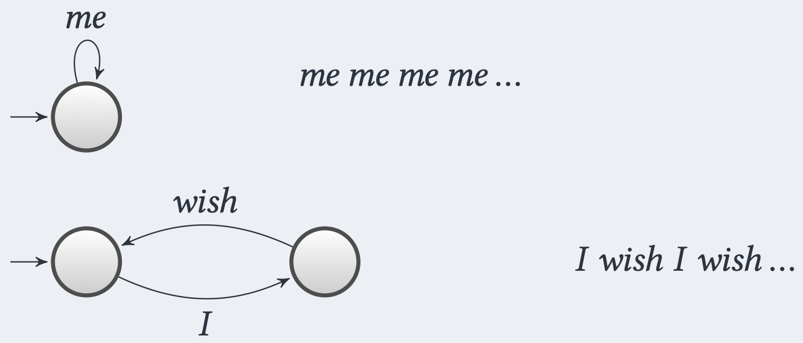
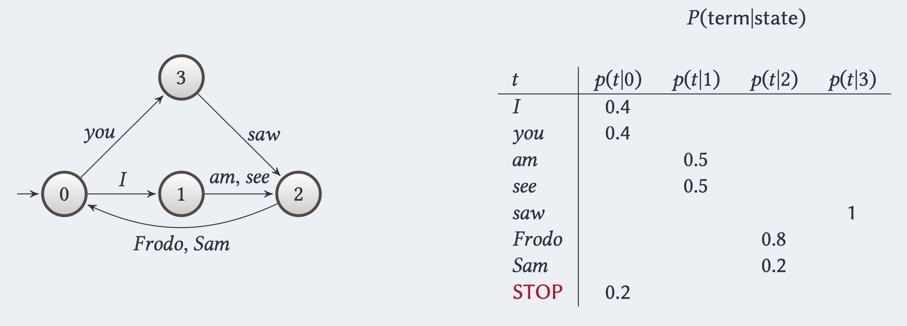
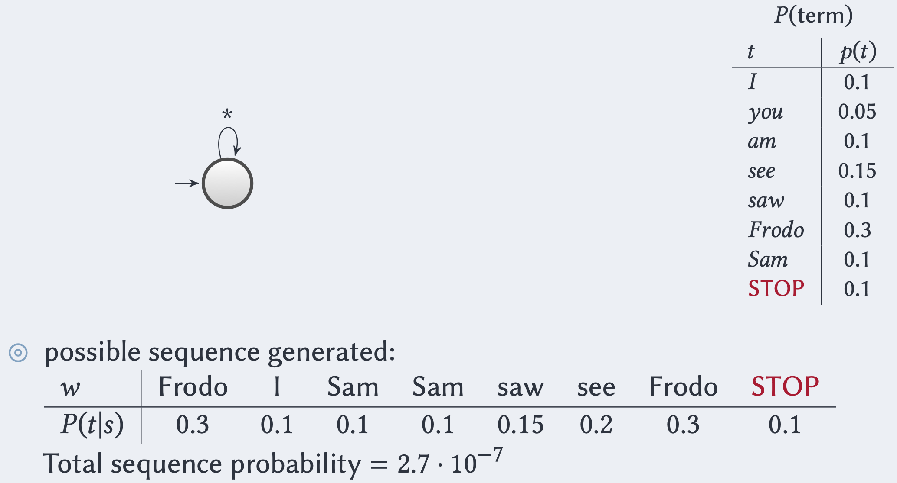

Nel [[Probabilistic Ranking Principle]] sfruttavamo la regola di [[Appendice Probabilità#Bayes' Rule|regola di Bayes]] per esprimere la probabilità che un documento sia rilevante rispetto a una query in funzione della rappresentazione del documento.

> $$P(R \vert d,q) = \frac{P(d \vert R, q) P(R \vert q)}{P(d \vert q)} = \frac{P(d \vert R, q) P(R \vert q)}{P(d)}$$
> dove
> - $P(d \vert R, q)$ è la probabilità di campionare un documento $d$  dal sottoinsieme dei **soli documenti rilevanti** rispetto a $q$.
> - $P(R \vert q)$ è la probabilità di campionare a caso un qualsiasi documento rilevante rispetto a $q$.
> - $P(d)$ è la probabilità che il documento $d$ sia campionato dalla collezione. Osservare che $P(d \vert q) = P(d)$ perché a priori un campionamento di un documento è indipendente dalla query $q$.

Allo stesso modo possiamo definire un **modello generatico** che esprime la stessa probabilità in funzione della query $q$.

$$P(R \vert d, q) = \frac{P(q \vert R,d) P(R \vert d)}{P(q \vert d)} = \frac{P(q \vert R,d) P(R \vert d)}{P(q)}$$
dove:
- $P(q \vert R,d)$ è la probabilità che dato un documento $d$ risaputo essere **rilevante** per l'information need, qual è la probabilità che $q$ sia la query fatta che ha **generato** $d$.
- $P(R \vert d)$ è la probabilità che il documento $d$ sia rilevante.
- $P(q)$ è la probabilità che venga fatta la query $q$.

Assumendo che $P(q)$ e $P(R \vert d)$ siano **uniformi**, siamo quindi interessati a stimare $$P(R \vert d, q) \propto P(q \vert R, d)$$ o più in generale $$P(q \vert d)$$ ovvero la probabilità che sia stata la query $q$ ad essere stata sottoposta, sapedo di aver ricevuto come risposta il documento $d$.

## Language Model
Assumiamo di voler **generare** termine per termine un documento $d$.

Un **Language Model** $M_d$ per un documento $d$ definisce le regole da applicare per **generare** step by step ogni termine del documento $d$.

Possiamo pensare ad $M_d$ come una sorta di **automa a stati finiti**, doce le transizione da stato a stato sono date dai termini.



Osserviamo che se stiamo in uno stato in cui abbiamo appena letto un verbo, ci sono vaire probabilità di leggere un `oggetto` anziché un `articolo` anziché un `aggettivo`, tutte dipendenti dal verbo (**stato**) appena letto.

Perciò è buono avere una **distribuzione** su ogni trasnizione che parte da un dato stato.

 ^85bf9e

Osserviamo che in questo caso $M_d$ è una **catena di Markov** in cui la probabilità di generare il documento $d$ è data dalla **Random Walk** (che parte dallo stato $0$) tale che il passo $i$-esimo della passeggiata aleatoria corrisponde al termine $i$-esimo di $d$.

> **Esempio**
> Consideriamo il [[#^85bf9e|precedente]] language model $M_d$ e cerchiamo di generare il documento $$d = \text{"I am Frodo you saw Sam.} \texttt{[STOP]} \text{"}$$
> Partendo dallo stato $X = 0$ avremo la seguente probabilità
> $$\begin{align*}
P(d \vert M_d) &=\\
&= P(\text{"I"}|X = 0) \cdot P(\text{"am"}|X = 1) \cdot P(\text{"Frodo"}|X = 2) \cdot P(\text{"you"}|X = 0) \cdot P(\text{"saw"}|X = 3) \cdot P(\text{"Sam"}|X = 2) \cdot P(\texttt{[STOP]}|X = 0)\\
&= 0.4 \cdot 0.5 \cdot 0.8 \cdot 0.4 \cdot 1 \cdot 0.2 \cdot 0.2\\
&= 0.00256
\end{align*}$$

Un modello parecchio più semplificato è quello in cui ho un **unico stato** e definisco quindi una distribuzione sull'occorrenza dei termini (in generale, indipendentemente da ciò che ho letto prima).

Ovvero ogni termine $t$ ha una probabilità associata di essere il prossimo termine osservato, e tale probabilità è **indipendente** da ciò che è stato letto in precedenza.



```ad-warning
Osservare che le probabilità di generare un documento nel modello semplificato diventano di ordini di grandezza più piccole.
```


Essendo una query un documento, possiamo sfruttare i *language model* per stimare la rilevanza dei documenti restituiti dal sistema di IR.
Data una query $q$ e i documenti $d_1, ..., d_n$, definiamo per ciascuno i relativi language model $M_{d_1}, ..., M_{d_n}$.
Il documento più rilevante sarà quel documento $d$ che massimizzerà la probabilità $$P(q \vert M_d) = P(\langle w_1, ..., w_{|q|} \rangle \vert M_d) = \prod_{i=1}^{|q|} P(w_i \vert M_d)$$
L'assunzione di **indipendenza** dei termini $w_1, ..., w_{|q|}$ della query $q$ è anche nota come **Naive Bayes Conditional Independence assumption**.

```ad-important
Osserviamo che la probabilità $P(q \vert M_d)$ è uno [[Stimatore di Massima Verosimiglianza]].
Infatti si calcola la probabilità che la query osservata sia $q$, fissati dei parametri (ovvero il language model $M_d$).
In alternativa possiamo pensare a $P(q \vert M_d)$ come una misura che indica quanto il modello $M_d$ descrive la query $q$.
```

### Esempio
Consideriamo due docuementi $d_1, d_2$ con relativi language model $M_{d_1}, M_{d_2}$.

$t$ | $P(t \vert M_{d_1})$ | $P(t \vert M_{d_2})$
---|---|---
\[STOP\] | 0.1 | 0.2
you | 0.2 | 0.1
see | 0.05 | 0.15
Frodo | 0.2 | 0.15
I | 0.15 | 0.1
am | 0.05 | 0.05
saw | 0.05 | 0.2
Sam | 0.2 | 0.05

Consideriamo la seugente query $$q = \text{"Frodo saw Sam \texttt{[STOP]}"}$$ e calcoliamo la probabilità che venga generato dai precedenti language model
$$\begin{align*}
P(q \vert M_{d_1}) &= 0.2 \cdot 0.05 \cdot 0.2 \cdot 0.1 = 2 \cdot 10^{-4}\\
P(q \vert M_{d_2}) &= 0.15 \cdot 0.2 \cdot 0.05 \cdot 0.2 = 3\cdot 10^{-4} 
\end{align*}$$

Dato che $P(q \vert M_{d_2}) > P(q \vert M_{d_1})$ allora $d_2$ è più rilevante rispetto al documenti $d_1$, perché è più probabile che $M_{d_2}$ abbia **generato** la query $q$.

-------
# Stimare $P(q \vert M_d)$

## Multinomial
In base a quanto visto [[#Language Model|prima]] vogliamo stiamre la probabilità che, all'interno della query $q$, un termine $t$ sia il prossimo ad essere osservato, **indipendentemente** da quanto letto in precedenza.

Assumendo che tale probabilità segua una [[Distribuzioni#Bernoulli|Bernoulliana]] di parametro $p_t$, allora la probabilità che il termine $t$ appaia $k$ volte nella query $q$ seguirà una [[Distribuzioni#Binomiale|legge Binomiale]] $$P(\text{df}_{t,q} = k) \sim \text{Binom}(\vert q \vert, p_t) \implies \binom{\vert q \vert}{k}p_t^k (1-p_t)^{\vert q \vert - k}$$

Combinando le probabilità di osservare $k_1, ..., k_{m}$ occorrenze dei termini $t_1, ..., t_m$ nella query $q$ può essere quindi modellato come [[Distribuzioni#Multinomiale (multivariata)|Multinomiale]]
$$P(\text{df}_{t_i,q} = k_i \forall i = 1, ..., m) = \frac{\vert q \vert!}{k_1!\cdots k_m!} \prod_{i=1}^{m} p_{t_i}^{k_i}$$

Dato che nel language model $M_d$ le probabilità $p_t$ sono date da $P(t \vert M_d)$ allora avremo che $$P(\text{df}_{t_i,q} = k_i \forall i = 1, ..., m \vert M_d) = \frac{\vert q \vert!}{\prod_{t \in q}\text{tf}_{t,q}!} \prod_{t \in q} P(t \vert M_d)^{\text{tf}_{t,q}}$$
Dato che il fattore $$\frac{\vert q \vert!}{\prod_{t \in q}\text{tf}_{t,q}!}$$ è una costante **indipendente** dal documento $d$ (dipende solo dalla query), possiamo interessarci al solo prodotto $$\prod_{t \in q}P(t \vert M_d)^{\text{tf}_{t,q}}$$

Dato che abbiamo detto che $P(t \vert M_d)$ è uno [[Stimatore di Massima Verosimiglianza]], sappiamo che il MLE di una **bernoulliana** equivale essattamente alla [[Random Sample#Media campionaria|media campionaria]].
Perciò $$P(t \vert M_d) = \frac{\text{tf}_{t,d}}{\vert d \vert}$$

In conclusione, data una query $q$ possiamo calcolare la **rilevanza** di un documento $d$ come $$P(d \vert q) \approx P(q \vert M_d) \approx \prod_{t \in q} \left( \frac{\text{tf}_{t,d}}{\vert d \vert} \right)^{\text{tf}_{t,q}}$$

## Multiple Poisson
Invece di assumere che $P(\text{tf}_{t,q} = k)$ segua una binomiale, possiamo assumere che c'è una dipendenza tra le occorrenze dei documenti, e quindi modellarla come una [[Distribuzioni#Poisson|Poisson]] di parametro $\lambda_t |q|$, dove $\lambda_t \vert q \vert$ è il numero atteso di occorrenze delt termine $t$ nella query $q$.

Perciò $$P(\text{tf}_{t,q} = k) \sim \text{Poisson}(\lambda_t \vert q \vert) \implies \frac{e^{-\lambda_t \vert q \vert}(\lambda_t \vert q \vert)^k}{k!}$$
Per l'intera query avremo quindi la [[Distribuzioni Multivariate#Joint PMF|distribuzione congiunta]] $$P(\text{tf}_{t_i,q} = k_i, \forall i=1,...,m \vert M_d) = \prod_{i=1}^{m} \frac{e^{-\lambda_i \vert q \vert}(\lambda_i \vert q \vert)^k_i}{k_i!}$$

----
# Avoid zero occurrences - Jelinek-Mercer smoothing
Che succede quando $P(t \vert M_d) = 0$?
Ovvero che succede il termine $t$ non appare nel documento $d$?

In questo caso accadrebbe che $P(q \vert M_d) = 0$.
Ma ciò significa veramente che $d$ è totalmente non rilevante per la query $q$.

Consideriamo un esempio.
- $d$ = *"From Sam Doom"*
- $q$ = *"Frodo goes to mount Doom"*

Avremo quindi che
$t$ | $P(t \vert M_d) = \text{tf}_{t,d}/\vert d \vert$
--- | ---
Frodo | 0.33
Sam | 0.33
Doom | 0.33
goes | 0
to | 0
mount | 0

Secondo questo lagnuage model avremo che $P(q \vert M_d) = 0$, nonostante il documento $d$ non sia del tutto irrilevante.

Abbiamo quindi bisogno di fare uno **smoothing** di $P(q \vert M_d)$, cercando di evitare le occorrenze nulle.

Come prima soluzione nel calcolo della **term frequency** potremmo sommare una quantità costante non nulla, come per esempio 1.
$$\text{tf}_{t,d} + 1$$
Così facendo avremo però che $\sum_{t \in d} \text{tf}_{t,d}+1 > \vert d \vert$, e che quindi $P(t \vert M_d)$ non è più una distribuzione (in quanto non avremmo somma 1).

Dobbiamo quindi normalizzare opportunamente $$P(t \vert M_d) = \frac{\text{tf}_{t,d} + 1}{\vert d \vert + M}$$ dove $M$ è il numero totale di termini in $d$.

