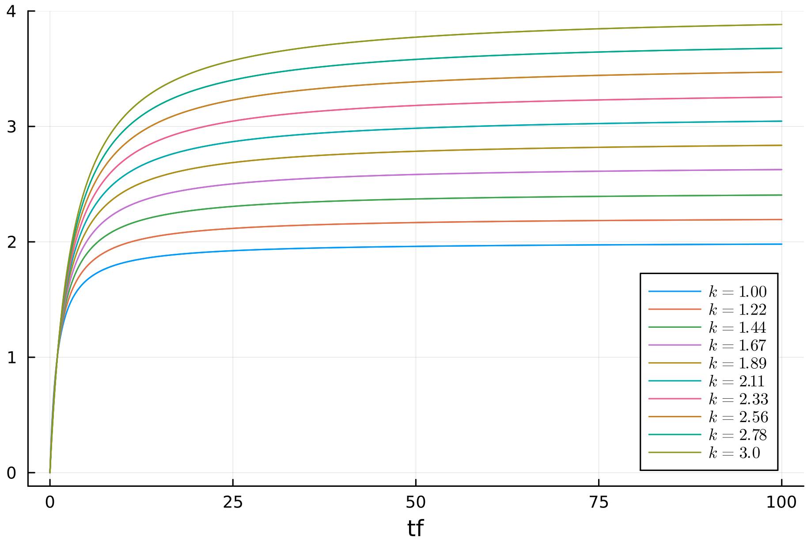
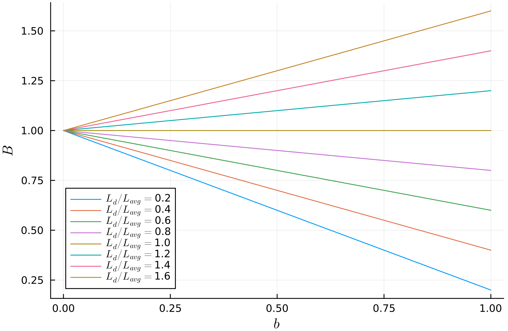

**Okapi BM25** è una funzione di ranking probabilistica basata sul modello **bag of words** che tiene conto della **term frequency** dei termini nei documenti, normalizzando opportunamente rispetto alla lunghezza del documento.

Prendiamo come punto di partenza la [[Term occurrences as 2-Poisson#^7a2ded|formula]] ricavata dalla [[Term occurrences as 2-Poisson]] $$RSV_d = \sum_{t \in q}\frac{(k_1 + 1)\text{tf}_{df}}{k_1 + \text{tf}_{df}}\log{\frac{N}{\text{df}_t}}$$
dove:
- $N$ è il numero di documenti nella collezione
- $\text{df}_t$ (**document frequency**) il numero di documenti nella collezione che contengono il termine $t$
- $\text{tf}_{df}$ (**term frequency**) il numero di volte in cui il termine $t$ appare nel documento $d$
- $k_1$ è un **parametro di tuning** che normalizza la grandezza della term frequency $\text{tf}_{df}$.
- Il fatore $k_1 + 1$ mantiene il ranking monotono (non modificando l'ordine), e fa si che il fattore di scaling rimane 1 nel caso in cui $\text{tf}_{df}=1$. Inoltre $k_1 + \text{tf}_{dt}$ serve per evitare di avere $\frac{0}{0}$ nel caso in cui $\text{tf}_{df} = 0$.

Questo scoring è simile al [[TF-IDF weight|tf-idf scoring]] con la differenza che i valori rimangono normalizzati.


Possiamo osservare che $k_1$ tiene limitato il contributo del $\text{tf}_{dt}$ al suo crescere.
Generalmente $k_1$ ha come valori tra $1.2$ e $2$.

Tale normalizzazione è necessaria perché in genere documenti molto grandi tendono ad avere un valori di $\text{tf}_{dt}$ molto grandi.

# Document length normalization
Osserviamo però che non sempre ha senso normalizzare rispetto alla lunghezza del documento.

- Se il documento è molto **verboso** allora il $\text{tf}_{dt}$ è elevato e quindi conviene normalizzare rispetto alla dimensione del documento.
- Se invece il documento è a **large scope** (parla di molti argomenti) anche se la sua dimensione è grande avremo che i $\text{tf}_{dt}$ non sono eccessivi. Quindi non conviene normalizzare rispetto alla grandezza del documento, rischiamo di perdere informazioni.

Dobbiamo quindi applicare una **normalizzazione parametrizzata**.
$$L_d = \sum_{t} \text{tf}_{d,t}$$
$$L_{\text{avg}} = \frac{\sum_{d \in D} L_d}{\vert D \vert}$$
Una possibile normalizzazione parametrizzata è $$B = (1-b) + b\frac{L_d}{L_{\text{avg}}}\;\;\; 0 \leq b \leq 1$$

Con $b \to 1$ abbiamo una normalizzazione maggiormente pesata verso la lunghezza del documento.
Con $b \to 0$ si tende a perdere il peso rispetto alla lunghezza del documento, lasciando solo la $\text{tf}_{d,f}$.

$$RSV_d = \sum_{t \in q}\frac{(k_1 + 1)\text{tf}_{df}}{k_1 \cdot B + \text{tf}_{df}}\log{\frac{N}{\text{df}_t}}$$

Il valore $B$ è messo al denominatore perché a valori alti di $B$ corrispondono minori di $RSV_d$.



- Caso $L_d / L_{\text{avg}} < 1$:
	- al **crescere** di $b$ abbiamo che $B$ **decresce** (abbiamo meno contributo rispetto alla lunghezza del documento).
- Caso $L_d / L_{\text{avg}} > 1$:
	- al **crescere** di $b$ abbiamo che $B$ **cresce** (abbiamo maggiore contributo rispetto alla lunghezza del documento).

Mediamente $b$ ha valori $0.75$.

## Weighting for long queries
Per query molto grandi possiamo applicare la stessa normalizzazione applicata rispetto alla term frequency.
L'idea è che se un termine appare molte volte in una query è perché magari è maggiormente importante.

$$RSV_d = \sum_{t \in q} \frac{(k_2+1)\text{tf}_{q,t}}{k_2+\text{tf}_{q,t}} \cdot \frac{(k_1 + 1)\text{tf}_{df}}{k_1 \cdot B + \text{tf}_{df}} \cdot \log{\frac{N}{\text{df}_t}}$$
Dove $k_2$ è un altro parametro di tuning, generalmente tra $1.2$ e $2$.

```ad-note
Non ha senso normalizzare rispetto alla **lunghezza** della query, in quanto non vogliamo penalizzare le term frequency dei termini della query.
Inoltre le query non sono mai esageratamente grandi.
```


