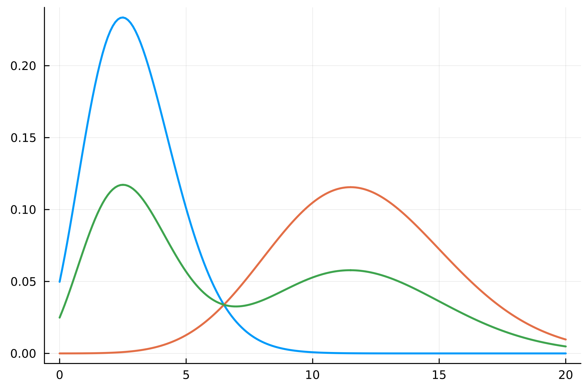

\
# Introducing term frequency in BIM
Una delle problematiche del [[Binary Independent Model#Problemi|Binary Independent Model]] era che non teneva affato in considerazione il numero di occorrenze di un termine in un documento.
Generalmente, se una parola chiave appare molte volte in un documento potrebbe voler dire che il documento è rilevante.

Ricordando come era definito il [[Binary Independent Model#^ab2996|Retrieva Status Value]]
$$RSV_d = \sum_{t \in q \cap d} \log{\frac{P(t \vert R,q) (1- P(t \vert \overline{R},q))}{P(t \vert \overline{R},q) (1-P(t \vert R,q))}} = \sum_{t \in q \cap d} \log{\frac{p_t (1- u_t)}{u_t (1-p_t)}}$$ dove
- $p_t = P(t \vert R,q)$ è la probabilità che il termine $t$ appaia in un documento **rilevante** per la query $q$.
- $u_t = P(t \vert \overline{R},q)$ è la probabilità che il termine $t$ appaia in un documento **non rilevante** per la query $q$.
- $1 - p_t = 1 - P(t \vert R,q)$ è la probabilità che il termine $t$ **non** appaia in un documento **rilevante** per la query $q$.
- $1 - u_t = 1 -P(t \vert \overline{R},q)$ è la probabilità che il termine $t$ **non** appaia in un documento **non rilevante** per la query $q$.

Abbiamo anche visto che in [[Binary Independent Model#Caso 2|mancanza di informazioni]] sulla rilevanza dei documenti, possiamo approssimare $$u_t \approx \frac{\text{df}_t}{N} = P(\lbrace d : t \in d \rbrace)$$ ovvero la probabilità di campionare un documento che contenga $t$ (sempre assumendo l'**indipendenza** tra termini e documenti).

Per introdurre il concetto di frequenza rappresentiamo i documenti come dei **count vector** $d = (d_1, ..., d_{\vert V \vert})$ dove $d_i$ è il numero di occorrenze del termine $t_i$ nel documento $d$.

Possiamo ridefinire il RSV in maniera [[Distribuzioni Multivariate|congiunta]] come
$$RSV_d = \sum_{t \in q}\log{\frac{P(d_t = n_t \vert R,q) P(d_t = 0)}{P(d_t = n_t)P(d_t = 0 \vert R, q)}}$$
dove
- $P(d_t = k \vert R,q)$ è la probabilità che il termine $t$ appaia esattamente $k$ volte in un documento rilevante.
- $P(d_t = k)$ è la probabilità che un termine $t$ appaia $k$ volte in un documento qualsiasi.

Una distribuzione semplice da calcolare che può modellare $P(d_t = k)$ è una **[[Distribuzioni#Binomiale|binomiale]]**.
Vediamo il documento $d$ come una serie di $\vert d \vert = L$ **celle**, contenenti ciascusa una parola/termine.
In maniera **semplificata** assumiamo che il termine $t_i$ abbia probabilità $\tilde{p}_i$ di apparire in una cella, e probabilità $1 - \tilde{p}_i$ di non apparire.
Avremo quindi che $$P(d_i = k) = \binom{L}{k}\tilde{p}_i^k(1-\tilde{p}_i)^{L-k}$$
# Term occurrences as Poisson
Per valori di $L$ grandi, possiamo approssiamare questa binomiale come una [[Distribuzioni#Poisson|poisson]] di parametro $\lambda = L\tilde{p}_t$
$$\text{Binom}(L, \tilde{p}) \approx \text{Poisson}(\lambda = L\tilde{p}) \implies P(d_i = k) \approx e^{-L\tilde{p_i}}\frac{(L\tilde{p}_i)^k}{k!}$$

Sorge ora il problema:
> come poter stimare il parametro $\lambda = L \tilde{p}_t$?

Come stimatore usiamo la [[Random Sample#Media campionaria|media campionaria]] del numero di occorrenze del termine $t_i$ nella collazione di documenti.
Ovvero $$\gamma_t = \frac{\sum_{d \in c} \text{tf}_{d,t}}{\vert c \vert}$$
- $$P(d_i = n_i) \sim \text{Poisson}(\gamma_i)(n_i) = \frac{e^{-\gamma_i}\gamma_i^{n_i}}{n_i !}$$
- $$P(d_i = 0) \sim \text{Poisson}(\gamma_i)(0) = e^{-\gamma_i}$$

Riducendoci ai soli documenti rilventi, possiamo calcolare la media campionaria dei numero di occorrenze del termine $t_i$ all'interno dei documenti rilevanti.
Ovvero $$\rho_t = \frac{\sum_{d \in R(q)} \text{tf}_{d,t}}{\vert R(q) \vert}$$ dove $R(q)$ è l'insieme dei documenti rilevanti per la query $q$.
- $$P(d_i = n_i \vert R,q) \sim \text{Poisson}(\gamma_i)(n_i) = \frac{e^{-\rho_i}\rho_i^{n_i}}{n_i !}$$
- $$P(d_i = 0 \vert R,q) \sim \text{Poisson}(\rho_i)(0) = e^{-\rho_i}$$

```ad-bug
Come faccio a calcolare $R(q)$ se fino a mo abbiamo detto che non so nulla riguardo a quali sono i documenti rilevanti???!!!
```

Come sonseguenza avremo che
$$\begin{align*}
RSV_d
&= \sum_{t \in q}\log{\frac{P(d_t = n_t \vert R,q) P(d_t = 0)}{P(d_t = n_t)P(d_t = 0 \vert R, q)}}\\
&= \sum_{t \in q} \log{\frac{\dfrac{e^{-\rho_t}\rho_t^{n_t}}{n_t !} \cdot e^{-\gamma_t}}{e^{-\rho_t} \cdot \dfrac{e^{-\gamma_t}\gamma_t^{n_t}}{n_t !}}}\\
&= \sum_{t \in q} \log{\frac{\rho_t^{n_t}}{\gamma_t^{n_t}}}\\
&= \sum_{t \in q} n_t \log{\frac{\rho_t}{\gamma_t}}
\end{align*}$$


# Term occurrences as 2-Poisson
Classifichiamo i termini in due differenti classi:
- I termini di **elite**, i quali caratterizzano l'argomento di un documento.
- I termini **non d'elite**, i quali non descrivono l'argomento di un documento.

Un esempio di termini d'elite in genere li possiamo trovare nei **titoli** di un documento, oppure nell'**abstract** di articoli.

Possiamo descrivere ciascuno dei termini delle due classi mediante la **composizione** di due [[Distribuzioni#Poisson|Poisson]]: una per la prima classe e una per la seconda.

Sia $E_t$ una v.a. **binaria** che rappresenta l'*eliteness* del documento $t$ rispetto al documento in questione.
$$E_t = \begin{cases}
1 &\text{se }t\text{ è di elite rispetto a }d\\
0 &\text{altrimenti}
\end{cases}$$

Possiamo modellizzare $P(d_t = n_t \vert R,q)$ come segue
$$\begin{align*}
P(d_t = n_t \vert R,q)
&= P(d_t = n_t \vert E_t)P(E_t \vert R,q) + P(d_t = n_t \vert \overline{E}_t)P(\overline{E}_t \vert R,q)\\
\\
&= \text{Poisson}(n_t\vert\lambda=\mu_t)p_t + \text{Poisson}(n_t\vert\lambda=\overline{\mu}_t)(1-p_t)\\
\\
&= \frac{e^{-\mu_t}\mu_t^{n_t}}{n_t!}\cdot p_t + \frac{e^{-\overline{\mu}_t}\overline{\mu}_t^{n_t}}{n_t!}\cdot (1 - p_t)
\end{align*}$$
dove
- $P(d_t = n_t \vert R,q)$ è la probabilità che un termine $t$ appaia $n_t$ volte all'interno di un documento rilevante.
- $P(E_t \vert R,q) = P(E_t = 1 \vert R,q) = p_t$ è la probabilità che il termine $t$ sia un termine d'elite per un documento rilevante.
- $P(\overline{E}_t \vert R,q) = P(E_t = 0 \vert R,q) = p_t$ è la probabilità che il termine $t$ sia un termine **non** d'elite per un documento rilevante.




