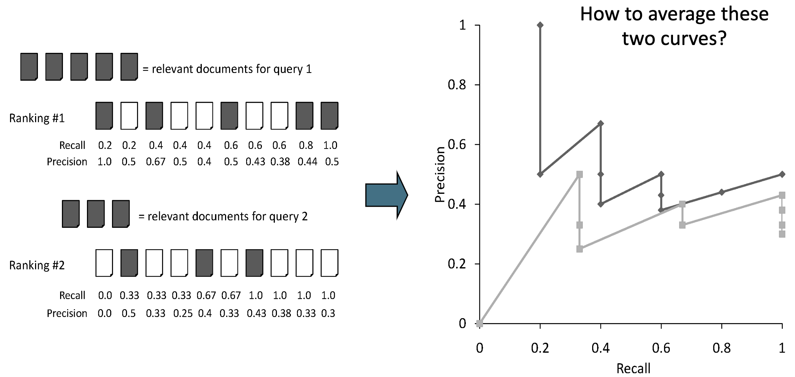
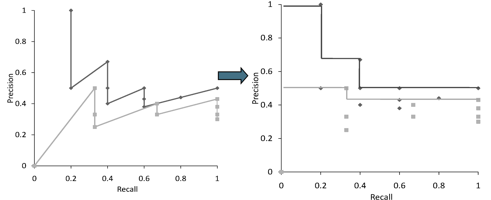
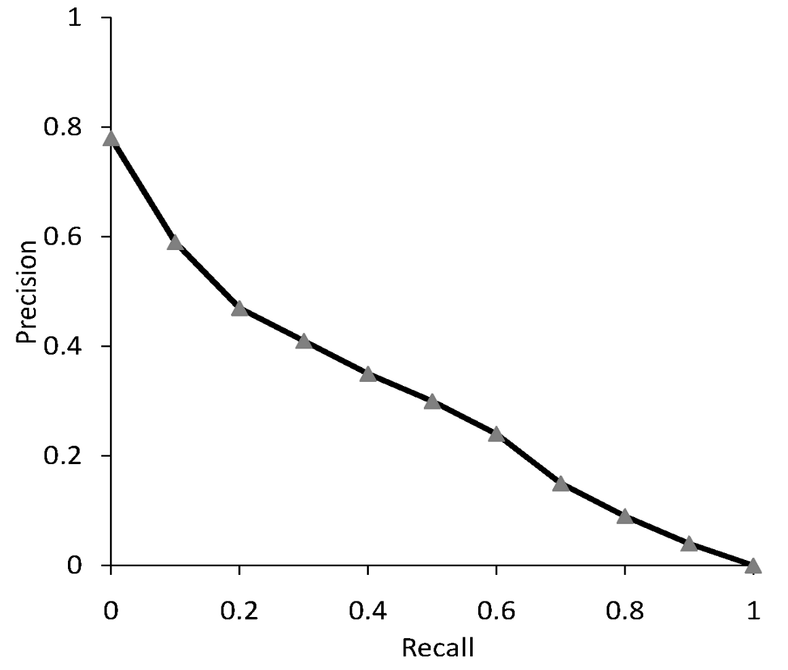

Misure come [[Set Based Measures|precision, recall ed F-measure]] sono basati solamente sugli **insiemi** dei documenti restituiti e sull'insieme dei documenti target.

Abbiamo visto che un sistema di IR non si limita solo a restituire un sottoinsieme di documenti, bensì ne devinisce un [[Scoring, term weighting & the vector space model|ranking]] di significatibilità (rispetto alla query).
Abbiamo perciò bisogno di estendere questi concetti di *misura della qualità* anche agli **score** delle pagine restituite.

----------
# Precision@K (P@K)
Per estendere il concetto di [[Set Based Measures#Precision and Recall|precision]] sui [[Scoring, term weighting & the vector space model|ranking]] procediamo nel seguente modo:
1. Prendiamo il risultato della nostra query.
2. Lo ordiniamo in base agli [[Scoring, term weighting & the vector space model|score]] delle pagine.
3. Prendiamo i primi $K$ documenti.
4. Definiamo la **precision** sull'insieme composto da quei soli $k$ documenti.
Intuitivamente stiamo **restringendo** il calcolo della precision sui primi $K$ documenti in cima al **ranking**.
Questa quantità è detta **precision@K** o **p@K**.
In maniera analoga, possiamo definire anche la **recall@K** o **r@K**.

> **Esempio**
> Consideriamo il seguente insieme di documenti $\langle$ ✅ ❌ ✅ ❌ ✅ $\rangle$ come risultato di un retrieval, dove con ✅ indichiamo i **true positive** e con ❌ i **false positive**.
> Avremo le seguente **precision@K** per i diveri valori di $K$:
> - $P@3 = 2/3$
> - $P@4 = 1/2$  
> - $P@5 = 3/5$

## Recall-Precision Graph
Dati tutti i valori di **precision@K** e **recall@K** (per $K$ da 1 alla dimensione del retrieval) possiamo metterli in un grafico **precision/recall**.



Dopodiché **interpoliamo** i valori del grafico con la seguente funzione
$$P(r) = \max{\lbrace P': \exists (R', P') \in S \left[ R' \geq r \right] \rbrace}$$
dove $S$ è l'insieme di **punti osservati** $(P,R)$.

In pratica la funzione $P(r)$ definisce il valore di *precision* rispetto a qualisasi recal $r$ come la *massima precision* **osservata** in tutte le coppie il cui valore di recall è $\geq r$.



Otterremo così un grafico **monotono non crescente**.

Produciamo questo grafico per ogni query (nel nostro caso 2) e facciamo la **media**.
Otterremo quindi una descrizione del mostro motore di IR tramite una **curva** (detta **curva precision/recall**) che rappresenta come **precision** e **racall** sono tra loro **bilanciate** nel notro motore di IR.

```ad-info
Ricoridamo che **precision** e **recall** sono mutuamente bilanciate.
Generalmente al crescere di una, l'altra diminuisce.
```




------
# Mean Average Precision (MAP)


-------
# Mean Reciprocal Rank (MRR)

