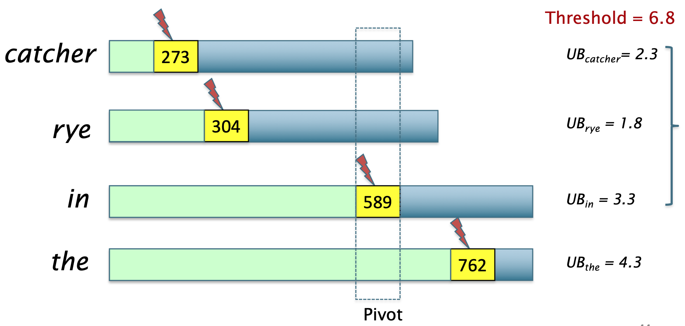

# The WAND operator
Definiamo l'**operatore booleano** **WAND** (da **Weak AND** o **Weighted AND**).

Tale operatore ha come parametri
- una serie di **variabili booleane** $\mathbf{X} = X_1, ..., X_n$.
- una serie di **pesi positivi** $\mathbf{w} = w_1, ..., w_n$.
- una **treshold** $\theta \geq 0$.

Per definizione $\text{WAND}(\mathbf{X}, \mathbf{w}, \theta)$ è **vero** se e solo se $$\sum_{i = 1}^{n} X_i \cdot w_i \geq \theta$$ 
Importante osservare che l'operatore **WAND** è una **generalizzazione** degli operatori logici **AND** e **OR**.
$$\text{OR}(\mathbf{X}) \equiv \text{WAND}(\mathbf{X}, \underline{1}, 1)$$
$$\text{AND}(\mathbf{X}) \equiv \text{WAND}(\mathbf{X}, \underline{1}, n)$$

Infatti, fissando i pesi tutti pari ad 1, al variare della *threshold* da $1$ ad $n$ avremo che l'operatore WAND varia dall'OR all'AND.

# Scoring
Prendiamo in considerazione come **funzione di score** il [[TF-IDF weight]].
Avremo quindi che lo **score** di un documento $d$ rispetto alla query $q$ risulta essere $$\text{Score}(d,q) = \sum_{t \in q \cap d}\alpha_t \cdot w(t,d)$$ dove
- $\alpha_t = \log{(N/\text{df}_t)}$ è la [[TF-IDF weight#^3ca620|informative document frequency]] del termine $t$.
- $w(t,d) = \log{(1 + \text{tf}_{d,t})}$ è una funzione della [[Bag of words model - Term Frequency tf|term frequency]] del termine $t$ rispetto al documento $d$.

Assuamiamo per il momento di avere a disposizione un **upper bound** al contributo massimo che ogni termine $t$ può dare nel calcolo dello score.
$$UB_t \geq \alpha_t \cdot \max_{d \in C}{\lbrace w(t,d) \rbrace}$$

Combinando questi upper bound possiamo definire un upper bound allo score che un documento $d$ può avere rispetto a una query $q$.
$$\text{Score}(d,q) = \sum_{t \in q \cap d} \alpha_t \cdot w(t,d) \leq \sum_{t \in q \cap d} UB_t = UB(d,q)$$

Dato questo setup, possiamo stimare uno **score preliminare** del documento $d$ come $$\text{WAND}(\langle X^{(d)}_1, ..., X^{(d)}_{\vert q \vert}\rangle, \langle UB_1, ..., UB_{\vert q \vert}\rangle, \theta)$$
dove 
- $X^{(d)}_1, ..., X^{(d)}_{\vert q \vert}$ sono variabili **indicatrici** della presenza di un query term nel documento $d$ ($X^{(d)}_i = 1$ se e solo se il query term $t_i$ è presente nel documento $d$, 0 altrimenti).
- $\theta$ è una threshold che varia **dinamicamente** durante l'esecuzione dell'algoritmo.

L'algoritmo WAND semplicemente calcola (in maniera efficiente) il predicato $\text{WAND}$ sui documenti della collezione, e per tutti quei documenti i quali il predicato è `true` verrà calcolato il ranking.
Tutti quei documenti per i quali il predicato è `false` non verranno processati per il calcolo del ranking.

La *threshold* $\theta$ è <u>aggiornata dinamicamente</u> come il **minimo score** $m$ tra i top $k$ documenti trovati fino a quel momento.
Più alto è il valore della threshold più documenti verranno **scartati**, e quindi calcoleremo lo score per meno documenti.

# Implementing the WAND iterator
Per sviluppare in maniera **efficiente** questo algoritmo non possiamo calcolare se l'operatore WAND è soddisfatto per <u>tutti</u> gli elementi di una posting list, in quanto risulta essere troppo dispendioso.
Il **WAND-iterator** è un metodo che consente di trovare in maniera **efficiente** i soli posting che soddisfano il predicato WAND.

Per prima cosa per le posting list dei query trem $t$ l'algoritmo tiene un **puntatore** (detto **finger**) che punta al posting corrente che è stato appena processato.
Abbiamo quindi bisogno di un metodo $\text{next}(\theta)$ che presa in input la threshold $\theta$ **sposta** il *finger* al succesivo documento della posting list il cui **approximation score** $UB(d,q)$ è maggiore di $\theta$.
$$\text{next}(\theta) \implies \text{finger}_t = \arg\min_{i \geq \text{finger}_t}{\lbrace \text{posting}_t\left[ i \right] \geq \theta \rbrace}$$

Il WAND-iterator mantiene una **invariante** durante l'esecuzione dell'algoritmo:
> tutti i documenti con docID $\leq \text{finger}_t$ sono stati considerati come possibili candidati.

Il metodo efficiente per implementare l'iteratore è il seguente:
1. Ordiniamo i query term $t_1, ..., t_{\vert q \vert}$ rispetto ai rispettivi *finger* (il termine con fingher più basso è il primo, il termine col finger più alto è l'utlimo).
2. Calcoliamo un **termine pivot** $t_i$ tale che $$\sum_{j = 1}^{i} UB_{t_i} \geq \theta$$
3. Il documento puntato del finger $\text{finger}_{t_i}$ del pivot è il minimo candidato possibile che soddisfa il WAND operator con parametri il $\theta$ corrente.
4. Per tutti i termini $t_j \leq t_i$ poniamo il loro finger uguale al minimo posting tale che $\geq \text{finger}_{t_i}$ (è possibile farlo in tempo **logaritmico** con una ricerca dicotomica).

Consideriamo come esempio la query $$q = \text{"catcher in the rye"}$$

# Setting the WAND Threshold
Abbiamo detto che $\theta$ è aggiornato **dinamicamente** durante l'esecuzione dell'algoritmo pari al **minimo** score dei **top** $k$ documenti tra tutti quelli presi in considerazione come candidati fino a quel momento.

Per fare ciò in maniera efficiente viene usato un (min-) **heap** che contiene i soli $k$ docuementi con score migliore trovati fino a quel momento.
Così facendo si può recuperare in maniera efficiente il minimo tra questi, ed eventualmente aggiornalo.

# WAND summary
WAND è un metodo [[Efficient Scoring#Safe vs non-safe ranking|safe]] in quanto tutti i documenti con $UB(d,q) \leq \theta$ non vengono considerati come candidati, e dato che $\text{Score}(d,q) \leq UB(d,q)$ allora non c'era alcuna speranza che tali documenti potessero appartenere ai top $k$.

Tale algoritmo da un miglioramento del $90\%$ nelle prestazioni del calcolo del [[Scoring, term weighting & the vector space model|ranking]].