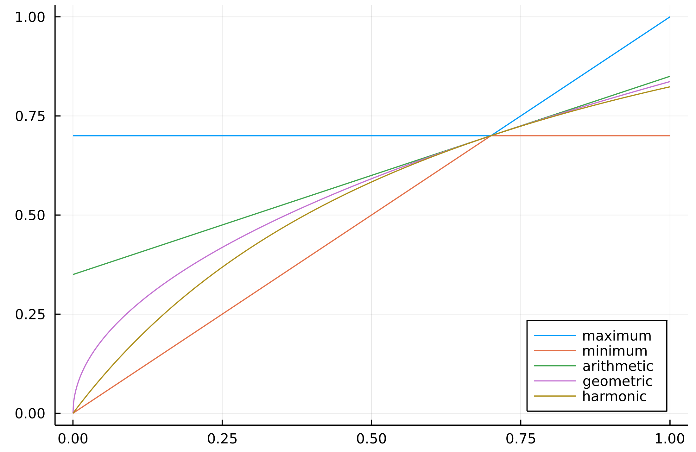

# Precision and Recall
Definiamo l'insieme $T$ di documenti **rilevanti**, detto anche **target**.
Sia invece $R$ l'insieme di documenti restituiti a seguito di una query.
Definiamo le seguenti misure

- **Recall**: la frazione di documenti rilevanti ritornati $$\text{recall} = \frac{\vert T \cap R \vert}{T} = \frac{tp}{tp + fn}$$
- **Precision**: la frazione di documenti rilevanti presenti nella mia risposta $$\text{precision} = \frac{\vert T \cap R \vert}{R} = \frac{tp}{fp + tp}$$

\ | **Relevant** | **Non Relevant**
---|---|---
**Retrieved** | true-positive: $tp = T \cap R$ | false-positive: $fp = R \setminus T$
**Not Retrieved** | false-negative: $fn = T \setminus R$ | true-negative: $tn = \lnot (T \cap R)$

Analiziamo la relazione tra **precision** e **recall**.
Se la query ritorna pochi risultati, potrei avere molti documenti rilevanti ovvero **alta precision**, però recall bassa perché ne ritorno troppo pochi (poca recall).
Ma mano che aumento il numero di documenti ritornani, aumento quelli rilevanti che riesco a recuperare ovvero aumento la **recall**, però tendo anche incluedere sempre più documenti non rilevanti (diminuendo al precision).
L'ideale è avere precision e recal abbastanza alti e simili.

### Esempio
Consideriamo l'insieme $T = \lbrace T_1, ..., T_6 \rbrace$ l'insieme dei documenti **target**, ed indichiamo con $X$ un qualsiasi documento **fuori** $T$.

\ | $T_2$ | $X$ | $T_3$ | $T_1$ | $T_6$ | $T_5$ | $X$ | $X$ | $X$ | $T_4$
---|---|---|---|---|---|---|---|---|---|---
**Recall** | 0.16 | 0.16 | 0.33 | 0.5 | 0.66 | 0.83 | 0.83 | 0.83 | 0.83 | 1.0
**Precision** | 1.0 | 0.5 | 0.66 | 0.75 | 0.8 | 0.83 | 0.71 | 0.62 | 0.55 | 0.6

\ | $X$ | $T_3$ | $X$ | $X$ | $T_6$ | $T_1$ | $T_4$ | $X$ | $T_5$ | $T_2$
---|---|---|---|---|---|---|---|---|---|---
**Recall** | 0.0 | 0.16 | 0.16 | 0.16 | 0.33 | 0.5 | 0.66 | 0.66 | 0.83 | 1.0
**Precision** | 0.0 | 0.5 | 0.33 | 0.25 | 0.4 | 0.5 | 0.57 | 0.5 | 0.55 | 0.6

------------
# Accuracy and Error
Altre due misure sono l'**accuracy** e l'**error**.
- **Accuracy**: la frazione di pagine correttamente classificate come rilevanti e non rilevanti $$\text{acc} = \frac{tp + tn}{tp+tf+fp+fn}$$
- **Error**: la frazione di pagine classificate in maniera sbagliata $$\text{err} = \frac{fp + fn}{tp+tf+fp+fn} = 1 - \text{acc}$$

----------
# F-Measure
In genere è preferibile usare una sorta di **media** tra **precisione** e **recall**.
Sia $P$ la precisione e $R$ la recall, .a **F-measure** usa una **media armonica** tra i duce valori $$F = \frac{1}{\alpha\frac{1}{P} + (1 - \alpha)\frac{1}{R}} = \frac{(\beta^2 + 1)PR}{\beta^2P + R}$$ dove $$\beta^2 = \frac{1-\alpha}{\alpha}$$
Per esempio, per $\alpha = 1/2$ avremo $\beta^2 = 1$ e quindi
$$F = \frac{1}{\frac{1}{2}(\frac{1}{P} + \frac{1}{R})} = \frac{2RP}{P + R}$$
Quando $\alpha = 1/2$ è nota come **F1-measure**.

