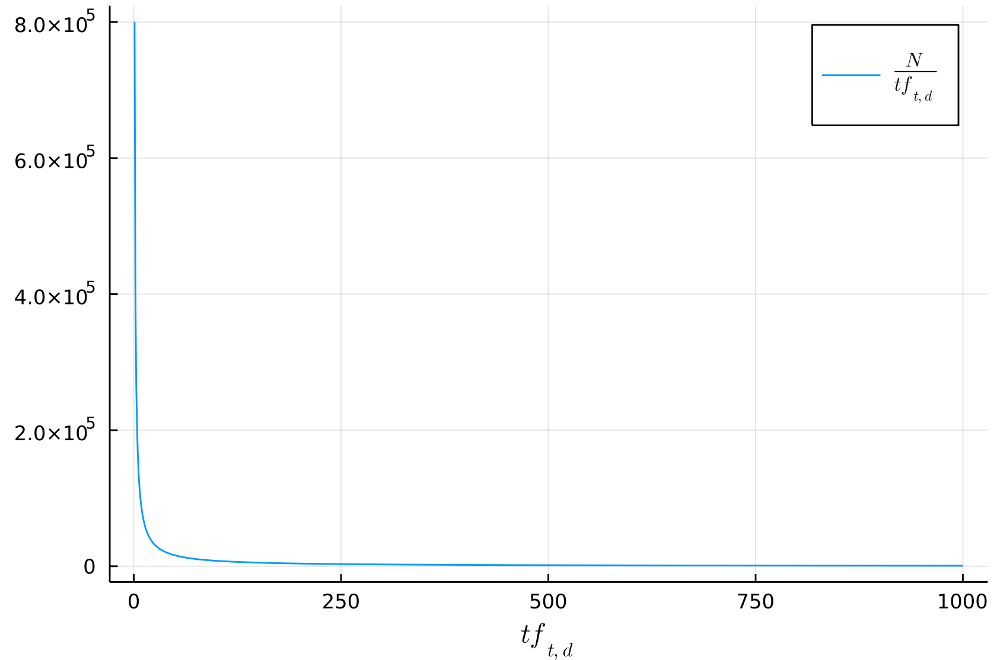
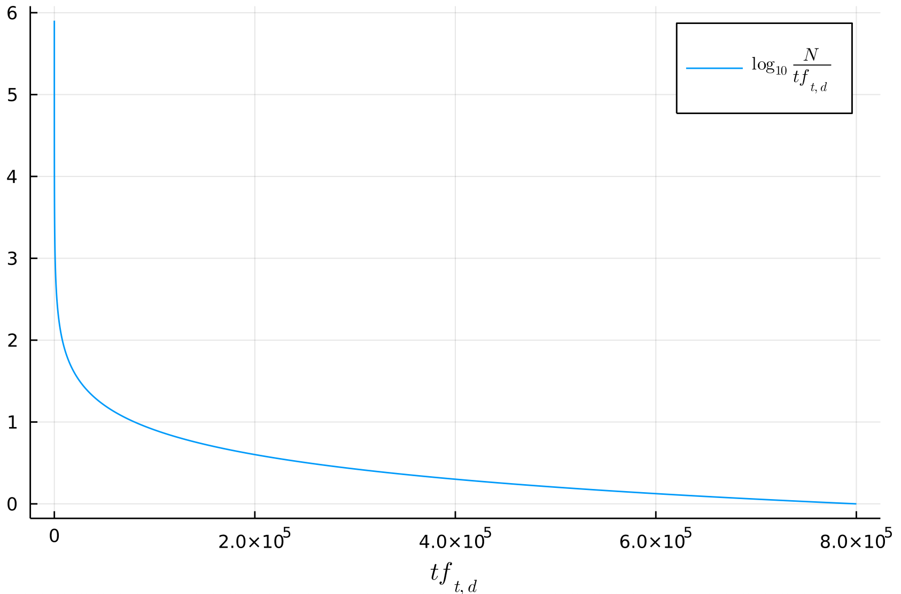

Consideriamo la query `the dog`.
Come risultato della query otterrò tantissimi documenti inutili alla mia ricerca, per il semplice motivo che è presente il termine `the` un numero elevato di volte.

Un primo approccio semplice che abbiamo già incontrato è la [[Inverted Index#Dropping common terms: stop words|rimozione delle stopwords]].
Questo metodo però non è molto elegante, perché alcune stopwords potrebbero risultare utili ai fini della mia query.
Per esempio, potrei cercare nella mia query `come si dice in inglese l'articolo "un"?`.
Eliminando le stopwords, gli unici termini utili risulterebbero `come, dice, inglese, articolo`.

Un'idea più elegante è invece che i termini che sono più **rari** in una lingua sono più **informativi** in un documento.
Più semplicemente si può pensare che un termine che occorre più volte sarà **meno informativo** di un termine **più raro**.

Se per esempio la mia query è `the Phenethylamine`, sicuramente il termine `Phenethylamine` è decisamente più utile ai fini della ricerca, anziché `the`.
E questo accade perché `Phenethylamine` è decisamente più raro nella lingua inglese rispetto a `the`.

È ragionevole quindi **pesare** i termini in base alla loro **rarità**, sfruttiamo di nuovo la loro **document frequency**.

Definiamo quindi la **informativeness** di un termine come
$$\text{idf}_t = \log_{10}{\frac{N}{\text{df}_t}}$$
dove $\text{df}_t$ è la **document frequency** del termine $t$ nella mia collezione, ed $N$ è il numero di documenti. ^3ca620

Si preferisce applicare una trasformazione non lineare a $N/\text{df}_t$ per avere una curva di decrescita **meno ripida**.

A questo punto definiamo il **peso** di un termine $t$ rispetto a un documento $d$ combinando la sua [[Bag of words model - Term Frequency tf|term frequency]] e la sua [[#^3ca620|informativeness]]
$$w_{t,d} = (1 + \log{(\text{tf}_{t,d}})) \cdot \log{ \left( \frac{N}{\text{df}_t} \right)} = \text{tf-weight} \times \text{idf-weight}$$

Possiamo quindi definire una **score matrix** dove le entri saranno $w_{i,j}$, dove $i$ è un termine e $j$ è un docuemnto.