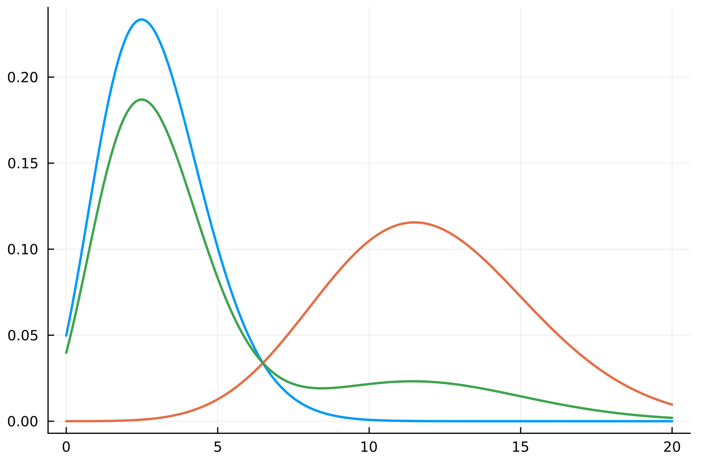

Classifichiamo i termini in due differenti classi:
- I termini di **elite**, i quali caratterizzano l'argomento di un documento.
- I termini **non d'elite**, i quali non descrivono l'argomento di un documento.

Un esempio di termini d'elite in genere li possiamo trovare nei **titoli** di un documento, oppure nell'**abstract** di articoli.

Possiamo descrivere ciascuno dei termini delle due classi mediante la **composizione** di due [[Distribuzioni#Poisson|Poisson]]: una per la prima classe e una per la seconda.

Sia $E_t$ una v.a. **binaria** che rappresenta l'*eliteness* del documento $t$ rispetto al documento in questione.
$$E_t = \begin{cases}
1 &\text{se }t\text{ è di elite rispetto a }d\\
0 &\text{altrimenti}
\end{cases}$$

Possiamo modellizzare $P(d_t = n_t \vert R,q)$ come segue
$$\begin{align*}
P(d_t = n_t \vert R,q)
&= P(d_t = n_t \vert E_t)P(E_t \vert R,q) + P(d_t = n_t \vert \overline{E}_t)P(\overline{E}_t \vert R,q)\\
\\
&= \text{Poisson}(n_t\vert\lambda=\mu_t)p_t + \text{Poisson}(n_t\vert\lambda=\overline{\mu}_t)(1-p_t)\\
\\
&= \frac{e^{-\mu_t}\mu_t^{n_t}}{n_t!}\cdot p_t + \frac{e^{-\overline{\mu}_t}\overline{\mu}_t^{n_t}}{n_t!}\cdot (1 - p_t)
\end{align*}$$

$$\implies P(d_t = 0 \vert R,q) = e^{-\mu_t}p_t + e^{-\overline{\mu}_t}(1-p_t)$$

dove
- $P(d_t = n_t \vert R,q)$ è la probabilità che un termine $t$ appaia $n_t$ volte all'interno di un documento rilevante.
- $P(E_t \vert R,q) = P(E_t = 1 \vert R,q) = p_t$ è la probabilità che il termine $t$ sia un termine d'elite per un documento rilevante.
- $P(\overline{E}_t \vert R,q) = P(E_t = 0 \vert R,q) = p_t$ è la probabilità che il termine $t$ sia un termine **non** d'elite per un documento rilevante.
- $\mu_t$ è il numero medio di termini d'elite in documenti rilevanti.
- $\overline{\mu}_t$ è il numero medio di termini **non** d'elite in documenti rilevanti.

Analogamente possiamo modellizzare con la combinazione di due Poisson anche la probabilità $P(d_t = n_t)$ che il termine $t$ appaia $n_t$ volte in un qualsiasi documento.
$$\begin{align*}
P(d_t = n_t)
&= P(d_t = n_t \vert E_t)P(E_t) + P(d_t = n_t \vert \overline{E}_t)P(\overline{E}_t)\\
\\
&= \text{Poisson}(n_t\vert\lambda=\mu_t)P(E_t) + \text{Poisson}(n_t\vert\lambda=\overline{\mu}_t)(1-P(E_t))\\
\\
&= \frac{e^{-\mu_t}\mu_t^{n_t}}{n_t!}\cdot P(E_t) + \frac{e^{-\overline{\mu}_t}\overline{\mu}_t^{n_t}}{n_t!}\cdot (1 - P(E_t))
\end{align*}$$
$$\implies P(d_t = 0) = e^{-\mu_t}P(E_t) + e^{-\overline{\mu}_t}(1-P(E_t))$$
dove
- $P(E_t) = P(E_t = 1)$ è la probabilità che il termine $t$ sia d'elite rispetto al documento in question.
- $P(\overline{E}_t) = P(E_t = 0) = 1 - P(E_t = 1) = 1 - P(E_t)$.

Possiamo quindi stimare il [[Introducing term frequency in BIM#^2d7816|Retrieva Status Value]] utilizzando queste nuove approssimazioni
$$\begin{align*}
RSV_d
&= \sum_{t \in q}\log{\frac{P(d_t = n_t \vert R,q) P(d_t = 0)}{P(d_t = n_t)P(d_t = 0 \vert R, q)}}\\
\\
&= \sum_{t \in q}
\log{
\frac{
	\left[
		\frac{e^{-\mu_t}\mu_t^{n_t}}{n_t!}\cdot p_t + \frac{e^{-\overline{\mu}_t}\overline{\mu}_t^{n_t}}{n_t!}\cdot (1 - p_t)
	\right]
	\cdot
	\left[
		e^{-\mu_t}P(E_t) + e^{-\overline{\mu}_t}(1-P(E_t))
	\right]
	}{
	\left[
		\frac{e^{-\mu_t}\mu_t^{n_t}}{n_t!}\cdot P(E_t) + \frac{e^{-\overline{\mu}_t}\overline{\mu}_t^{n_t}}{n_t!}\cdot (1 - P(E_t))
	\right]
	\cdot
	\left[
		e^{-\mu_t}p_t + e^{-\overline{\mu}_t}(1-p_t)
	\right]
	}
}
\end{align*}$$

