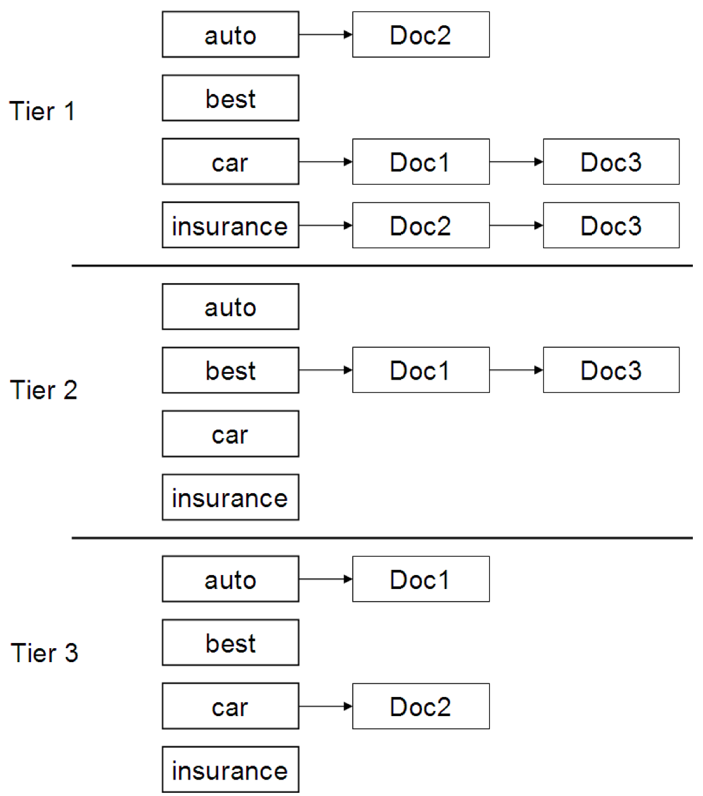

L'idea del **tiered indexes** consiste nel **partizionare** le posting list di un termine $t$ in vari **tier** (**livelli**), raggruppati per **importanza**.

Perciò quando andiamo a considerare un termine $t$ consideriamo i **tier** più importanti, scendendo di livello finché non abbiamo recuperato i $k$ documenti più importante.

Per definire i **tier** possiamo usare una generica misura di **qualità** dei documenti, come per esempio il [[Query-Independent Document Scores#Net-Score|quality-score]] $g(d)$ (o qualsiasi altra misura approriata).