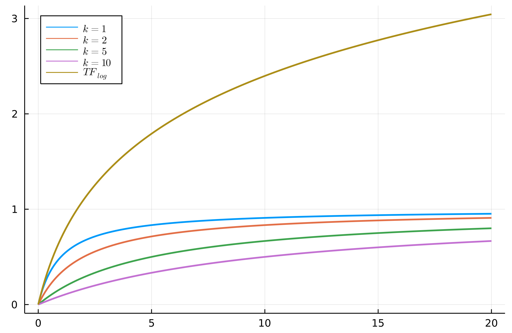

# Variants of tf weighting
Nel modello [[Bag of words model - Term Frequency tf|bag of words]] usiamo come **term frequency** solamente il numero di documenti in cui un termine $t$ appare in un dato documento $d$.

Analiziamo ora alcune varianti interessanti.
Prima però definiamo:
- $\vert d \vert$ il numero di termini **distinti** nel documento $d$.
- $\vert c \vert$ il numero di documenti in una **collezione** $c$.
- $\text{tf}_{t,d}$  il numero di volte in cui un termine $t$ appare nel documento $d$.
- $N(d) = \sum_{t} \text{tf}_{t,d}$, il numero di occorrenze dei termini nel documento $d$.
- $N_{avg}(d) = \dfrac{N(d)}{\vert d \vert}$  la **media** del numero di occorrenze dei termini nel documento $d$.
- $\text{adl}(c) = \dfrac{\sum_{d \in c}N(d)}{\vert c \vert}$ il numero **medio** di occorrenze dei termini nei documenti della collezione $d$. (oss. )
- $\text{ndl}(d,c) = \dfrac{N(d)}{\text{adl}(c)}$ il numero di occorrenze dei termini in $d$ **normalizzato** (tra 0 e 1).

```ad-note
title: Osservazioni importanti
1. $N(d)$ è la **lunghezza** (inteso come numero di parole) del documento $d$. Questo è differente da $\vert d \vert$ perché conta anche i duplicati ($\vert d \vert$ conta solo quelli distinti).
2. Alla luce del punto (1) abbiamo che $\text{adl}(c)$ è la **lunghezza media** dei documenti nella collezione $c$.
```


**Name** | **Symbol** | **Function**
---|---|---
natural | $\text{TF}_{total}(t,d)$ | $\text{tf}_{t,d}$
boolean | $\text{TF}_{bool}(t,d)$ | $\begin{cases}1 &\text{if tf}_{t,d}>0\\0&\text{otherwise}\end{cases}$
sum | $\text{TF}_{sum}(t,d)$ | $\dfrac{\text{tf}_{t,d}}{N(d)}$
max | $\text{TF}_{max}(t,d)$ | $\dfrac{\text{tf}_{t,d}}{\max_x\lbrace\text{tf}_{x, d}\rbrace}$
augmented | $\text{TF}_{aug}(t,d)$ | $\frac{1}{2}(1 + \text{TF}_{max}(t,d))$
log | $\text{TF}_{log}(t,d)$ | $\log{(1 + \text{tf}_{t,d})}$
log avg | $\text{TF}_{logavg}(t,d)$ | $\dfrac{\text{TF}_{log}(t,d)}{\log{(1 + N_{avg}(d))}}$
frac | $\text{TF}_{frac}(t,d \; \vert \; k)$ | $\dfrac{\text{tf}_{t,d}}{\text{tf}_{t,d} + k}$
BM25 | $\text{TF}_{BM25}(t,d,c \; \vert \; k,b)$ | $\dfrac{\text{tf}_{t,d}}{\text{tf}_{t,d} + k(b \cdot \text{ndl}(d,c) + (1-b))}$

Osservazioni sulle funzioni
1. Le funzioni $\text{TF}_{total}$, $\text{TF}_{sum}$ e $\text{TF}_{max}$ si basano tutte sull'assunzione di **indipendenza** delle occorrenze. La **term frequency** continua a cresce della stessa quantità ma mano che trovo le occorrenze nel documento $d$, **indipendentemente** da quante ne ho trovate in precedenza.

2. La funzione $\text{TF}_{total}$ non è **normalizzata** rispetto alla grandezza del documento, perciò ha una forte tendenza a preferire i documenti più grandi. Infatti, supponiamo di avere una collezione di documenti tutti con la stessa **percentuale** di occorrenze di un termine $t$. Con $\text{TF}_{total}$ quelli più grandi sono preferiti a quelli più piccoli, anche se in proporzione sono tutti uguali.
 ^da73f5
3. La funzione $\text{TF}_{sum}$ invece **normalizza** rispetto alla **lunghezza** del documento. Perciò risolve il problema del punto [[#^da73f5|(2)]].

4. Invece $\text{TF}_{max}$ è una via di mezzo tra $\text{TF}_{total}$ e $\text{TF}_{sum}$: per la stessa percentuale di **term frequency** preferisce i documenti con grandezza maggiore, ma non così tanto come $\text{TF}_{total}$.

5. La funzione $\text{TF}_{frac}$ da un apporto più basso a frequenze basse, per poi andare a regolarizzarsi per frequenze molto grandi.

6. Infine la funzione $\text{TF}_{log}$ applica una funzione logaritmo per mettere in paragone solamente le **scale di grandezza** delle frequenze.



-------------
# Variants of idf weighting
Definiamo:
- $n(t,c) = \sum_{d \in c}\text{TF}_{bool}(t,d)$, ovvero il numero di documenti nella collezione $c$ in cui il termine $t$ appare.
- $\vert c \vert$ il numero di documenti in una **collezione** $c$.

**Name** | **Symbol** | **Function**
---|---|---
total | $\text{IDF}_{total}(t,c)$ | $-\log{n(t,c)}$
sum | $\text{TF}_{sum}(t,d)$ | $-\log{\dfrac{n(t,c)}{\vert c \vert}}$
sooth sum | $\text{TF}_{smooth}(t,d)$ | $-\log{\dfrac{n(t,c) + 0.5}{\vert c \vert + 1}}$
prob | $\text{TF}_{prob}(t,d)$ | $\max \left( 0, -\log{\dfrac{n(t,c)}{\vert c \vert - n(t,c)}} \right)$
smooth prob | $\text{TF}_{smoothprob}(t,d)$ | $\max \left( 0, -\log{\dfrac{n(t,c) + 0.5}{\vert c \vert - n(t,c) + 0.5}} \right)$
