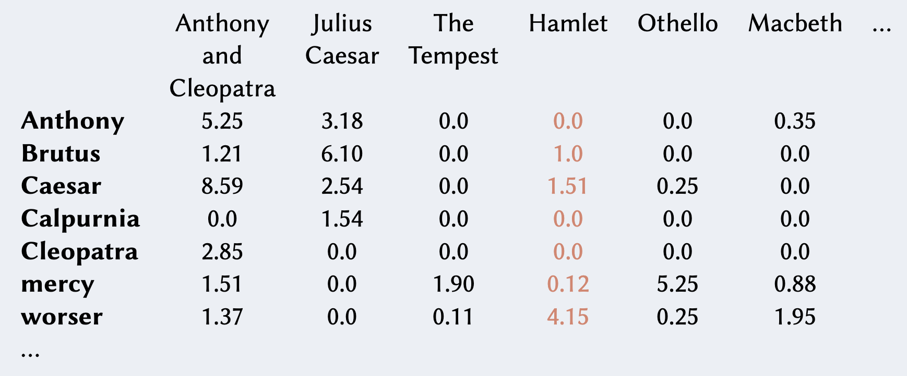
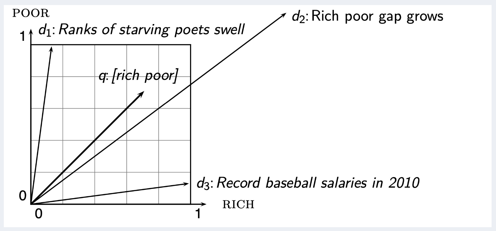
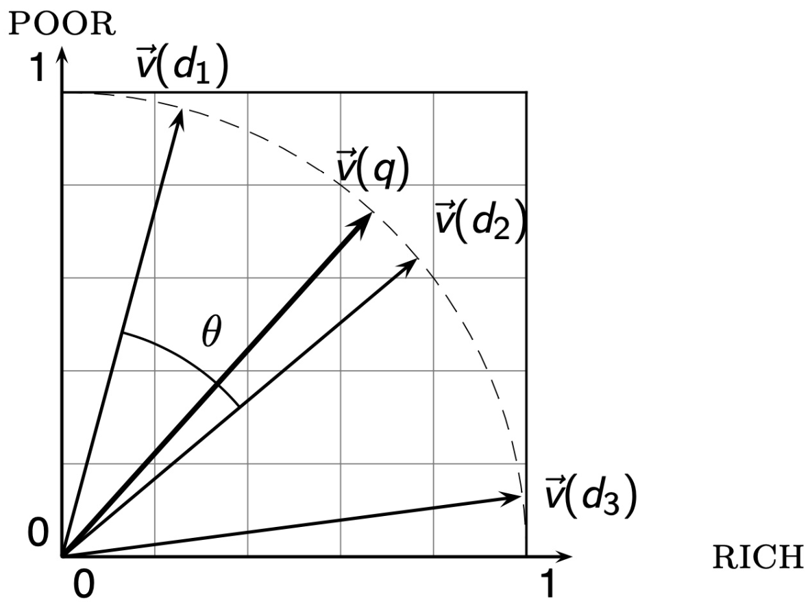

Abbiamo visto in precedenza che è utile rappresentare i documenti come:
- un [[Binary Term-Document Incidence Matrix|binary term vector]] in $\lbrace 0,1 \rbrace^{\vert V \vert}$
- un [[Bag of words model - Term Frequency tf#^6f3674|count term vector]] in $\mathbb{N}^{\vert V \vert}$

Alla luce di quanto visto fin ora, è più ragionevole definire una matrice di valori **reali**, dove alla cella $(i,j)$ è presente il [[TF-IDF weight|peso tf-idf]] $w_{i,j}$.



Tale matrice è anche detta **score matrix**, e ogni documento è ora rappresentato com un vettore in $\mathbb{R}^{\vert V \vert}$.

Grazie a questa rappresentazione, abbiamo che i nostri documenti ora sono dei **punti** o **vettori** in uno spazio $\vert V \vert$-dimensionale, dove i termini rappresentano le **dimensioni** o **assi** di questo spazio.

La lunghezza di ogni coordinata di un vettore che rappresenta un documento è quindi il peso tf-idf rispetto alla coordinata.

```ad-note
Osservare che tale spazio può avere un numero di dimensioni veramente esorbitante: anche decine di milioni se pensiamo al web.
In ogni caso, quando le dimensioni sono tante, i vettori sono per lo più **sparsi** (con molte entries nulle).
```

Secondo questo modello, possiamo rappresentare anche le **query come vettori**.
A questo punto potremmo definire un **rank** dei documenti in base alla loro "*prossibità*" al vettore-query.

Ma quale metrica di **distanza** conviene usare?
Per esempio la classica **distanza euclidea** potrebbe funzionare bene se i vettori avessero **magnitudo** simili.

Purtroppo però i documenti hanno migliaia di termini in più rispetto alle query (sono **molto meno sparsi**) perciò potrebbero essere davvero parecchio distanti dal vettore-query, anche se rilevanti alla fine del ranking.



Per rendere meglio l'idea, consideriamo un vettore-documento $d$.
Da esso creaimo il vettore $d'$, composto dalla concatenzaione di due o più volte $d$ stesso.
Semanticamente i due vettori $d$ e $d'$ sono la stessa cosa, però se usiamo la distanza euclidea come misura di similarità capiterà che uno è decisamente milgiore rispetto all'altro. ^b7f306

Un modo migliore per misurare la similiratià tra i vettori di questo spazio è quindi la loro **direzzione**.
L'idea è che se due vettori puntano nella stessa direzione nello spazio allora semanticamente voglio dire la stessa cosa.

Perciò, più la direzione di un vettore-documento è simile a quella del vettore-query, più esso sarà rilevante ai fini del ranking.

Per calcolare la differenza di direzione possiamo sfruttare l'**angolo** tra vettori.

Osservare che, dato un angolo $\alpha \in \left[ 0, \pi \right]$, la funzione $\cos{\alpha}$ sarà **decrescente**.
Perciò ordinare i documenti in senso **decrescente rispetto all'algono** è equivalente ad ordinarli in senso **crescente rispetto al coseno**.

È inoltre possibile calcolare il coseno tra due vettori in maniera efficiente semplicemente **normalizzandoli**.
Dati due vettori unitari, infatti, il loro coseno equivale al loro **prodotto scalare**.

```ad-info
title: Normalizzare un vettore
Prendiamo un generico vettore $v \in \mathbb{R}^n$.
Il vettore **normalizzato** di $v$ equivale a $v$ stesso ma scalato in modo tale da avere **lunghezza** pari ad 1.
Per ottenerlo, basterà dividere ogni componente di $v$ con la sua **norma euclidea**, o **norma 2**.
$$\Vert v \Vert_2 = \sqrt{\sum_{i=1}^{n} v_i^2}$$
Perciò avremo che $$\Bigg\Vert \frac{v}{\Vert v \Vert_2} \Bigg\Vert_2 = 1$$
```

```ad-info
title: Prodotto scalare
Il **prodotto scalare** (o **dot product**) tra due vettori $u,v \in \mathbb{R}^n$ è definito come $$u \cdot v = \sum_{i = 1}^{n} u_i \cdot v_i$$
```

^29d1d9

Come risultato di questa normalizzazione avremo che:
1. tutti i punti saranno pogiati su di una (**iper**-)**sfera unitaria**.
2. i punti $d$ e $d'$ del [[#^b7f306|controesempio]] sono ora **identici**.
3. possiamo calcolare il coseno di due vettori unitari $q$ (query) e $d$ (document) come il loro [[#^29d1d9|prodotto scalare]]
$$\text{SIM}(q,d) = \cos{(\text{angle}(q,d))} = \frac{q}{\Vert q \Vert} \cdot \frac{d}{\Vert d \Vert} = \frac{\sum_{i = 1}^{\vert V \vert} q_i \cdot d_i}{\sqrt{\sum_{i = 1}^{\vert V \vert} q_i^2} \cdot \sqrt{\sum_{i = 1}^{\vert V \vert} d_i^2}}$$

Tale misura di similitudine è anche detta **cosine similarity**.
