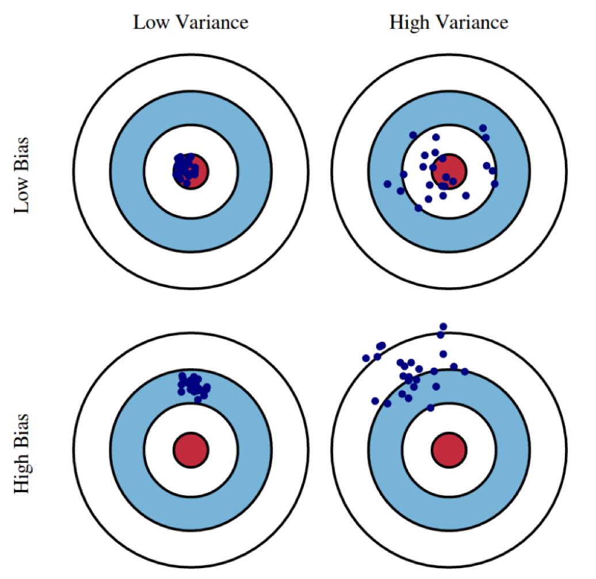
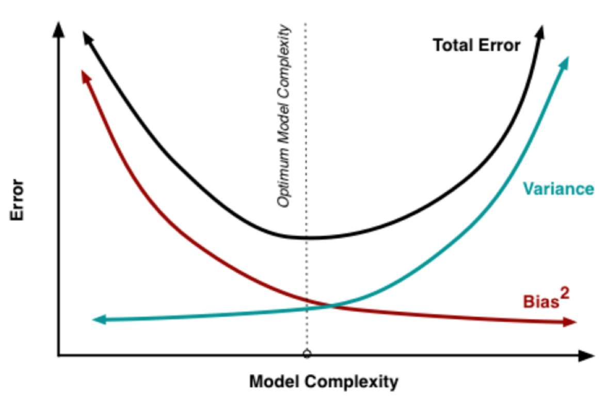

Abbiamo abbiamo visto che un approccio a un problema di *learning* è quello di [[Supervised Learning#Derivare un predittore|derivare dal training set]]  un predittore che **minimizzi** (almeno approssimativamente) il [[Prediction Risk#^9cd1a0|rischio emprico]].

Più formalmente, sia $\mathcal{H}$ uno **spazio di funzioni**, allora siamo interessati a trovare $$h^* \approxeq \arg \min_{h \in \mathcal{H}}\overline{\mathcal{R}}_{\mathcal{T}}(h)$$

L'insieme $\mathcal{H}$ è anche detto insieme di **ipotesi** o **bias induttivo**.

Scegliere un $\mathcal{H}$ adeguato è un problema fondamentale del Machine Learning.
- quali sono gli effetti nella scelta della struttura di $\mathcal{H}$?
- come definire $\mathcal{H}$ in modo tale che $h^*$ sia computabile?

La scelta di $\mathcal{H}$ può essere vista come una sorta di **conoscenza a priori** del problema, da parte di chi definisce il modello.

## Problemi con $\mathcal{H}$ grande
Certamente scegliendo $\mathcal{H}$ il più grande possibile, avremo un modello molto espressivo.
Ci sono però delle problematiche che occorrono.

Supponiamo per esempio di avere un task **binario**, ovvero dove $\mathcal{Y} = \lbrace 0, 1 \rbrace$.
Dato il training set $\mathcal{T} = (\mathbf{X}, \mathbf{t})$, definiamo la seguente [[Prediction Risk#^0b44e2|loss function]]
$$L(y, t) := \begin{cases}
1 &\text{se } y = t\\
0 &\text{altrimenti}
\end{cases}\;\;\; \forall y,t \in \lbrace 0,1 \rbrace$$

Assumiamo ora che i target siano **equamente** distribuiti in $\mathcal{X}$, ovvero che $$p(t \vert x) = \frac{1}{2}\;\; \forall x \in \mathcal{X}, \forall t \in \lbrace 0, 1 \rbrace$$

Definiamo ora il predittore
$$h(x) := \begin{cases}
t_i &\text{se } \exists x_i \in \mathbf{X} : x = x_i\\
0 &\text{altrimenti}
\end{cases}$$
Ovvero se $x$ è presente nel training set gli assegna il suo target, in ogno altro caso gli assegna 0.
Il rischio empirico per costruzione è 0, perciò certmante il predittore è ottimo $h = h^*$.
Il rischio invece in media sarà $\lessapprox 1/2$.
La qualità di questo predittore sarà quindi simile al un predittore che **casualmente** assegna 0 o 1.

Perciò $h^*$ perfoma benissimo sui soli dati del training set, mentre in generale si comporta male.
Questo fenomeno è anche detto **overfitting**.

Rispetto alla grandezza di $\mathcal{H}$ possiamo quindi fare le seguenti osservazioni:
- se $\mathcal{H}$ è troppo grande (**complesso**) potremmo avere dell'**overfitting**: ovvero un predittore che funziona troppo bene sui dati del training set ma male in generale.
- se $\mathcal{H}$ è troppo piccolo (**semplice**) potremmo avere dell'**underfitting**: ovvero un predittore che si comporta sempre male, sia sul training set che su nuovi dati.

Questo fenomeno è anche noto come **tradeoff bias-varianza**.

## Bias vs Varianza
In generale, il [[Prediction Risk#^04c36e|rischio]] di un [[Prediction Risk|predittore ottimo]] $h^*$ (che minimizza il ==**rischio empirico**==) può essere decomposto in due parti $$\mathcal{R}(h^*) = \varepsilon_B + \varepsilon_V$$ dove:
- $\varepsilon_B$ è il **minimo rischio** che un qualsiasi $h \in \mathcal{H}$ può avere. Questo valore dipende solamente dalla conformazione di $\mathcal{H}$, ed è **indipendente** dal training set. Questa quantità è detta **bias**.
- $\varepsilon_V$ misura la sensibilità del modello alle fluttuazioni casuali dei dati del training set. Questo è correlato al fatto che il rischio empirico (che $h^*$ minimizza) dipende dai dati del training set, mentre il rischio è definito su tutto $\mathcal{X}$. Questa quantità è detta **varianza**.

La scelta di $\mathcal{H}$ è soggetta al **tradeoff bias-varianza**:
- un **alto bias** implica una **bassa varianza**. Ciò indica che tutti i predittori ottimi di $\mathcal{H}$ che si possono ottenere da differenti training set hanno tutti comportamenti simili con rischi simili (bassa varianza). Purtroppo però quasi tutti questi predittori tendono a comportarsi male (basso bias), in quanto $\mathcal{H}$ è troppo semplice e poco espressivo.
- un **basso bias** e **alta varianza** implica che $\mathcal{H}$ è molto espressivo, che quindi ha un buon predittore per i dati del dataset. Purtroppo in questo caso il predittore risulta troppo buono per i dati, e si tende all'overfitting.

Dato che il bias decresce al crescere della varianza, e viceversa, allora avremo che il rischio di un predittore $h^*$ che minimizza il rischio empirico è il **punto di minimo** della parabola `bias + varinza`.

