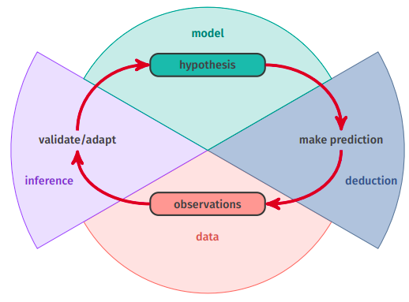

# Approccio induttivo
Assumiamo di avere a disposizione un **training test**, rappresentato come:
- un insieme di $n$ items rappresentati come una sequenza di **vettori di features** $x_1, ..., x_n \in \mathbb{R}^d$, usati per per derivare un **modello**. $$\mathbf{x} = (x_1, ..., x_n) \in \mathbb{R}^{n \times d}$$
- se lo scopo è la **classificazione**, abbiamo un **vettore target** $\mathbf{t} = (t_1, ..., t_n)$ tale che $t_i \in \mathbb{N}$ è la classe a cui appartiene l'elemento $x_i$. $$\mathbf{t} = (t_1, ..., t_n) \in \mathbb{N}^n$$





# Supervised Learning
Assumiamo di avere un **dominio** $\mathcal{X}$, ovvero l'insieme degli oggetti che vogliamo classificare.
Ogni elemento è rappresentato come un **vettore di features**.

```ad-note
title: Dimensionalità
Il numero di features è anche detto **dimensionalità** del problema.
```

Abbiamo anche un insieme di **classi** (o **etichette**) $\mathcal{Y}$ che vogliamo associare agli elementi di $\mathcal{X}$.
Distinguiamo
- problema di **classificazione** quando $\mathcal{Y}$ è **dicreto**
- problema di **regressione** quando $\mathcal{Y}$ è **discreto**


## Derivare un predittore
Abbiamo a disposizione un **training set**
$$\mathcal{T} \equiv \lbrace (x_1, t_1), ..., (x_n,t_n) \rbrace$$ 

Un algoritmo di predizione $A$ deriva da $\mathcal{T}$ una funzione $$A_{\mathcal{T}}: \mathcal {X} \to \mathcal{Y}$$
Tale che associa ad ogni elemento $x \in \mathcal{X}$ un $y \in \mathcal{Y}$

Un primo approccio semplice è quello di associare ad $x$ la classe $y$ dei primi $k$ elementi più vicini ad $x$ nel training set $\mathcal{T}$.


