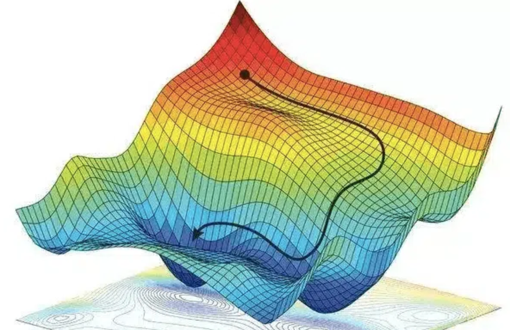

Richiamando [[Prediction Risk|quanto già visto]], la **funzione loss** $L: \mathcal{Y} \times \mathcal{Y} \to \mathbb{R}$ misura, per ogni $y,t \in \mathcal{Y}$, qual è il costo di predire il valore $y$ anziché quello ottimale $t$.
Nel [[Supervised Learning]], questa quantità serve per misurare qualità di un predittore $h$ rispetto a un input $x$ con target $t$.
$$\mathcal{R}(h,x) = L(h(x),t)$$

Questa misura viene usata a sua volta per calcolare il [[Prediction Risk#^9cd1a0|rischio empirico]], ovvero una misura di qualità di un predittore $h$ rispetto al training set $\mathcal{T}$.
$$\overline{\mathcal{R}}_{\mathcal{T}}(h) = \frac{1}{\vert \mathcal{T} \vert} \sum_{(x,t) \in \mathcal{T}}L(h(x),t)$$

Durante la fase di training si cerca di trovare la funzione $h$ che minimizza il rischio empirico.
Più in generale, assumiamo che la famiglia $\mathcal{H}$ di funzioni sia composta da funzioni che dipendono da una serie di parametri $\pmb{\theta} = (\theta_1, ..., \theta_d)$ .
Perchio $h_{\theta}$ è la funzione di $\mathcal{H}$ con parametri $\theta$.

Perciò, riscrivendo tutto in funzione di $\theta$, avremo $$\overline{\mathcal{R}}_{\mathcal{T}}(\pmb{\theta}) =\mathcal{L}(\pmb{\theta}; \mathcal{T}) = \sum_{i=1}^{n}L_i(\pmb{\theta})$$ dove $$L_i(\pmb{\theta}) = L(h_{\pmb{\theta}}(x_i), t_i)$$

Ci siamo quindi ridotti ad uno **spazio dei parametri** $\Theta \subseteq \mathbb{R}^d$, e vogliamo trovare il punto di **minimo globale** rispetto alla funzione $\mathcal{L}( \;\cdot\; ; \mathcal{T})$.

Un primo approccio potrebbe quello **analitico**, trovando il punto in cui la **derivata si annulla** (e in cui derivata seconda è positiva).
$$\nabla_{\pmb{\theta}} \;\mathcal{L}( \pmb{\theta} ; \mathcal{T}) = 0$$
$$\dfrac{\partial}{\partial \theta_i} \mathcal{L}( \pmb{\theta} ; \mathcal{T}) = 0; \;\;\; \forall i = 1,...,d$$

I problemi di questo approccio però sono:
1. bisogna vedere la derivata seconda per distinguere punti minimo, massimo o sella.
2. un minimo locale potrebbe non essere molto buono rispetto a quello globale.

Un approccio più ragionevole è quello **numerico**, ovvero tramite un metodo **iterativo** noto come **[[Gradient Descent]]**.

Si parte da un punto iniziale $$\pmb{\theta}^{(0)} = (\theta_1^{(0)}, ..., \theta_d^{(0)})$$

Iterativamente, deriviamo il punto $\pmb{\theta}^{(i)}$ modificando il precedente punto $\pmb{\theta}^{(i-1)}$, modificandolo nella direzione in cui $\mathcal{L}( \;\cdot\; ; \mathcal{T})$ diminuisce.

Ovvero $$\theta^{(i)}_j = \theta^{(i-1)}_j - \eta \dfrac{\partial}{\partial \theta_j^{(i-1)}} \mathcal{L}( \pmb{\theta}^{(i-1)} ; \mathcal{T}) = \theta^{(i-1)}_j - \frac{\eta}{\vert T \vert} \sum_{(x,t) \in \mathcal{T}} \dfrac{\partial}{\partial \theta_j^{(i-1)}} L( h_{\pmb{\theta}^{(i-1)}}(x) , t)$$
O in termini vettoriali $$\pmb{\theta}^{(i)} = \pmb{\theta}^{(i-1)} - \eta \nabla_{\pmb{\theta}^{(i-1)}}\mathcal{L}( \pmb{\theta}^{(i-1)} ; \mathcal{T}) = \pmb{\theta}^{(i-1)} - \frac{\eta}{\vert T \vert} \sum_{(x,t) \in \mathcal{T}} \nabla_{\pmb{\theta}^{(i-1)}} L( h_{\pmb{\theta}^{(i-1)}}(x) , t)$$

Quello che si vuole è definire delle funzioni loss tali che:
1. abbiano un solo punto di minimo.
2. non abbiamo *punti di sella* in cui il metodo può bloccarsi.
3. sia fatta in modo tale che il metodo iterativo converga velocemente.

Segliere una funzione loss $\mathcal{L}$ che sia [[Convessità|convessa]] risolve molti problemi, in qunato ogni punto di minimo locale di una funzione convessa è anche un minimo **globale**.
Più precisamente, se la funzione è **strettamente convessa**, allora abbiamo un unico punto di minimo.

Un altro vantaggio delle funzioni convesse è che la **combinazione lineare di funzioni convesse è ancora una funzione convessa**.

# Some Loss Functions