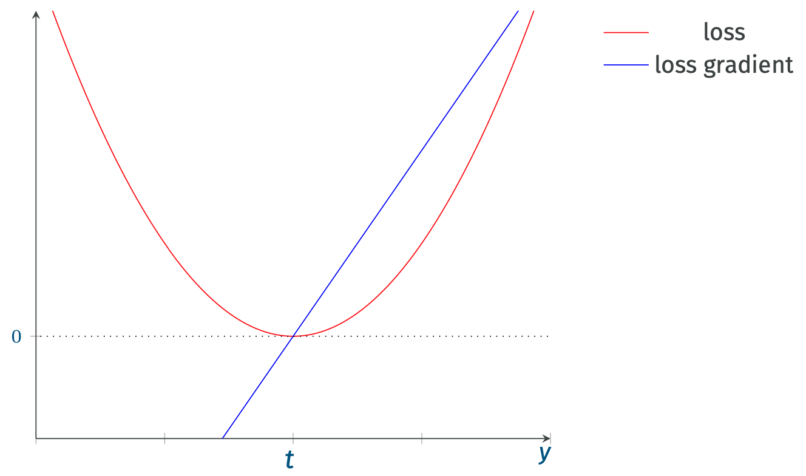

Per semplicità, consideriamo il caso della [[Supervised Learning#^42e3b6|regressione]].
Assumimo quindi che sia $y = h(x)$ che il relatico target $t$ siano *valori reali*.

# Quadratic Loss
Una comune [[Prediction Risk#^0b44e2|funzione loss]] [[Convessità|convessa]] è la **distanza quadratia**.
$$L(y,t) = (y-t)^2$$

Questa funzione loss è anche nota come **quadratic loss**.

Se applichiamo quindi la *loss quadratica* alla funzione di [[Prediction Risk#^9cd1a0|rischio empirico]] avremo $$\overline{\mathcal{R}}_{\mathcal{T}}(h) = \frac{1}{\vert \mathcal{T} \vert} \sum_{(x,t) \in \mathcal{T}}(h(x)-t)^2$$

