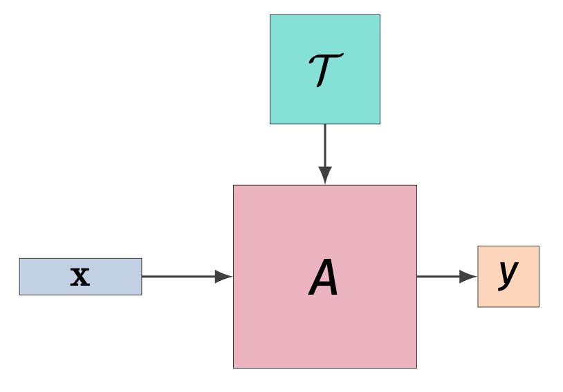

# Approccio induttivo
Assumiamo di avere a disposizione un **insieme di dati d'esempio**, detto **training test**, considerabile **attendibile**.
Esso è rappresentato come:
- un insieme di $n$ items rappresentati come una sequenza di **vettori di features** $x_1, ..., x_n \in \mathbb{R}^d$, usati per per derivare un **modello**. $$\mathbf{x} = (x_1, ..., x_n) \in \mathbb{R}^{n \times d}$$
- se lo scopo è la **classificazione**, abbiamo un **vettore target** $\mathbf{t} = (t_1, ..., t_n)$ tale che $t_i \in \mathbb{N}$ è la classe a cui appartiene l'elemento $x_i$. $$\mathbf{t} = (t_1, ..., t_n) \in \mathbb{N}^n$$

L'**approccio induttivo** all'apprendimento automatico cerca di identificare le **relazioni** tra $\mathbf{x}$ e $\mathbf{t}$ senza bisogno di una specifica conoscenza a priori del problema, in modo tale da poter classificare un qualsiasi input $x \in \mathbb{R}^d$ associandogli un opportuno target $t \in \mathbb{N}$.


# Tipologie di problemi
Nel ML esistono sostanzialmente due tipologie di problemi:

1. **Supervised Learning**: dato un elemento $x$ del dominio rappresentato come un **vettore di caratteristiche**, si vuole **predire** una caratteristica sconosciuta $t$ detta **target**. Se $t \in \mathbb{R}$ si parla di **regressione**, se invece $t \in \lbrace 1, ..., k \rbrace$ si parla di **classificazione**. L'approccio a questo problema è quello di creare un **predittore**, sottoforma di **funzione** $y(x)$ oppure di **distribuzione** $p(t \vert x)$. ^42e3b6
2. **Unsupervised Learning**: in questo caso abbiamo solamente un dataset $\mathbf{X} = \lbrace x_1, ..., x_n \rbrace \in \mathbb{R}^{d \times n}$, ma nessun target associato. Si vuole identificare qualche informazione implicita nei dati, come:
	- **clusters**: sottoinsiemi di oggetti *simili*.
	- **density estimation**: la distribuzione degli elementi nel dominio.
	- **feature selection/extraction**: una proiezione dei dati in uno spazio di dimensione più piccola, in modo da preservare però quante più informazioni possibili.
3. **Reinforcement Learning**: in questo problema si vuole che il modello prenda una decisione in modo tale da **massimizzare un profitto** (deciso a priori), in un contesto che però è **dinamico**, e quindi bisogna tener conto che una decisione può influire i "guadagni" futuri.

------
# Supervised Learning
Assumiamo di avere un **dominio** $\mathcal{X}$, ovvero l'insieme degli oggetti che vogliamo **classificare** (assegnare un valore).
Ogni elemento è rappresentato come un **vettore di features**.

```ad-note
title: Dimensionalità
Il numero di features è anche detto **dimensionalità** del problema.
```

$$\mathcal{X} \subseteq \mathbb{R}^{d}$$

Abbiamo anche un insieme di **classi** (o **etichette**) $\mathcal{Y}$ associate agli elementi di $\mathcal{X}$.
Distinguiamo:
- problema di **classificazione** quando $\mathcal{Y}$ è **dicreto**
- problema di **regressione** quando $\mathcal{Y}$ è **reale**


## Derivare un predittore
Abbiamo a disposizione un **training set**, ovvero un insieme di dati del tipo
$$\mathcal{T} \equiv \lbrace (x_1, t_1), ..., (x_n,t_n) \rbrace \subseteq \mathcal{X} \times \mathcal{Y}$$ 
Possiamo indicare $\mathcal{T}$ come la coppia di elementi:
- **feature matrix** $$\mathbf{X} = (x_1, ..., x_n)^T = \begin{pmatrix} x_{1,1} & x_{1,2} & \dots & x_{1,d} \\ x_{2,1} & x_{2,2} & \dots & x_{2,d} \\ \vdots & \vdots & \ddots & \vdots \\ x_{n,1} & x_{n,2} & \dots & x_{n,d} \end{pmatrix}$$
- **target vector** $$\mathbf{t} = \begin{pmatrix} t_1 \\ t_2 \\ \vdots \\ t_n \end{pmatrix}$$
Nel *supervised learning* si vuole **derivare** da $\mathcal{T}$ un **algoritmo predittore** $A$, il quale avrà il compito di *"indovinare"* un possibile target $y \in \mathcal{Y}$ per ogni possibile input $x \in \mathcal{X}$.

### Primo Approccio
Un primo approccio semplice è quello di definire un algoritmo $A$ che computa una funzione $$h: \mathcal{X} \times \mathcal{T} \to \mathcal{Y}$$
Ovvero un algoritmo che, sfruttando direttamente i dati del training set $\mathcal{T}$, calcola un possibile target $y \in \mathcal{Y}$ per ogni possibile input $x \in \mathcal{X}$.
$$h(x, \mathbf{X}, \mathbf{t}) \mapsto y$$




Un esempio di questo approccio è l'algoritmo $k$-nearest neighbors per la classificazione.
Il training set è composto da un insieme $\mathbf{X}$ di punti in uno spazio, ognuno dei quali appartenente ad una classe $t \in \mathbf{t}$.
Dato un $x$ qualsiasi  non appartenente ad $\mathbf{X}$, vogliamo sapere a quale classe appartiene (potenzialmente).
L'algoritmo $k$-nearest neighbors ritorna la classe *"più popolare"* tra i $k$ punti di $\mathbf{X}$ più vicini ad $x$, seconda una qualche misura di distanza.

### Secondo Approccio
Derivare da $\mathcal{T}$ un algoritmo $A_{\mathcal{T}}$ che computa una funzione $$h_{\mathcal{T}}: \mathcal{X} \to \mathcal{Y}$$
Per fare ciò abbiamo bisogno di un **algoritmo di apprendimento** $\mathcal{A}$ chre deriva $A_{\mathcal{T}}$ da $\mathcal{T}$.


Un esempio di questo secondo approccio è la [[Linear Regression]].
In sintesi, si predice il target $y$ di un qualisasi input $x = (x_1, ..., x_d) \in \mathcal{X}$ tramite una **combinazione lineare** delle sue features.
$$y = w_0 + \sum_{i=0}^{d} w_i \cdot x_i$$

I $d+1$ coefficienti $w_0, w_1, ..., w_d$ sono **appresi** da $\mathcal{A}$ mediante i dati $\mathcal{T}$.

### Terzo Approccio
Derivare da $\mathcal{T}$ un **insieme di algoritmi** $A_{\mathcal{T}}^{(1)}, ..., A_{\mathcal{T}}^{(s)}$, ognuno dei quali
- calcola una diversa funzione $h_{\mathcal{T}}^{(i)}: \mathcal{X} \to \mathcal{Y}$.
- ha un **peso** $w^{(i)}$, i quali rappresentano una sorta di **qualità** del rispettivo predittore.

Dato poi un qualsiasi input $x \in \mathcal{X}$ si calcolano i valori $y^{(i)} = h_{\mathcal{T}}^{(i)}(x)$ (per ogni $i = 1, ..., s$), e dopodiché si **combinano linearmente** usando i pesi $w^{(1)}, ..., w^{(s)}$.


