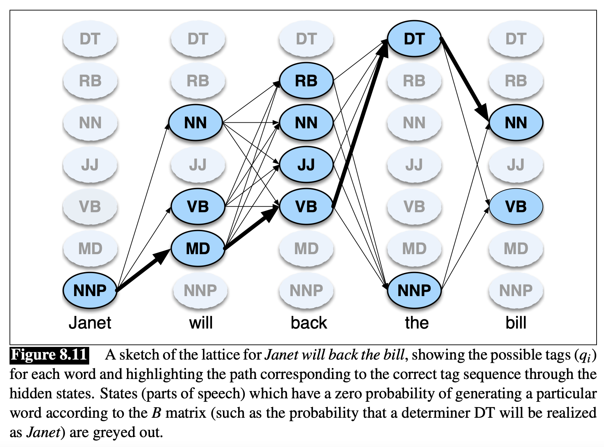

In un [[Hidden Markov Model Tagger#The Hidden Markov Model Tagger|HHM tagger]] bisogna trovare il vettore di [[Part of Speach|pos]] tag $\hat{t}$ che **massimizza** la camminata aleatoria dalla prima parola $w_1$ della nostra frase, fino alla al'ultima parola $w_n$.
$$\hat{t} = \arg \max_{t_1, ..., t_n}{P(t_1, ..., t_n \vert w_1, ..., w_n)}$$

Abbiamo visto che possiamo *semplificare* $\hat{t}$ come 
$$\hat{t} \approx \arg \max_{t_1, ..., t_n} \prod_{i=1}^{n} \underbrace{P(w_i \vert t_i)}_{\text{emission}} \; \underbrace{P(t_i \vert t_{i-1})}_{\text{transition}}$$
dove:
- $P(w_i \vert t_i)$ è la probabilità di **emissione** (occorrenza) della parola $w_i$ dato il tago $t_i$. Questa probabilità è definità matrice $B$ dell'HMM.
- $P(t_i \vert t_{i-1})$ è la probabilità di avere il tag $t_i$ sapendo che quello precedente è il tag $t_{i-1}$. Questa probabilità è invece definita nella matrice $A$.

Purtroppo il numero possibile di vettori $t_1,...,t_n$ è **esponenziale** nel numero $T$ di tag a disposizione.
Perciò abbiamo bisogno di metodo più efficiente che trovi il vettore che massimizza tale probabilità

L'**algoritmo di Viterbi** è un algoritmo di **programmazione dinamica** che trova tale sequenza di tag e la loro probabilità.

Come prima cosa l'algoritmo crea un **reticolo** dove ad ogni parola osservata $w_i$ corrisponde una colonna, e ad ogni tag $t_i$ (stato dell'HHM) è associata una riga.

Ogni colonna rappresenta un **livello**, e da ogni stato di un livello c'è un arco verso tutti gli stati del livello successivo.

L'algoritmo consiste nel trovare il cammino che partendo da uno stato del primo livello, arriva a uno stato dell'ultimo livello, massimizzando la **probabilità** di tale cammino.

L'idea dell'algoritmo è la seguente:
la probabilità di un sottocammino che arriva fino alla parola $i$-esima è pari a:
- la probabilità del tag che massimizza $B_t(w_i)$, moltiplicato per
- la probabilità del sottocammino fino a $w_{i-1}$, moltiplicato per
- la probabilità di transitare dallo stato precedente $t_{i-1}$ a quello attuale $t_i$.

$$P(\langle t_1, ..., t_i \rangle) = \max_{t \in T} P(w_i \vert t) \cdot P(X_i = t\vert X_{i-1} = t_j) \cdot P(\langle t_1, ..., t_{i-1} \rangle)$$