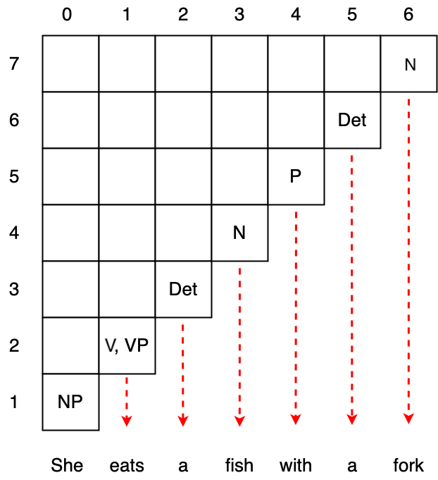

L'algoritmo **Cocke–Younger–Kasami** (o in breve **CYK**) è un algoritmo **decisionale** di [[Parsing]] per [[Grammatiche Formali#Tipo 2 - Grammatiche Context-Free|grammatiche contex-free]].

Tale algoritmo prende in input:
- una [[Grammatiche Formali#Tipo 2 - Grammatiche Context-Free|grammatica context-free]] $G = \langle N, \Sigma, P, S \rangle$ espressa in [[Grammatiche Formali#Grammatiche CNF - Chomsky Normal Form|CNF]].
- una stringa $I \in \Sigma^*$.
e **decide** se la strigna $I$ è una stringa del linguaggio $L(G)$ generato dalla grammatica $G$.

La complessità temporale dell'algoritmo (nel caso peggiore) è $O(n^3 \cdot \vert P \vert)$ dove:
- $n$ è la **lunghezza** (numero di simboli) della stringa $I$.
- $\vert P \vert$ è il **numero di regole** della grammatica $G$.

Dato che tale algoritmo è un algoritmo di [programmazione dinamica](https://en.wikipedia.org/wiki/Dynamic_programming "Dynamic programming") ha una complessità *spaziale* dell'ordine di $O(n^2)$.

```ad-info
È facile **estendere** l'algoritmo in modo tale che **generi** un **albero sintattico**.
```

# Funzionamento
Consideriamo come inputo la stringa $I = \text{"She eats a fish with a fork"}$ e la seguente grammatica
- $N = \lbrace \text{S, VP, PP, NP, V, P, N, Det} \rbrace$.
- $\Sigma$ sono le **parole** della lingua inglese.
- $P$ è composto dalle seguenti produzioni


Come prima cosa il CYK genera una **matrice triangolare superiore** $M$ di dimensione $n = \vert I \vert$, **indicizzata** come seuge


Tale algoritmo considera tutte le **sottostringhe** dell'input $I$ da quelle lunghe $1$ fino a quelle lunghe $n$, in ordine.

Per le sottostringhe lugnhe $1$ l'algoritmo vede 

Per tutte le sottostringhe di lunghezza $\geq 2$ l'algoritmo considera tutte le sue possibili (bi-)**partizioni**, e tiene traccia se esiste una produzione di tipo $A \to BC$ tale che $B$ corrisponde alla prima parte e $C$ alla seconda.

L'algoritmo *popola* le celle di $M$ in diagonale, dalla più lunga lunga $n$ (a destra), a quella più corta composta da una sola cella (in alto a sinistra).


```julia
I = ["She", "eats", "a", "fish", "with", "a", "fork"]
n = length(I)

for d=2:n
	println("diagonal = $d")
	for i=d:n
		j = i-d
		print("($i, $j) -> ")
		for s=(i-1):-1:(j+1)
			# Consider a substring
			# Starting from `j`
			# Ending at `i`
			# Cutted at `s`
	        print(
		        "[",
		        join(I[j+1:s], " "),
		        "#",
		        join(I[s+1:i], " "),
		        "]",
		        " - "
		        )
		end
		println()
	end
end
```

L'interpretazione di questa indicizzazione è la seguente:
- nella diagonale $d$ consideriamo tutte le sottostringhe lunghe $d$ simboli.
- che iniziano in posizione $j$
- terminano in posizione $i = j+d$
- e sono partizionate in posizione $s \in (j,i)$.

Per la prima diagonale $d=1$ l'algoritmo tiene traccia, nelle rispettive celle, di tutti i **[[Grammatiche Formali#^c1b4a0|simboli preterminali]]** che generano i rispettivi simboli di $I$.



```ad-warning
Dato che la grammatica in input è [[Grammatiche Formali#Grammatiche CNF - Chomsky Normal Form|CNF]] dobbiamo necessariamente avere tutte le celle della prima diagonale popolate.
Infatti, dato che nelle grammatiche CNF l'unico modo di generare un terminale è tramite una produzione del timpo $A \to a$, se esiste un simbolo terminale $a$ per il quale non esiste tale produzione, allora non abbiamo alcun modo di generare l'intera stringa $I$.
```

Dopodiché, per ogni cella $(i,j)$ della diagonale $d=2$ di $M$ l'algoritmo tiene traccia di tutti i **simboli non terminali** $A$ tali che esiste almeno una produzione $A \to BC$ , dove $B$ sta nella cella subito sotto e $C$ nella cella subito a destra.


```ad-note
Non è detto che tutte le celle della diagonale possono essere popolate.
Potrebbe non esistere una produzione diretta che generi una seuqnza di simboli preterminali.
```

Per una qualsiasi diagonale $d \geq 2$ si procede in maniera simile.
Consideriamo le coppie di celle $(i,s), (s,j)$ con $s$ che va da $i-1$ a scendere fino a $j+1$ (questo è sempre vero in quanto $i \geq j$), e qualora trovassimo una produzione $A \to BC$ tale che $B \in M\left[ i,s \right]$ e $C \in M\left[ s,j \right]$ inseriamo $A$ nella cella $(i,j)$.


Iterando questo procedimento per tutte le *diagonali*, ci troveremo alla fine in due situazioni rispetto alla cella in alto a sinistra $(n,0)$ (ultima diagonale):
1. Se $M\left[ n,0 \right] = S$ allora $I \in L(G)$
2. Se $M\left[ n,0 \right] \neq S$ allora $I \notin L(G)$