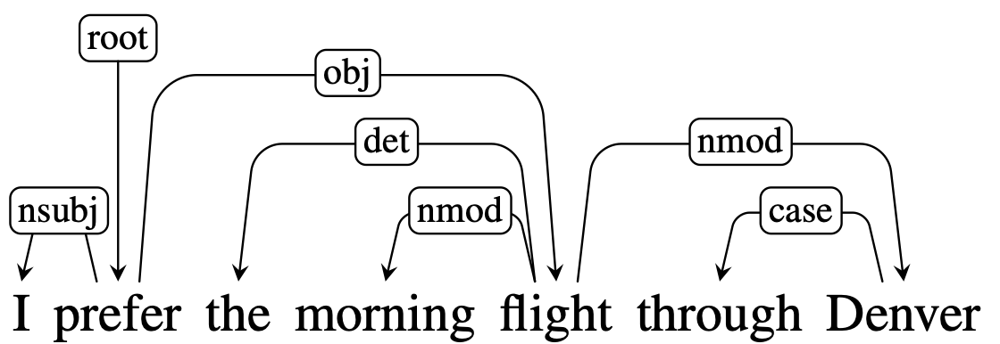
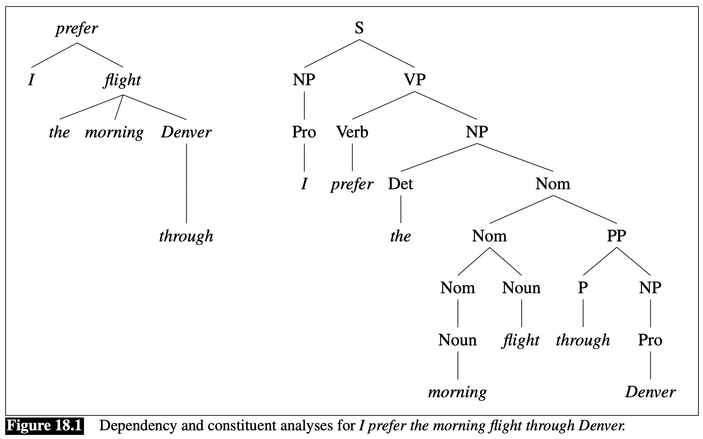

Abbiamo precedentemente visto che a **livello sintattico** le frasi possono essere scomposte in **componenti** noti come **[[Part of Speach|parti del discorso]]** o **costituenti**.

Un'altra famiglia importante di famiglie di grammatiche sono le **grammatiche alle dipendenze**.
In una grammatica alle dipendenze i costituenti e la struttura grammaticale della frase non gioca un ruolo fondamentale nella descrizione della struttura sintattica della frase.
Invece, la struttura sintattica, è descritta mediante **relazione binarie** di **dipendenza** tra le singole parole.

Ongi relazione è rappresentata da un **arco diretto etichettato** con la **relazione di dipendenza** che intercorre tra una parola e il suo **dipendente**.

Questa rappresentazione è anche nota come **typed dependecy structure** in quanto le relazioni di dipendenza sono prese da un **insieme fissato** di relazioni, **indipendenti** dalla grammatica.

Una specifica parola è esplicitamente etichettata come *radice*, generalmente il *verbo* della frase principale.

Mentre nell'albero ai costituenti le relazioni tra le parole sono definite mediante una serie di **regole di produzione** della grammatia, nell'albero alle dipendenza le relazioni tra le parole sono **dirette**.

Le relazioni di dipendenza tra le parole codificano direttamente delle importanti **informazioni**, che non vengono direttamente catturate dalle strutture ai costituenti.
Ad esempio, gli argomenti del verbo `preferire` (soggetto e complemento) sono **direttamente collegati** ad esso nella struttura alle dipendenze, mentre la loro connessione al verbo principale è più distante nell'albero ai costituenti.
Allo stesso modo, `morning` e `Denver` [[Part of Speach#ADV - Avverbio|avverbi]] di `flight`, sono collegati ad esso direttamente nella struttura alle dipendenza.
Perciò il vantaggio di una rappresentazione alle dipendenze è che vengono rappresentate importanti informazioni riguardo alle **relazioni semantiche** tra i predicati e i loro argomenti.

Un altro vantaggio delle rappresentazioni alle dipendenze è che funzionano anche con grammatiche il cui ordine delle parole è **libero**.
Per esempio l'inglese è una lingua detta SVC, necessariamente avremo la sequenza *soggetto-verbo-complemento*, mentre una lingua come l'italiano è molto più libera, e non specifica un unico ordine grammaticalmente corretto.
In un albero ai costituenti questa sequenza è rigorosamente vincolata dalla grammatica in analisi, perciò esistono molti alberi per qualsiasi posizione assume una parola nella frase.
Per gli alberi alle dipendenze invece non ci sono questi tipi di vincoli, rendondo quindi tali strutture molto più versatili.

# Dependency Relations
Per **dipendenza** grammatica si intende una **relazione binaria** i cui argomenti sono due parole, la **testa** e il **dipendente**.
La testa indica la parola principale e il dipendente è una sorta di suo "modificatore", il cui effetto è definito dalla relazione.

Una **grammatica alle dipendenze** definisce quindi una serie di **relazioni grammaticali** tra le parole, definendo il ruolo che gioca la parola dipendente con la parola testa.
Per esempio in lingua inglese abbiamo relazioni come **subject**, **direct object** e **indirect object**.
Queste relazioni definiscono solamente come interagiscono le parole tra di loro, indipendentemente dalla loro **posizione** nella frase o dal **[[Part of Speach|pos-tag]]**.

