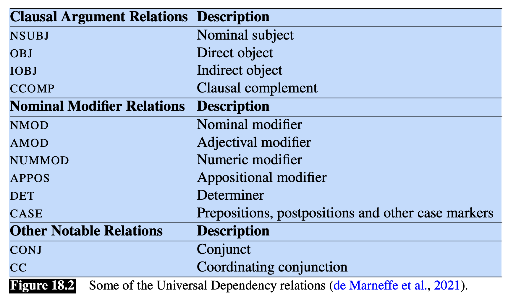
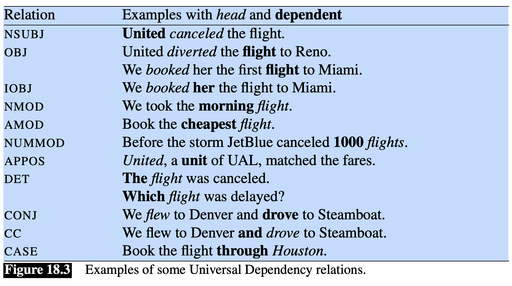
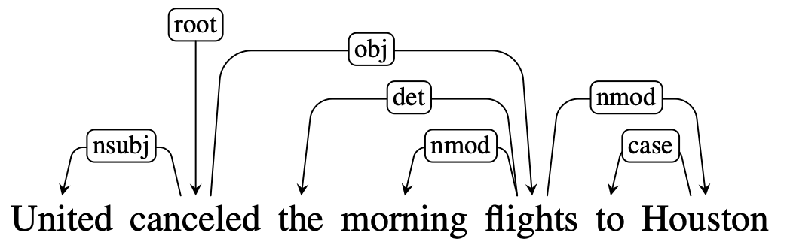
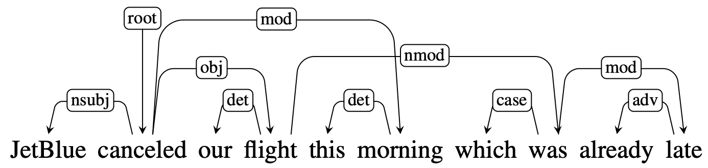

Abbiamo precedentemente visto che a **livello sintattico** le frasi possono essere scomposte in **componenti** noti come **[[Part of Speach|parti del discorso]]** o **costituenti**.

Un'altra importante famiglia di grammatiche sono le **grammatiche alle dipendenze**.
In una grammatica alle dipendenze i costituenti e la struttura grammaticale della frase non gioca un ruolo fondamentale nella descrizione della struttura sintattica della frase.
Invece, la struttura sintattica, è descritta mediante **relazione binarie** di **dipendenza** tra le singole parole.

Ongi relazione è rappresentata da un **arco diretto etichettato** con la **relazione di dipendenza** che intercorre tra una parola e il suo **dipendente**.

Questa rappresentazione è anche nota come **typed dependecy structure** in quanto le relazioni di dipendenza sono prese da un **insieme fissato** di relazioni, **indipendenti** dalla grammatica.

Una specifica parola è esplicitamente etichettata come *radice*, generalmente il *verbo* della frase principale.

Mentre nell'albero ai costituenti le relazioni tra le parole sono definite mediante una serie di **regole di produzione** della grammatia, nell'albero alle dipendenza le relazioni tra le parole sono **dirette**.

Le relazioni di dipendenza tra le parole codificano direttamente delle importanti **informazioni**, che non vengono direttamente catturate dalle strutture ai costituenti.
Ad esempio, gli argomenti del verbo `prefer` (soggetto `I` e complemento `flight`) sono **direttamente collegati** ad esso nella struttura alle dipendenze, mentre la loro connessione al verbo principale è più distante nell'albero ai costituenti.
Allo stesso modo, `morning` e `Denver` [[Part of Speach#ADV - Avverbio|avverbi]] di `flight`, sono collegati ad esso direttamente nella struttura alle dipendenza.
Perciò il vantaggio di una rappresentazione alle dipendenze è che vengono rappresentate importanti informazioni riguardo alle **relazioni semantiche** tra i predicati e i loro argomenti.

Un altro vantaggio delle rappresentazioni alle dipendenze è che funzionano anche con grammatiche il cui ordine delle parole è **libero**.
Per esempio l'inglese è una lingua detta SVC, necessariamente avremo la sequenza *soggetto-verbo-complemento*, mentre una lingua come l'italiano è molto più libera, e non specifica un unico ordine grammaticalmente corretto.
In una struttura ai costituenti questa sequenza è rigorosamente vincolata dalla grammatica in analisi, perciò esistono molti alberi per qualsiasi posizione assume una parola nella frase.
Per gli alberi alle dipendenze invece non ci sono questi tipi di vincoli, rendondo quindi tali strutture molto più versatili.

# Dependency Relations
Per **dipendenza** grammatica si intende una **relazione binaria** i cui argomenti sono due parole, la **testa** e il **dipendente**.
La testa indica la parola principale e il dipendente è una sorta di suo "modificatore", il cui effetto è definito dalla relazione.

Una **grammatica alle dipendenze** definisce quindi una serie di **relazioni grammaticali** tra le parole, definendo il ruolo che gioca la parola dipendente con la parola testa.
Per esempio in lingua inglese abbiamo relazioni come **subject**, **direct object** e **indirect object**.
Queste relazioni definiscono solamente come interagiscono le parole tra di loro, indipendentemente dalla loro **posizione** nella frase o dal **[[Part of Speach|pos-tag]]**.

I linguisti hanno definito intere tassonomie di relazioni di dipendenza.
Anche se ci sono differenze tra le varie teorie linguistiche, c'è comunque abbastanza similitudine tra i vari modelli, abbastanza da aver consentito lo sviluppo di **standard inter-linguistici**.
Un esempio è dato da **Universal Dependencies**, una comunità che ha definito caratteristiche grammaticali tra oltre 100 lingue, è ha definito 37 relazioni di dipendenza.

Nel precedente esempio abbiamo che `United` è il **soggetto nominale** del verbo `cancelled`, mentre il suo oggetto è `flights`.

# Dependency Formalisms
Una struttura alle dipendenze è definita come un **grafo diretto etichettato** $G=(V,E, \ell)$, dove:
- $V$ è l'insieme dei vertici. Per semplicità assumiamo che i vertici corrispondano alle singole parole, però potrebbero corrispondere anche alla punteggiatura, oppure in grammatiche morfologicamente più ricche a radici e desinenze.
- $E$ è l'insieme delle relazioni tra una coppie di parole. Le relazioni sono dirette, ed ogni nodo può avere un solo arco entrante.
- $\ell$ indica l'etichetta degli archi, la quale rappresenta il tipo di relazione.

Esiste un nodo contrassegnato come **radice**, ed esiste un unico cammino dal nodo radice che collega un qualsiasi altro nodo.

Unendo queste definizioni abbiamo che una struttura alle dipendenze è di fatto un **albero diretto radicato**.

# Projectivity
Un arco dei una struttura alle dipendenze è detto **proiettivo** se esiste un cammino dalla testa dell'arco verso tutte le parole comprese tra la testa e il dipendente.
Analogamente una struttura alle dipendenze è detta **proiettiva** se tutti i suoi archi sono proiettivi.

La frase nell'esempio precedente NON è proiettiva: per esempio l'arco `flight -> was` è non proiettivo.
Una importante proprietà è che se un albero alle dipendenze è proiettivo allora è anche **planare**.