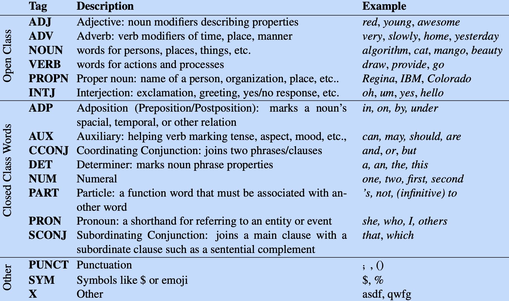
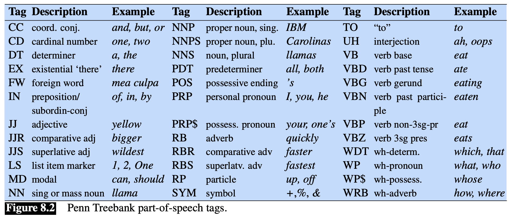
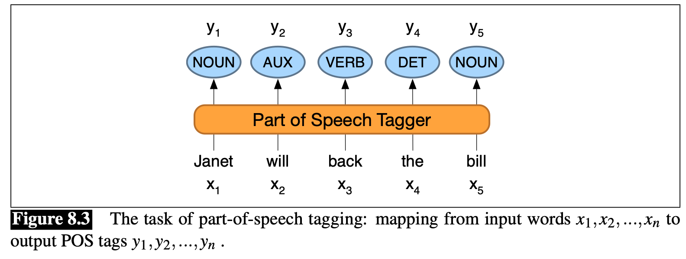

Nella linguistica, la **sintassi** studia come combinare **parole** e **morfemi** in modo da generare delle **frasi** (o **senteces**) che siano conformi alla **grammatica** in questione.

In una grammatica quindi ogni parola di una frase ha un "**ruolo**", e possiamo quindi **categorizzare** tali ruoli in **parti del discorso** (o **part-of-spech**, **PoS**).
Una part-of-spech può essere vista come una **categoria sintattica**.
Ogni parola all'inerno di una frase appartiene a una diversa categoria in base alla **funzione** che ha tale parola all'interno della frase.

Per esempio, consideriamo le seguenti frasi:
- I went for a *run*.
- I *run*.
Nella prima frase la parole `run` indica un **nome**, mentre nella seconda frase un **verbo**.

Le parole di una categoria sintattica hanno proprietà simili, e scambiandole tra di loro la frase rimande sintatticamente corretta.
Per esempio, nella frase
> Mary likes *black* cat.

La parola *black* potrebbe tranquillamente essere sostituita con altre parole come *persian*, *white*, *big*, ecc... e la frase rimarrebbe comunque *semanticamente corretta*.

Possiamo quindi dire che le parole *black*, *persian*, *white*, *big* appartengono alla stessa categoria sintattica all'interno di questa frase.

# Universal Dependecies
Universal dependecies è un framework che definisce un inseme di POS tag e il loro utilizzo in più di 100 differenti lingue.

Tra le più importanti classi in lingua inglese abbiamo:

### NOUN - Nome
Sono tutte quelle parole che indicano entità del mondo reale come *persone*, *luoghi*, *oggetti* o *astrazioni*.

### PROPN - Nomi Propri
Un nome proprio è un nome specifico una specifica entità, come *Mario*, *IBM*, *New York*, ecc...

### ADJ - Aggettivo
Un **aggettivo** serve a definire una **proprietà** di un nome, come per esempio il colore, la grandezza, l'età, la qualità, ecc..

### VERB - Verbo
Un verbo si riferisce a una **azione** o **processo** che una entità fa o subisce.

### ADV - Avverbio
Un avverbio (da *vicino al verbo*) è una parole che serve a **modificare il significato** di un verbo, aggiungendo dettagli.
Per esempio nella frase

> *Ieri* guidavi *troppo* *velocemente*.

- la parola *ieri* è un avverbio di **tempo** in quanto indica il momento in cui avviene l'azione (quando?)
- la parola *velocemente* è un avverbio di **modo** in qunanto indica la modalità in cui si guida (come?)
- la parola *troppo* è un avverbio di **quantità** in quanto definisce una misura di qunato velocemente si guida (quanto?)

# Open/Closed class
Le classi possono essere suddivise in **aperte** e **chiuse**.

Una classe è **chiusa** quando è composto da un insieme fissato di parole, come per esempio gli articoli: in una lingua generalmente non vengono mai rimossi articoli oppure aggiunti nuovi.

Una classe è **aperta** quando invece possono essere coniate nuove parole che ne appartengono, come per esempio i nomi (*iPhone*), i verbi (*schedulare*) o gli aggettivi.

# Penn Treebanck
Il **Penn Treebanck** è un corpus **annotato** composto da $2,499$ storie prese da una raccolta del Wall Street Journal.
Per annotare questo corpus è stati definito un **tag-set** di parti del discorso ([vedi](https://www.cis.upenn.edu/~bies/manuals/tagguide.pdf)).

 

Vediamo un esmpio di frasi annotate coi diversi tag-set visti UD e PTB.

\ | There | are | 70 | children | there 
--|--|--|--|--|--
**UD** | PRO | VERB | NUM | NOUN | ADV
**PTB** | EX | VBP | CD | NNS | RB

\ | Preliminary | findings | were | reported | in | today | ’s | New | England | Journal | of | Medicine
--|--|--|--|--|--|--|--|--|--|--|--|--
**UD** | ADJ | NOUN | AUX | VERB | ADP | NOUN | PART | PROPN | PROPN | PROPN | ADP | PROPN
**PTB** | JJ | NNS | VBD | VBN | IN | NN | POS | NNP | NNP | NNP | IN | NNP

-------
# POS Tagging
Il **Part-Of-Speach** tagging è il processo di assegnazione di un pos tag ad ogni parola di un discorso.
L'input di questo task è definito come:
- una sequenza $x_1, ..., x_n$ di parole opportunamente **normalizzate** che rappresentano il nostro testo
- un tag-set $T$
L'output invece è:
- una sequenza $y_1, ..., y_n$ di tag di $T$ tale che ogni tag $y_i$ corrispone alla parola $x_i$.

Il pos-tagging è in realtà un task di **disambiguazione**: ogni parola può avere più tag differenti, e l'obbiettivo è quello di trovare quello più corretto per la situazione (e che ovviamente sia grammaticalmente coerente).
Perciò tra i possibili tag di una parola bisogna scegliere quello più coerente col **contesto**.

Statisticamente (nella lingua Inglese) solamente il $15\%$ termini sono *ambigui*, ovvero che hanno 2 o più possibili tag associati.
Il restante $85\%$ delle parole sono non ambigue, ovvero hanno un solo possibile tag.
Allora perché questo risulta essere un task complicato?
La risposta sta nel fatto che tale tali parole ambigue sono quelle che in realtà vengono usate con maggiore frequenza in una lingua, perciò alla fine risulta che circa il $60\%$ delle parole di una frase sono ambigue (hanno più di un pos tag).

Alcune parole sono facili da disambiguare.
Per esempio la parola *"a"* in inglese può essere sia un articolo che un nome (se mi sto riferendo alla lettera A come entità).
Però alla fine molto raramente ci si riferisce ad *"a"* come lettera anziché come articolo nella lingua inglese.
Perciò decisamente più probabile che il tag corretto sia articolo.

Questa osservazione ci suggerisce un punto di partenza, una **baseline**:
> **Most Frequent Class Baseline:** Avendo a disposizione un corpus annotato, possiamo dare come primo pos-tagging quello che assegna alle parole il tag **più frequente** all'interno del nostro corpus.

Questo approccio ha una [[Set Based Measures#^0fb052|accuracy]] del $92\%$ che si discossa dallo stato dell'arte (che è il $97\%$) di solo un $5\%$!