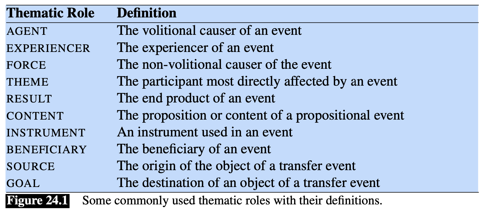
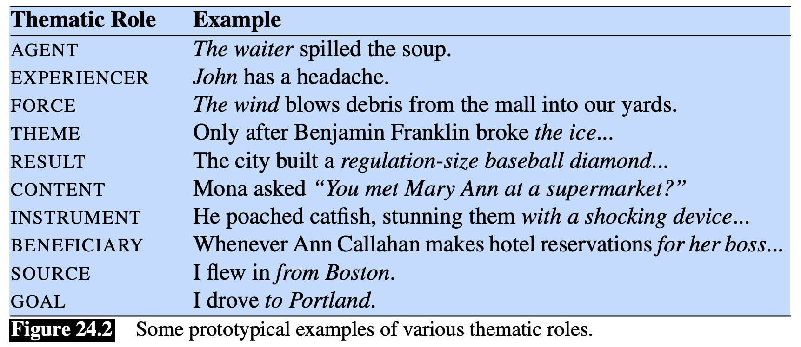

Consideriamo le seguenti frasi
- *Sasha ha rotto la finestra*.
- *Pat ha aperto la porta*.
Una [[rappresentazione logica]] di queste frasi può essere
- $$\exists x,y \text{ Breaking}(x) \land \text{Breaker}(x, Sasha) \land \text{BrokenThing}(x,y) \land \text{Window}(x)$$
- $$\exists x,y \text{ Aprendo}(x) \land \text{Apritore}(x, Pat) \land \text{OggettoAperto}(x,y) \land \text{Porta}(y)$$

In queste frasi i soggetti dei verbi *rompere* e *aprire* sono ricoperti dai ruoli di **Bracker** e **Opener**, rispettivamente.
Questi ruoli sono specifici di alcuni eventi: l'evento **Bracking** ha un **Bracker**, l'evento **Opening** ha un **Opener**.

Per essere in grado di processare la semantica di questi eventi, fare inferenza o rispondere in maniera automatica alle domande abbiamo bisogno di conoscere qualcosa di più tra le relazioni che intercorrono tra questi *predicati*.
Per esempio *Breaker* e *Opener* hanno qualcosa in comune: per esempio sono entrambi **animati** e hanno **dirette conseguenze** dalle loro azioni.

Le regole che legano **agenti**, **azioni**, chi **subisce l'azione** e le **conseguenze** sono dette **regole tematiche**.
Per esempio $\text{AGENT}$ può rappresentare la *regola tematicha* che rappresenta l'idea astratta di **casualità volontaria**.

Similmente gli oggetti diretti **BrokenThing** e **OpenedThing** dei verbi nel nostro esempio sono **oggetti inanimati** che sono in qualche modo affetti dalle conseguenze delle azioni fatte dai soggetti.
In questo caso il ruolo semantico di questi partecipanti è detto $\text{THEME}$.

