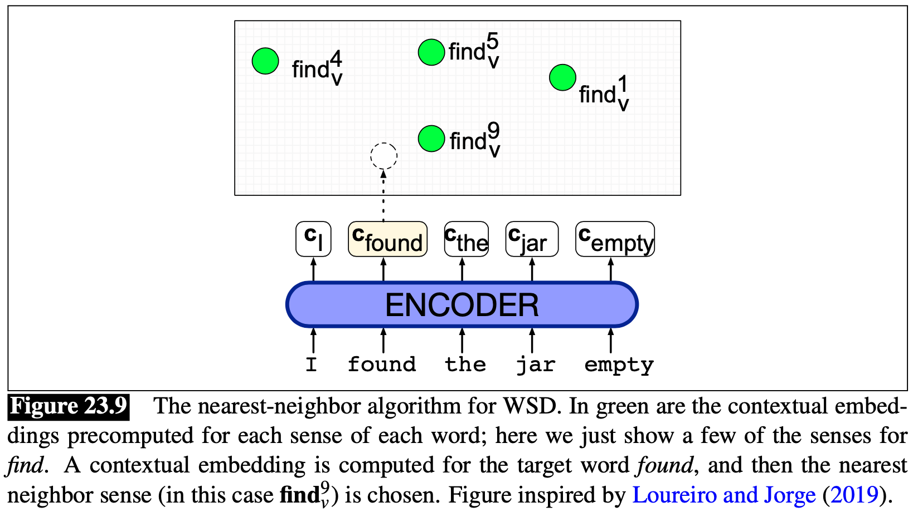

Si può sfruttare [[WordNet]] per il task del **Word Sense Disambiguation** (**WSD**).

L'idea è abbastanza semplice:
prendiamo un frase composta dalle parole $w_1, ..., w_n$, e facciamo un [[Word Embedding|word embedding]] **contestuale** (per esempio usando **BERT**).
Otteremo quindi i seguenti **punti** $p_1, ..., p_n$ per le rispettive parole $w_1,...,w_n$.

Supponiamo che la parola $w_2 = \text{mouse}$, e di voler capire se il suo senso è *animale* o *apparecchio elettronico*.
Prendiamo quindi i differenti [[WordNet#^13f0c9|synset]] $$\text{synset}(w_2) = \lbrace S_1, ..., S_k \rbrace$$
Vogliamo rappresentare i synset $S_1, ..., S_k$ per la parole $w_2$ come dei **punti** nel nostro **spazio semantico** (esattamente come i punti $p_1, ..., p_n$).
Perciò, per ogni $S_i$ definiamo il **punto mediano** $s_i$ come la $$s_i = \frac{1}{\vert S _i \vert} \sum_{w \in S_i} \text{embedding}(w)$$

Definiamo quindi il **senso** di $w_2$ come $$\text{sense}(w_2) = \arg \max_{S_i \in \text{synset}(w_i)}\text{cosine}(s_i, p_2)$$ dove con la funzione $\text{cosine}$ si intende la [[Vector Space Model|cosine similarity]].

