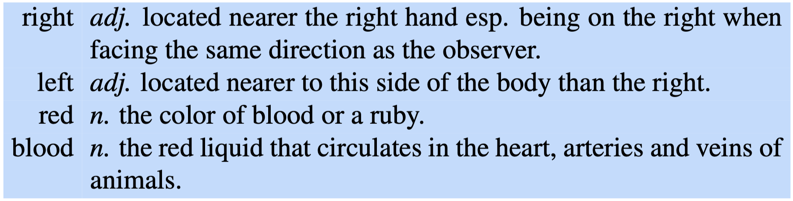

Le parole sono **ambigue**: la stessa parola può essere usata per significare cose diverse.
Per esempio la parole `mouse` in inglese può voler significare l'apparecchio elettronico che serve per controllare il cursore di un computer, oppure un animale roditore.

Un **senso** (o **word sense**) è una **rappresentazione discreta** di un aspetto del significato di una parola.
Un approccio computazionale standard per la rappresentazione dei significati è il cosidetto [[Word Embedding|word embedding]], ovvero una rappresentazione delle parole come **punti** in uno **spazio semantico**.
L'idea dietro i modelli di word embedding (come [[Word2Vec]]) è quella che il significato di una parola è catturato dalle parole con le quali co-occorrono nelle "vicinanze": se due parole $A$ e $B$ co-occorrono con più o meno lo stesso insieme di parole (e con più o meno la stessa freqeunza) allora $A$ e $B$ potrebbero essere simili.
Questo metodo ci dice solo però se due parole sono in qualche modo simili (o correlate), non ci dice nulla su come poter definire il loro *senso*.
Infatti, data la parola `mouse` [[word2vec]] restituisce una rappresentazione che non ci consente di distinguere se stiamo parlando del mouse del pc oppure di un topo.

Altri modelli più sofisticati e moderni, come [BERT](https://en.wikipedia.org/wiki/BERT_(language_model)), propongono un **embedding contestuale** che aiuta per la **disambiguazione dei significati**.

Per prima cosa vediamo le alternative proposte dai *dizionari* e *teasuri*.
La prima alternativa per la disambiguazione è il **glossario**, ovvero una **descrizione testuale** dei vari significati che può avere una parola.

> Per esempio, per il termine inglese `bank` avremo il glossario
> 1.  financial institution that accepts deposits and channels the money into lending activities.
> 2.  sloping land (especially the slope beside a body of water).

I glossari non offrono però una descrizione **formale** dei sensi: sono scritti in maniera discorsiva per le persone.

Vediamo però quali informazioni riusciamo a estrapolare dai glossari.

Osserviamo che la parola `right` fa due volte riferimento verso se stesso, la parola `left` fa un autorifermiento implicito, mentre `red` e `blood` si referenziano a vincenda.

La seconda soluzione data dai tesauri è una serie di **relazioni** attraverso i sensi delle parole.
Per esempio, se parilamo di `left` e `right` come direzioni allora possiamo dire che la loro relazione sta nel fatto che sono **opposti**.
Allo stesso modo possiamo mette la relazione tra `red` e `colore`  e tra `blood` e `liquido`, e relazionare `colore` come **caratteristica** dei `liquidi`.

Le **relazioni** tra i sensi delle parole sono raccolte in [WordNet](https://wordnet.princeton.edu), un enorme database online che definisce le relazioni semantiche tra le parole e i loro possibili sensi.

# Relations Between Senses
## Sinonimia
Due parole **distinte** sono in relazione di **sinonimia** quando hanno un senso identico, o quasi identico.

> Esempio: `macchina` e `automobile`.

Un'altra definizione di **sinonimia** è la seguente:
due parole sono **sinonime** se **intercambiandole** in una frase non ne cambiano il significato.

> Esempio:
> - quei pantaloni ti stanno *grandi*.
> - quei pantaloni ti stanno *larghi*.

## Antonimia
Contrariamente alla [[#Sinonimia|sinonimia]], due parole sono **antonime** (o in relazione di **antonimia**) quando il loro senso è opposto.

> Esempio:
> - `lungo` e `corto`.
> - `chiaro` e `scuro`.
> - `grande` e `piccolo`.
> - `salire` e `scendere`.
> - `dentro` e `fuori`.
> - `caldo` e `freddo`.
> - `integro` e `rotto`.
> - `felice` e `triste`.

Ci sono differenti tipi di antonomie.
Per esempio le antonomie sulle unità di misura:
- `lungo` e `corto` $\to$ lunghezza.
- `chiaro` e `scuro` $\to$ luminosità.
- `grande` e `piccolo` $\to$ grandezza.
Un altro esempio sono le antonomie nelle direzioni:
- `salire` e `scendere` $\to$ verso l'alto o verso il basso.
- `dentro` e `fuori` $\to$ verso l'interno o verso l'esterno.
In generale l'antonomia si riferisce a tutte quelle situazioni **binarie** in cui una parole identifica uno dei due stati.

## Relazioni Tassonomiche: Iponimia e Iperonimia
Un altro modo in cui i sensi possono essere correlati è tramite relazioni **tassonimiche**.

Una parola è **iponima** di un'altra se il senso della prima parola è più **specifico** del senso della seconda.
Per esempio `macchina` è un iponimo di `veicolo`, `cane` è iponimo di `animle`, ecc...

Al contrario abbiamo la **iperonimia**: una parola è **iperonima** di un'altra se il suo senso è più **generale**.
Il `veicolo` è un iperonimo di `macchina`, `animale` è iperonimo di `cane`, ecc...

L'iperonimia e l'iponimia può anche esse espresso in termini di **implicazione**.
Un senso $A$ è **iponimo** di $B$ se tutto ciò che è $A$ è anche $B$ $$\text{iponimia} : A \implies B$$
Analogamente un senso $A$ è **iperonimo** di $B$ se tutto ciò che è $B$ allora è anche $A$ $$\text{iperonimo} : A \Longleftarrow B$$
Data quandi questa definizione, possiamo evincere che l'iponimia/iperonimia è una **relazione transitiva**: se $A$ è iponimo/iperonimo di $B$ e $B$ è iponimo/iperonimo di $C$ allora $A$ è iponimo/iperonimo di $C$.

## Meronimia e Olonimia
Un'altra relazione comune è la **meronimia**, o anche relazione `parte-di`.
Per esempio la parola `gamba` può essere un meronimo di `sedia`, `tavolo`, `persona`, ecc...

La relazione opposta alla meronimia è la **olonimia**: `ruota` è **meronimo** di `macchina` e `macchina` è **olonimo** di `ruota`.

## Polisemia
La **polisemia** è la capictà di una parole di avere molteplici sensi.
Per esempio consideriamo la frase "*The bank is on the corner of Nassau and Witherspoon.*", in tal caso per banca si può intendere una **istituzione finanziaria** oppure una **struttura**.
$$\text{Building} \leftrightarrow \text{Organization}$$

