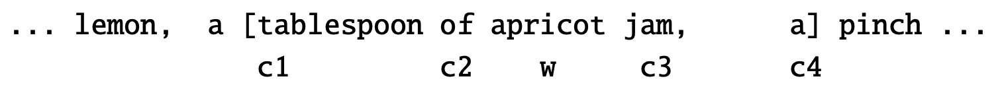

Esistono varie [[Scoring, term weighting & the vector space model|rappresentazioni vettoriali]] delle parole, tutte purtroppo con una **dimensionalità** pari alla grandezza del **vocabolario** del nostro corpus, oppure del numero dei **documenti della collezione**.
Oltre alla dimensionalità enorme, tali rappresentazioni risultano anche estremamente **sparse**.

Il **word embeddig** invece è una rappresentazione molto più **densa** con dimensionalità $d$ molto **ridotte** (circa da 50 a 1000).
Generalmente le rappresentazioni **dense** funzionano meglio delle rappresentazioni sparese in tutti i task di NLP.

Non abbiamo delle motivazioni del perché le rappresentazioni  dense funzionano meglio, però abbiamo delle alcune intuizioni.
Innanzitutto osserviamo che avere un vettore di 300 dimensioni richiede molti meno **parametri** da **apprendere** in un **classificare**, piuttosto di un vettore con 50.000 dimensioni, e avere uno **spazio di parametri** molto più piccolo aiuta alla **generalizzazione** ed evita l'**overfitting**.
Infatti, con più parametri è più facile ottenere una funzione che si avvicina a quella **reale** che si desidera ottenere.

I vettori densi possono anche essere utili per catturare la [[Word Senses#Sinonimia|sinonimia]].
Infatti con una rappresentazione **sparsa** le dimensioni in cui il vettore `car` e `automobile` sono <u>non nulle</u> sono *statisticamente* molto scorrelate, perciò non catturano la loro relazione di [[Word Senses#Sinonimia|sinonimia]].

Intuitivamente word2vec ha la seguente intuizione:
Anziché **contare** le quante volte la parola $X$ **occorra** vicino alla parola `albicocca`, modelliamo il problema come un **task di classificazione binaria** del tipo 
> È probabile che la parole $X$ appaia vicino ad `albicocca`?

Una volta **addestrato** il **modello** che risolve questo task, ci disinteressiamo del task in se, e prendiamo i **parametri** addestrati nel modello e li utiliziamo come **vettore/embedding** della parola `albicocca`.

La cosa realmente importante di questa idea è che non abbiamo bisogno di un dataset **etichettato in precedenza** per addestrare il modello.
Infatti, una parola $C$ che occorre vicino alla parola `albicocca` è automaticamente una risposta alla domanda *"È prbabile che C appaia vicino ad `albicocca`?"*
Questo metodo è anche **self-supervised**, ed evita qualsiasi tipo di **annotazione a mano** del dataset.

# Skip-Gram with Negative Sampling
In realtà Word2Vec è un **pacchetto softoware** contente due algoritmi, uno dei quali è noto come **skip-gram with negative sampling** (in breve **SGNS**).

```ad-info
In realtà comunemente ci si riferisce all'algoritmo **SGNS** semplicemente con **word2vec**.
Perciò d'ora in avanti ci riferiremo a word2vec per indicare l'algoritmo SGNS.
```

Intuitivamente word2vec (SGNS) funziona nel seguente modo:
1. Tratta la parola interessata $X$ e le sue parole *vicine* come **esempi positivi**.
2. Uniformemente campiona altre parole dal vocabolario per ottenere **esempi negtivi**.
3. Usa la [[Logistica Regression]] per **addestrare** il modello predittivo, e distinguere i casi casi positivo/negativo.
4. Utilizza i parametri/pesi del modello addestrato come embedding di $X$.

## Il classificatore
Prendiamo come parola target $X =$ `albicocca`.
Diciamo che il **contesto** di $X$ sono le precedenti 2 parole ad essa e le successive 2, nel nostro dataset.


L'idea è quello di **addestrare un classificatore** che data una coppia $(w,c)$ calcoli la **probabilità** che $c$ sia **contestuale** rispetto alla parola $w$, ovvero che appaia nel contesto delle $\pm 2$ parole vicino a $w$ $$P(+ \vert w,c)$$
Analogamente, la probabilità inversa equivale a $$P(- \vert w,c) = 1 - P(+ \vert w,c)$$

Come fa il classificatore a calcolare $P$?
L'idea di SGNS è che la probabilità che $c$ appaia vicino a $w$ è simle alla probabilità che l'embedding di $c$ sia simile all'embedding di $w$.

Diciamo che due vettori sono simili quando il loro **dot-product** ha valore **alto**.

```ad-important
D'altronde la funzione [[Vector Space Model|cosine]] equivale al dot-product **normalizzato**.
Perciò più è alta il [[Vector Space Model|cosine]] più sarà alto il dot-product, e quindi maggiore i vettori saranno simili.
```

Perciò avremo che $$\text{Similarity}(w,c) \approx \mathbf{w} \cdot \mathbf{c} \in (-\infty, \infty)$$ dove $\mathbf{w},\mathbf{c}$ sono i rispettivi embedding di $w,c$.

Per trasformare il dot-product in una probabilità usiamo una **funzione logistica** o **sigmoide**.
$$P(+ \vert w,c) = \frac{1}{1+\exp{(-\mathbf{w} \cdot \mathbf{c})}}$$
mentre il complemento $$P(- \vert w,c) = \frac{1}{1+\exp{(\mathbf{w} \cdot \mathbf{c})}}$$
[DA FINIRE]