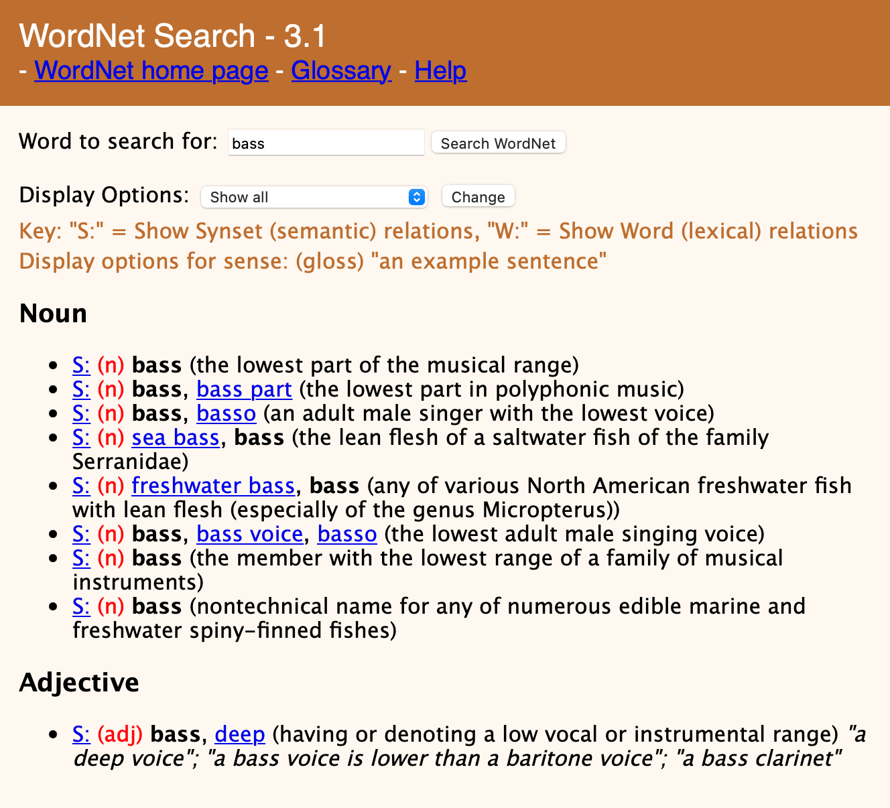
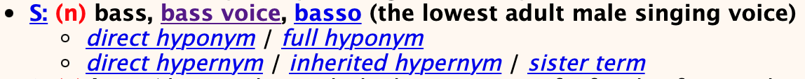
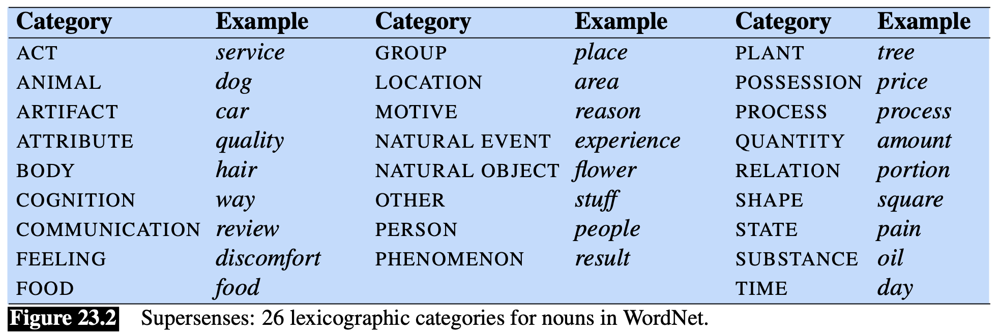

**WordNet** è un database lessicale che definisce le [[Word Senses#Relations Between Senses|relazioni fra sensi]] delle parole della lingua inglese.
È in realtà costituito da una raccolta di 3 database:
1. uno per i **sostantivi**
2. uno per i **verbi**
3. uno per **aggettivi** e **avverbi**
Uno per [[Word Senses|word sense]] delle [[Part of Speach#Open/Closed class|classi chiuse]] non è presente.

WordNet può essere utilizzato online al segue [link](http://wordnetweb.princeton.edu/perl/webwn).

I sensi sono riportati sottoforma di **glossario** o **vocabolario**: abbiamo una descrizione in linguaggio naturale del **senso**, i **sinonimi** rispetto al **dato senso** e all'occorrenza degli **esempi**.
Le parole **sinonime** riessto al **dato senso** formano i cosidetti **synset** (da **synonym set**).

Per ogni termine dei **synset** è anche definita la rispettiva [[Word Senses#Relations Between Senses|relazione]].
Per esempio abbiamo che la parola `bass` è ha tra i suoi (8) synset uno composto dalle parole {`bass voice`, `basso`}.
Per esempio quindi che `bass` è un [[Word Senses#Relazioni Tassonomiche: Iponimia e Iperonimia|iponimo]] di `bass voice` mentre è [[Word Senses#Relazioni Tassonomiche: Iponimia e Iperonimia|iperonimo]] di `basso`. ^13f0c9

In WordNet i synset sono a loro volta etichettati con delle **categorie lessicografiche**, detti anche **super-sense**.
