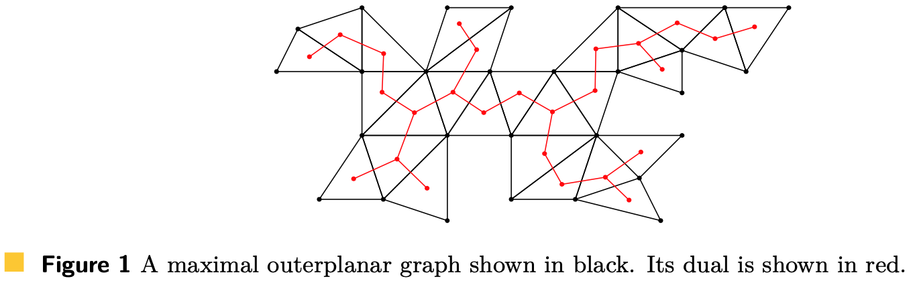
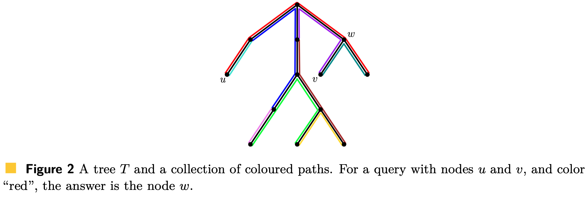
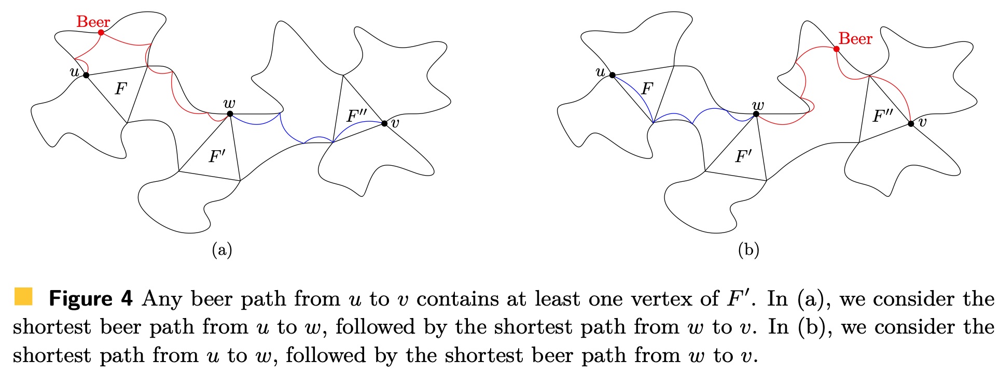

# Risultati

> **Funzione di Ackermann**
> La funzione di Ackermann è definita ricorsivamente come
> $$\begin{align*}
A_0(i) &= i+1\\
A_{\ell+1}(i) &= A_{\ell}(A_{\ell+1}(i-1))
\end{align*}$$
> Definiamo $\alpha(n,m)$ la quantità
>$$\begin{align*}
\alpha(m,n) &= \arg \min_{\ell \geq 0} A_{\ell}(\lfloor m/n \rfloor) > n\\
\alpha(n) &= \alpha(n,n) 
\end{align*}$$

### Teorema 1
Sia $G$ un **outerplanar graph** con $n$ nodi.
Per ogni intero $m \geq n$ è possibile processare $G$ in tempo $O(m)$ in una struttura dati grande $O(m)$, tale che per ogni coppia di nodi $u,v$ è possibile processare $\texttt{beer\_dist}(u,v)$ e $\texttt{beer\_shortest\_path}(u,v)$  in tempo $O(\alpha(m,n))$.

```ad-note
Ponendo $m = n$ avremo una struttura dati di grandezza lineare e costruita in tempo lineare, che consente di effettuare query in tempo $O(\alpha(n))$.
```

```ad-important
Sia $\log^*n$ il numero di volte che bisogna applicare la funzione $\log$ ad $n$ affinché il risultato non sia $\leq 1$.

Per esempio $$\ln^* (e^4) = 3$$ infatti 
- $\ln(e^4) = 4$
- $\ln(\ln(e^4)) = \ln(4) \approx 1.38 > 1$
- $\ln(\ln(\ln(e^4))) \approx \ln(1.38) < 1$

Sia invece la funzione $\log^{**}n$ il numero di volte che bisogna applicare la funzione $\log^*$ ad $n$ affinché, ancora, il risultato sia $\leq 1$.

Per esempio $$\ln^{**} (e^4) = 2$$ infatti
- $\ln^*(e^4) = 3$
- $\ln^*(\ln^*(e^4)) = \ln^*(3) = 1$

Ponendo $m = n\log^{**}(n)$ avremo che $\alpha(m,n) = O(1)$ e quindi una struttura dati di dimensione e tempo di costruzione $O(n\log^{**}(n))$ (<u>quasi lineare</u>) e con query time costante $O(1)$.
```


## Teorema 2
Sia $G$ un **outerplanar graph** con $n$ nodi.
Per ogni intero $m \geq n$ è possibile processare $G$ in tempo $O(n)$ in una struttura dati grande $O(n)$, tale che per ogni coppia di nodi $u,v$ è possibile riportare lo $\texttt{beer\_shortest\_path}(u,v)$  in tempo $O(L)$, dove $L$ è la lunghezza (numero di vertici) del cammino.

```ad-important
$L$ è un lowerbound ottimo alla risposta della query.
Infatti per riportare un cammino lungo $L$ abbiamo bisogno di tempo almeno $L$ per scrivere l'output.
```

### Outerplanar graph massimale
Un outerplanar graph $G$ è detto **massimale** se aggiungendo un arco tra una qualsiasi coppia di nodi non adiacenti il nuovo grafo risulta essere <u>non-outerplanar</u>.

Il numero di archi in outrplanar graph massimale è $2n - 3$.
Tutte le *facce* di $G$ sono triangoli, e tutti gli archi esterni formano un **ciclo hamiltoniano**.

Il **duale** di $G$ è un **albero** $D(G)$ dove l'insieme dei nodi è equivalente all'insieme delle facce di $G$.
Esiste un arco $(F,F')$ in $D(G)$ se e solo se le facce $F$ ed $F'$ condividono un arco in $G$.
$D(G)$ ha $n-2$ nodi, ognuno dei quali con grado al più $3$.


----
# Query problem on Tree

### Lemma 3
Sia $T$ un albero con $n$ nodi.
Allora si può processare $T$ in tempo $O(n)$ in modo tale da poter rispondere alle seguenti query in tempo $O(1)$:
1. dato un nodo $u$, ritornare la sua profondità $\text{level}(u)$ ovvero la distanza dalla radice dell'albero.
2. Data una qualsiasi coppia $u,v$ ritornare il più profondo antenato comune (o **lower common ancestor**) $\text{LCA}(u,v)$.
3. Data una coppia di nodi $u,v$ decidere se $u$ è nel sottoalbero $T(v)$ radicato in $v$.
4. Dati due nodi <u>distinti</u> $u \neq v$ restituire il **secondo** nodo del cammino da $u$ a $v$. ^01c818
5. Dati tre nodi $u,v,w$ decidere se $w$ appartiene al cammino da $u$ a $v$.

# Closest-Colour Queries in Trees
Sia $T$ un albero con $n$ nodi e $\mathcal{C}$ un insieme di colori.
Abbiamo associato ad ogni colore $c \in \mathcal{C}$ un cammino $P_c$ in $T$.
Ognuno di questi cammini $P_c$ può intersecarsi con altri cammini, perciò assumiamo che ogni nodo $u \in T$ preserva l'insieme dei colori $c \in \mathcal{C}$ tali che $u \in P_c$.
Assumiamo inoltre che ogni nodo $u$ può appartenere al più a un numero **costante** $O(1)$ cammini $P_c$.

In una **clostest-color query** noi abbiamo due nodi $u,v \in T$, un colore $c \in \mathcal{C}$ tale che $u \in P_c$ e vogliamo sapere qual è il nodo $w \in P_c$ più vicino a $v$, ovvero tale che $$w = \arg \min_{x \in P_c} d(x,v)$$ ^361256



### Lemma 4
È possibile preprocessare $T$ in tempo **lineare** $O(n)$ in modo tale da poter rispondere a qualsiasi *[[#^361256|closest-pair query]]* in tempo **costante** $O(1)$.


# Path-Sum Queries in Trees
Sia $(W, \oplus)$ un **semigruppo**, e assumiamo di poter calcolare in tempo **costante** $O(1)$ $a \oplus b$, per ogni $a,b \in W$.

Sia $T$ un albero con $n$ nodi, assumiamo che ogni arco $e$ ha salvato una quantità $s(e) \in W$.
Per ogni coppia di nodi distinti $u \neq v \in T$, definiamo il **path-sum** $\text{PS}(u,v)$ come segue $$\text{PS}(u,v) = \bigoplus_{e \in P:u \leadsto v} s(e)$$ dove $P:u\leadsto v$ è il cammino da $u$ a $v$ in $T$. ^08615e

### Lemma 5
Sia $T$ un albero con $n$ nodi, tale che ogni arco $e$ ha salvata una quantità $s(e)$ appartenente al semigruppo $(W,\oplus)$.
Assumendo che $\oplus$ si possa calcolare in tempo costante $O(1)$, allora per ogni $m \geq n$ possiamo processare $T$ in tempo $O(m)$ in una struttura dati grande $O(m)$ tale che ogni [[#^08615e|path-sum query]] può essere processata in tempo $O(\alpha(m,n))$.

------
# Beer Distance Queries in Maximal Outerplanar Graphs

> **Generalized Triangle Inequality**
> Un grafo $G=(V,E)$ rispetta la **disuguaglianza triangloare generalizzata** se per ogni arco $(u,v) \in E$ avremo che il cammino minimo tra $u$ e $v$ è esattamente l'arco $(u,v)$.
> In altri termini $$\text{dist}(u,v) = w((u,v))$$ dove $w$ è una funzione di peso degli archi.
> Nel caso di grafi non pesati avremo che $w \equiv \lbrace 1 \rbrace$.

^391f5c

Consideriamo un [[#Outerplanar graph massimale|outerplanar graph massimale]] $G$ con $n$ vertici, tale che rispetti la [[#^391f5c|disuguaglianza triangolare generalizzata]].
Il nostro obiettivo è quello di preprocessare $G$ in una struttura dati efficiente che ci consenta di riportare la $\texttt{beer\_dist}(u,v)$, per ogni coppia di nodi.

L'apporccio consiste nel definire un **semigruppo** $(W, \oplus)$ "speciale" tale che ogni elemento di $W$ "contenga" in qualche modo certe distanze beer\_distances.
Più precisamente, per ogni arco del duale $D(G)$ noi definiremo un elemento di $W$.

Vedremo che una *beer distance query* può essere **ridotta** a una [[#Path-Sum Queries in Trees|path-sum query]] in $D(G)$.
Sfruttando quindi i risultati del [[#Lemma 5]] otterremo ciò che è enunciato nel [[#Teorema 1]].

### Lemma 7
Sia $G$ un [[#Outerplanar graph massimale|outerplanar graph massimale]] con $n$ vertici, tale che rispetti la [[#^391f5c|disuguaglianza triangolare generalizzata]].
1. In tempo $O(n)$ possiamo calcolare $\texttt{beer\_dist}(u,u)$ per ogni $u \in V$, e $\texttt{beer\_dist}(u,v)$ per ogni arco $(u,v) \in E$.
1. In tempo $O(n)$ possiamo **pre-processare** $G$ in modo tale che:
	- per ogni arco $(u,v) \in E$ riportare lo $\texttt{shortest\_beer\_dist}(u,v)$ in tempo $O(L)$, dove $L$ è la lunghezza (numero di vertici) del cammino.
	- per ogni nodo $u \in V$ riportare lo $\texttt{shortest\_beer\_dist}(u,u)$ in tempo $O(L)$, dove $L$ è la lunghezza (numero di vertici) del cammino.
*(Dimostrazione fatta con una visita in post-ordine, vedere versione completa del paper)*.

## Step 1
Assumiamo di aver precomputato, grazie al [[#Lemma 7]], tutti i $\texttt{beer\_dist}(u,u)$ e $\texttt{beer\_dist}(u,v)$ (dove $(u,v)$ è un arco).

Per ogni coppia di facce interne distinte $F, F'$ di $D(G)$, definiamo l'insieme $Q_{F,F'}$ come l'**unione** dei due seguenti insiemi.
- $$\lbrace (u,v, \text{dist}(u,v), D) \vert u \in F \land v \in F' \rbrace$$
- $$\lbrace (u,v, \texttt{beer\_dist}(u,v), BD) \vert u \in F \land v \in F' \rbrace$$
I bits $D$ e $BD$ servono ad indicare se la tupla si riferisce a una distanza normale o ad una beer dist.
Dato che ogni faccia ha esattamente 3 vertici allora $Q_{F,F'}$ ha esattamente 18 elementi, 9 per le coppie $(u,v)$  e 9 per le coppie $(v,u)$.

### Lemma 8
Siano $u,v$ due vertidi di $G$ tali che $u$ appartiene alla faccia $F$ e $v$ alla faccia $F'$.
1. se $F = F'$ allora possiamo calcolare $\text{dist}(u,v)$ e $\texttt{beer\_dist}(u,v)$ in tempo **costante** $O(1)$.
2. se $F \neq F'$ ma conosciamo $Q_{F,F'}$, allora possiamo calcolare $\text{dist}(u,v)$ e $\texttt{beer\_dist}(u,v)$ in tempo **costante** $O(1)$.

#### Proof
- Caso $F = F'$
	- se $u = v$ allora $\text{dist}(u,v) = \text{dist}(u,u) = 0$ e $\texttt{beer\_dist}(u,v) = \texttt{beer\_dist}(u,u)$ è già stato precomputato (vedi [[#Lemma 7]]).
	- se $u \neq v$, dato che $F=F'$ allora avremo che $(u,v) \in E$. Perciò per [[#^391f5c|disuguaglianza triangolare generalizzata]] $\text{dist}(u,v) = w((u,v))$ mentre $\texttt{beer\_dist}(u,v)$ è già stato precomputato.
- Case $F \neq F'$
	- dato che conosciamo $Q_{F,F'}$ possiamo identificare $\text{dist}(u,v)$ e $\texttt{beer\_dist}(u,v)$ in tempo costante $O(1)$, dato che $Q_{F,F'}$ ha solo 18 elementi.

### Lemma 9
Per ogni arco $(F,F')$ in $D(G)$, possiamo calcolare $Q_{F,F'}$ in tempo **costante** $O(1)$.

#### Proof
Osservare che il sottografo $G'$ **indotto** dalle facce $F$ ed $F'$ avrà solamente 4 node e 5 archi.
Perciò in tempo **costante** $O(1)$ possiamo calcolare le distante $\text{dist}(u,v)$ per tutte le 9 coppie di nodi nelle due facce.

Concentriamoci quindi su $\texttt{beer\_dist}(u,v)$.
Se $u=v$ oppure $(u,v) \in E$ allora $\texttt{beer\_dist}(u,v)$ è già stato precomputato (vedi [[#Lemma 7]]).
Siano $x,y$ i due nodi condivisi da $F$ ed $F'$.
Dato $(x,y)$ partiziona $G$, allora qualsiasi cammino da $u \in F$ a $v \in F'$ deve necessariamente passare per almeno uno tra $x$ e $y$.
Perciò
$$\texttt{beer\_dist}(u,v) = \min \begin{Bmatrix}
\texttt{beer\_dist}(u,x) + w(x,v),\\
w(u,x) + \texttt{beer\_dist}(x,v),\\
\texttt{beer\_dist}(u,y) + w(y,v),\\
w(u,y) + \texttt{beer\_dist}(y,v)
\end{Bmatrix}$$
Dato che $(u,x),(x,v),(u,y),(y,v) \in E$, tutti e quattro glie elementi possono essere calcolati in tempo costante.

### Lemma 10
Siano $F,F',F''$ tre facce **distinte** di $D(G)$, tali che $F'$ si trovi lungo il cammino tra $F$ ed $F''$ in $D(G)$.
Se conosciamo gli insiemi $Q_{F,F'}$ e $Q_{F',F''}$ allora possiamo calcolare in **tempo costante** $O(1)$ l'insieme $Q_{F,F''}$.

Dato che $G$ è un [[#Outerplanar graph massimale]] (e quindi $D(G)$ un albero), allora certamente qualsiasi cammino tra $u \in F$ e $v \in F''$ deve <u>necessariamente</u> passare per un nodo $w \in F'$.
Perciò avremo che $$\text{dist}(u,v) = \min_{w \in F'}\lbrace \text{dist}(u,w) + \text{dist}(w,v) \rbrace$$
Dato che $(u,w,\text{dist}(u,w), D) \in Q_{F,F'}$ e $(w, v,\text{dist}(w,v), D) \in Q_{F',F''}$ allora possiamo calcolare $\text{dist}(u,v)$ in tempo $O(1)$.

Con lo stesso ragionamento possiamo dire che
$$\text{dist}(u,v) = \min_{w \in F'}\lbrace \min(\texttt{beer\_dist}(u,w) + \text{dist}(w,v),\; \text{dist}(u,w) + \texttt{beer\_dist}(w,v) ) \rbrace$$


## Step 2
A questo punto definiamo il semigruppo $(W,\oplus)$ come
- $$W \equiv \lbrace Q_{F,F'} \vert F,F' \text{ sono facce distinte di } D(G) \rbrace \cup \lbrace \perp \rbrace$$ dove $\perp$ è un simbolo speciale.
- L'operatore $\oplus: W \times W \to W$ definito come:
	1. Se $F,F'$ sono **distinti** allora $Q_{F,F'} \oplus Q_{F,F'} = Q_{F,F'}$.
	2. Se $F,F',F''$ sono **distinti** e tali che $F'$ si trova lungo il cammino tra $F$ ed $F''$ in $D(G)$, allora $Q_{F,F'} \oplus Q_{F',F''} = Q_{F,F''}$.
	3. In ogni altro caso $\oplus$ restituisce $\perp$.

```ad-note
È facile verificare che $\oplus$ per come è stato definito è **associativo**.
```

Osservare che:
- per [[#Lemma 9]], per ogni arco $(F,F')$ possiamo calcolare in tempo **costante** $Q_{F,F'}$. Dato che il numero di archi di $D(G)$ è [[#Outerplanar graph massimale|n-3]], allora possiamo calcolare in $O(n)$ tutti i $Q_{F,F'}$ per tutti gli archi $(F,F')$.
- Grazie al [[#Lemma 3]], dopo una precomputazione di $O(n)$, possiamo decidere in **tempo costante** se $F'$ appartiene al cammino tra $F$ ed $F''$ in $D(G)$. Se $F'$ appartiene al cammino, allora grazie al [[#Lemma 10]] possiamo calcolare $Q_{F,F''}$ in tempo costante (conoscendo a priori $Q_{F,F'}, Q_{F',F''}$), altrimenti ritorno $\perp$.
- In fine, date due facce **distinte** $F,F'$ sia il cammino $F = F_0, F_1, ..., F_L = F'$ in $D(G)$. Grazie al [[#^01c818|punto 4 del lemma 3]] possiamo calcolare possiamo calcolare in **tempo costante** faccia dopo faccia del cammino, e quindi $Q_{F,F'} = \bigoplus_{i=0}^{k-1} Q_{F_i, F_{i+1}}$ in tempo $O(L)$.
Perciò per ogni arco $(F,F')$ di $D(G)$ salviamo il corrispettivo elemento in $W$, riducendoci quindi al problema citato in [[#Path-Sum Queries in Trees]].


