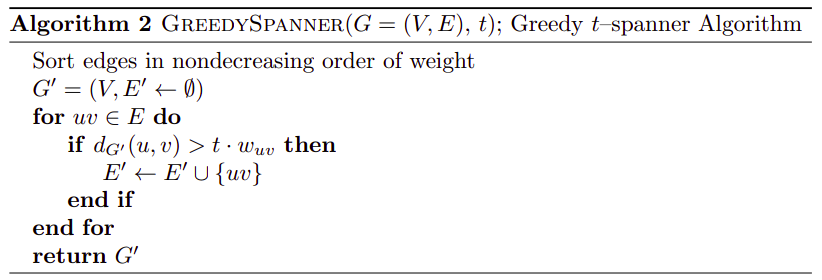

# Erdos’ Girth Conjecture

```ad-tldr
title: Circonferenza - Grith
La **circonferenza** (o **grith**) di un grafo $G = (V,E)$ è definita come la lunghezza del più piccolo **ciclo** presente in $G$.
```
^42dad2

```ad-info
Esiste una relazione tra circonferenza è numero minimo di arhci che un grafo può avere.
Infatti una clique non può in alcun modo avere un ciclo col lunghezza maggiore di 3.
Indichiamo con $\gamma(n,k)$ il **massimo** numero di archi che può avere un grafo con $n$ nodi e **circonferenza** $> k$.
```


> **Proposizione 2.2**
> Un grafo non diretto e non pesato $G = (V,E)$ con [[#^42dad2|circonferenza]] $> t + 1$ non può avere alcun $t$-spanner.

^95ab93

> **Proof**
> Consideriamo un generico arco $(u,v) \in E$.
> Rimuovendolo, o **disconnettiamo** $u$ e $v$, oppure aumentiamo la loro distanza da 1 alla lunghezza del **minimo ciclo** che li conteinete, meno 1.
> Dato che $G$ ha circonferenza $> t + 1$ allora avremo che $d_{G \setminus \lbrace (u,v) \rbrace}(u,v) > t$. $\square$

```ad-info
L'implicazione della [[#^95ab93|Proposizione 2.2]] è che dato un grafo $G$ con $\vert E \vert = \gamma(n, t+1)$ archi e circonferenza $> t + 1$, l'**unico** $t$-spanner per $G$ è $G$ stesso.
```

## Moore Bound
$$\gamma(n,k) = O\left(n^{1 +\frac{1}{\lfloor k/2 \rfloor}}\right)$$

# Greedy Alg for Multiplicative Spanners

 ^ecccd6

- Questo algoritmo è basato sull'algrotimo di Kruskal, con la differenza che **rilassa** il vincolo sulla mancanza di cicli.

> **Proposizione 4.1**
> L'algoritmo produce un $t$-spanner per $G$.

> **Proof**
> Assumiamo *senza perdita di generalità* che per ogni arco $(u,v) \in G$ abbiamo che $d_G(u,v) = w(u,v)$.
> Se avessimo che $d_G(u,v) < w(u,v)$ allora potremmo tranquillamente **rimuovere** l'arco $(u,v)$ da $G$ senza andare ad influire su alcun cammino minimo.
> Infatti, supponiamo per assurdo che esiste un **cammino minimo** $P: x \leadsto v$ che passa per l'arco $(u,v)$. Consideriamo ora il cammino **modificato** $P'$ dove rimuoviamo l'arco $(u,v)$ è aggiungiamo al posto di esso il cammino minimo $L: u \leadsto v$. Dato che $L$ è ottimo, e dato che stiamo assumendo che $\text{len}(L) = d_G(u,v) < w(u,v)$ allora avremo che $$\text{len}(P') - \text{len}(P) = \text{len}(L) - w(u,v) < 0 \implies \text{len}(P') < \text{len}(P)$$ assurdo!
> 
> Fatta questa assunzione, ogni volta che consideriamo un arco $(u,v) \in G$ secondo la *plitica greedy*, uno dei seguenti casi:
> 1. aggiungiamo $(u,v)$ a $G'$ e quindi avremo che $d_{G'}(u,v) = w(u,v) = d_G(u,v)$
> 2. **non** aggiungiamo $(u,v)$ a $G'$, e quindi avremo che $$d_{G'}(u,v) \leq t \cdot w(u,v) = t \cdot d_G(u,v)$$
> In entrmabi i casi avremo che il fattore di dilatazione $t$ viene rispettato per $(u,v)$. $\square$

-----
> **Lemma 4.1**
> Sia un interno $t > 1$ fissato, e $G$ un grafo **pesato** e **connesso** di $n$ nodi. Sia $G'$ il $t$-spanner ottenuto dall'[[#^ecccd6|algoritmo greedy]]. Se $G''$ è un $t$-spanner di $G'$, allora $G'' \equiv G'$.

> **Proof**.
> Siano $G' = (V, E')$ e $G'' = (V, E'')$.
> Supponiamo per assurdo che esista un arco $e = (u,v) \in E' \setminus E''$.
> Dato che $e \notin E''$ allora esiste un **cammino minimo** $P$ che connette $u$ e $v$ in $G''$.
> Osserviamo inoltre che dato che $G''$ è un $t$-spanner proprio di $G'$, allora
> - tutti gli archi del cammino $P$ appartengono anche a $G'$.
> - $W(P) \leq t \cdot w(e)$
> 
> Consideriamo ora il ciclo $C = P \cup \lbrace e \rbrace$ e indichiamo con $\tilde{e}$ l'**ultimo** arco di $C$ considerato dall'algoritmo greedy.
> Dato che $\tilde{e}$ è considerato per ultimo, allora avremo che $w(x) \leq w(\tilde{e})$ per ogni arco $x \in C$ (e quindi anche $w(e) \leq w(\tilde{e})$).
> 
> Dato che $C$ appartiene al grafo $G'$ e dato che tutti i suoi archi hanno peso al più $w(\tilde{e})$, allora segue che tutti gli archi di $C \setminus \lbrace \tilde{e} \rbrace$ sono già stati inseriti in $E'$ prima di considerare $\tilde{e}$.
> Tale cammino $C \setminus \lbrace \tilde{e} \rbrace$ connette quindi i due estremi di $\tilde{e}$ in $G'$.
> Avremo quindi che $$W(C \setminus \lbrace \tilde{e} \rbrace) = W(P) + \underbrace{w(e) - w(\tilde{e})}_{\leq 0} \leq W(P) \leq t \cdot w(e) \leq t \cdot w(\tilde{e})$$
> Il cammino che connette gli estremi di $\tilde{e}$ in $G'$ è $\leq t \cdot w(\tilde{e})$, ovvero l'arco $\tilde{e}$ **non** è stato mai aggiunto di $E'$.
> Ciò è una contraddizione, perché avevamo detto che tutti gli archi di $P$ sono presenti in $E'$ però $\tilde{e}$ no.
> 
> In conclusione un arco $e \in E' \setminus E''$ non può esistere, e quindi $E' \equiv E''$.


